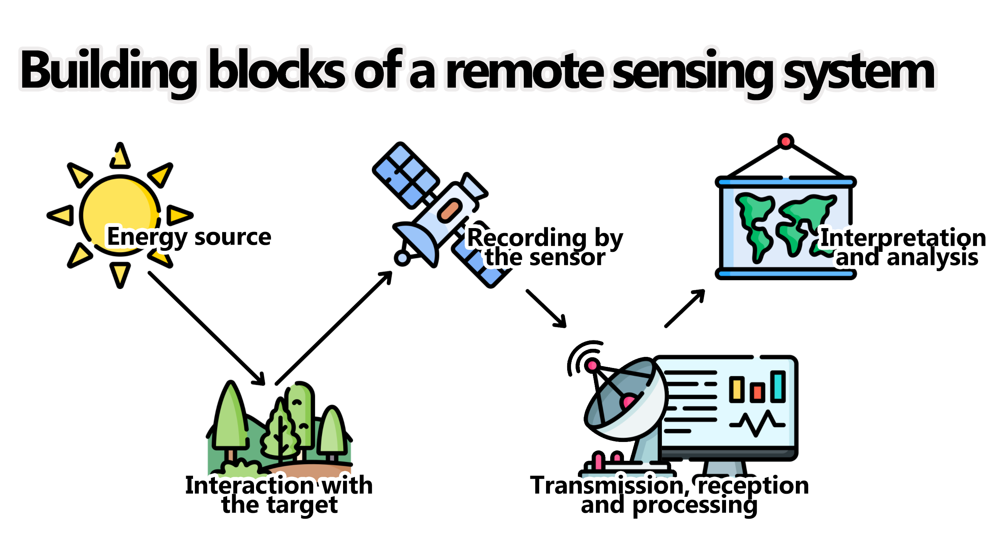
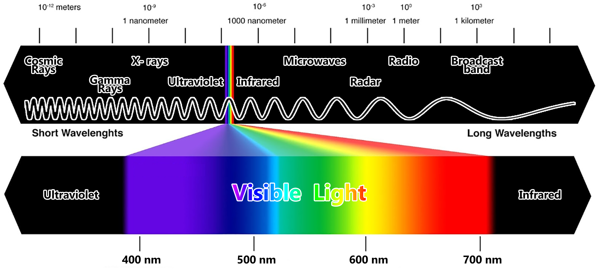
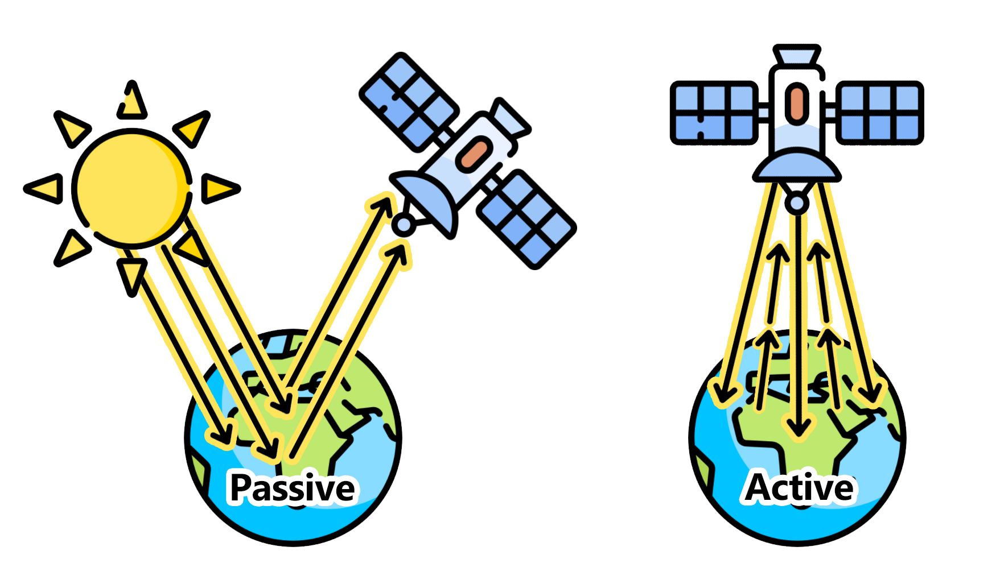
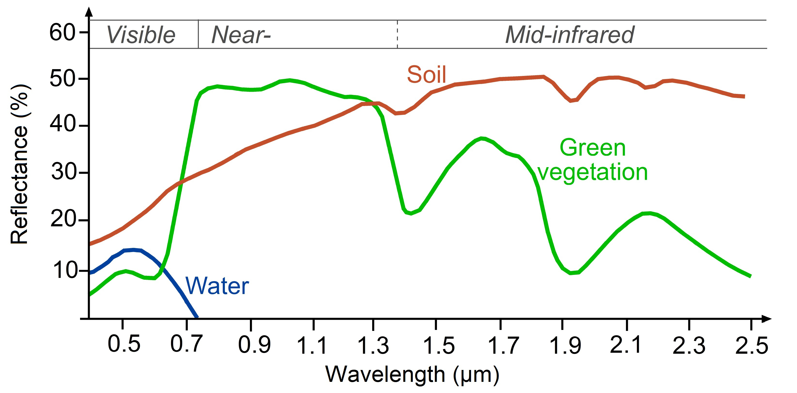

# Part 1 - Basics & Fundamentals

## Programming and Remote Sensing Basics 

### Remote Sensing Language

__A) Definition__

The term *__Remote sensing__* has been variously defined. Some of its early definitions include:

- [...] the art or science of telling something about an object without touching it .(Fischer et al., 1976)

- Remote sensing is the acquisition of physical data of an object without touch or contact. (Lintz and Simonett, 1976)

- Remote sensing is the observation of a target by a device separated from it by some distance. (Barrett and Curtis, 1976)

- The term _remote sensing_ in its broadest sense means "reconnaissance at a distance." (Colwell, 1966)

Thus, in the context of this training, we can define *Remote Sensing* as the science of acquiring information about a given target, object or phenomenon on the surface of the Earth by sensors on-board various platforms orbiting our planet. 

__B) Building blocks of remote sensing__

Although the many different methods for collection, processing and interpretation of remotely sense data can vary widely, they will always have the following essential components:

```{r FigBuildingBlocks, fig.cap="Basic components of a remote sensing system.", echo=FALSE, message=FALSE}

```

I) Energy Source

The source of the electromagnetic radiation/energy (EMR) is the first requirement of any remote sensing process. The electromagnetic spectrum is used to "classify" the EMR according to to its wavelength:

```{r FigEMS, fig.cap="The Electromagnetic Spectrum", echo=FALSE, message=FALSE}

```

Depending on the source of energy they are using, the different remote sensing systems can be classified as *__active__* or *__passive__*. *Active* sensors will produce its own source of energy for the illumination of the target. They will emit the energy toward the target being investigated and the energy reflected by this target is detected and measured by the sensor. Usually, these sensors operate in the microwave range of the electromagnetic spectrum. On the other hand, *passive* sensors only measures the energy that is naturally available, usually from the sun. These sensors can only be used to detect the energy being reflected during the time when the sun is illuminating the Earth. These sensors usually measure energy from the optical range (visible, near infrared, short-wave infrared and thermal infrared).

```{r PassiveAndActive, fig.cap="Remote sensing can be classified as Passive or Active based on the source of energy.", echo=FALSE, message=FALSE}

```

You can also think about these concepts of *active* and *passive* using a handheld photogarphic camera as an example: When photographing a target in the dark, the camera flash will provide the energy necessary to illuminate the target. Therefore, in that case, the camera is an *active* sensor. On the other hand, this same camera will be a *passive* sensor when you are photographing a target or object during the day, when the target being illuminated by sun light and no flash is necessary.

II) Interaction with the target/object

The most common medium in between the source and target is the atmosphere. This is where the firt interaction ocurrs. As the EMR travel from its source to the target, it will come in contact with and interact different atmosphere constituents: aerosols, water vapor, solid particles, ect. Secondly, once the EMR makes its way through the atmospherethe to the target, it will interact with it depending on the target properties and energy wavelength. The EMR can have different types of interaction when it encounters matter; whether it is gas, solid or gas: it can be __transmitted__ (that is, it passes through the target), __absorbed__ (that is, the target absorbs the energy usually increasing its temperature as a result), __emitted__ (that is, energy is emitted from all matter at temperatures above the absolute zero of 0 Kelvins), __scattered__ (that is, deflected in every direction) and __reflected__ (that is, energy bounces off the target's surface and its direction is usually a function of target structure and texture). 

```{block, type='caution'}
Keep in mind: All targets can show different proportions of each of these interactions.

```

III) Recording of the energy by the sensor

The sensor - often onboard of airplanes or satellites in space - will measure the returning EMR after it has interacted with the target and the atmosphere. This measurement is converted into a digital image with discrete values in units of digital number (DN) for each image pixel. Depending on the sensor, these resulting images will have different characteristiscs (or *__resolutions__*). They are:

- __Spatial Resolution__: usually known as "pixel size". It refers to the sensor's ability to discriminate different objects/targets. A higher spatial resolution means a smaller pixel size which, in turn, means that smaller objects can be distinguishable as separate targets.

- __Spectral Resolution__: Different sensors will measure the EMR at specific ranges (or wavelengths), usually called *bands*. Thus, the spectral resolution of a sensor usually refers to the number and bandwith of these bands.

- __Radiometric Resolution__: Usually measured in *bits*, it refers to the sensor's ability to detect the smallest change in the spectral reflectance among different targets. For example, a 8-bit image will have 256 levels of brightness while a 16-bit image has 65,536 levels of brightness.

- __Temporal resolution__ (sensors onboard satellites): is the time required for the satellite to collect two images at the same geographic location on Earth. Higher temporal resolution means less time for revisiting the same location. However, temporal resolution is usually inverselly proportional to spatial resolution: The larger the pixel size, the larger area the sensor will cover which means less time until the next revisit.


IV) Transmission, Reception, and Processing

The EMR recorded by the sensor is transmitted in an electronic form to a receiving station on Earth where the data is processed and stored.

V) Analysis and Interpretation (we are here!)

This is where this training is focused on! The EMR was transformed into a digital dataset where we can use specialized instruments/hardware/software to extract information about the target observed. This extraction is often done through *__image processing__* (or digital image processing), which is the process which makes an image interpretable for a given use. There are many methods of image processing, but these are the most common ones:

- __Image correction__: The digital image recorded by the sensor on a satellite (or aircraft) may contain errors related to the geometry and brightness values of the pixels. For example, a geometrical correction, also called *__geo-referencing__*, is a procedure where the content of image will be assigned a spatial coordinate system (for example, geographical latitude and longitude).

- __Image enhancement__: This is related to modification of an image, by changing the pixel brightness values, to improve its visual aspects so that the actual analysis of images will be easier, faster and more reliable.

- __Image classification__: The overall goal of this method is to categorize all pixels in an image into themes (or *__land cover classes__*). This resulting map with its limited number of classes can be more readily and sucessfully interpreted compared to the raw image and it is often use for planning purposes. There are supervised and unsupervised methods for classification of an image: A *__supervised classification__* (human-guided) is based on the idea that a user can select sample pixels in an image that are representative of specific classes and then direct the image processing software to use these training sites as references for the classification of all other pixels in the image. These samples are selected based on the knowledge of the user. On the other hand, an *__unsupervised classification__* (computer/software-guided) is where the output classes are based on the software's ability to determine which pixels are related, using several different models and techniques. 

This final component of Remote Sensing (V) is achieved when we apply the extracted information to solve a particular problem. 

__C) Spectral Signatures: A target's spectral fingerprint__

As mentioned before, remote sensing is based on the measurement of reflected (or emitted) radiation from different targets. Objects having different surface features reflect or absorb the sun's radiation in different ways.
In order to understand and interprete the information extracted from remotely sensed data, you have to first understand the behavior of the target in respect to the electromagnetic spectrum. Each target will show a distinct reflectance pattern as a function of the wavelength - known as *__spectral signature__* (or a spectral fingerprint). This signature will directly (or indirectly) lead to the identification of a target based on its set of values for its reflectance in different spectral ranges:

```{r SpectralSignature, fig.cap="Typical spectral signatures of specic land cover types in the visible and infrared region of the electromagnetic spectrum (Source: http://www.seos-project.eu/)", echo=FALSE, message=FALSE}

```

```{block, type='rmdcomment'}
*__Reflectance__* is the ratio of the amount of light leaving a target to the amount of light striking the target. It has no units. 
```

The spectral signature of *healthy green vegetation* has a small reflectance in the visible portion of the electromagnetic spectrum resulting from the pigments in plant leaves. Most of the light is being used in the photosynthesis process. However, the reflectance increases dramatically in the near infrared. The spectral signature of *soil* is much less variable. Its behavior is affected by soil moisture, texture, surface roughness and they are less dominant than the absorbance features present in vegetation. The *water*'s spectral signature is characterized by a high absorption at near infrared wavelengths range and beyond. Because of this absorption property, water bodies as well as features containing water can easily be detected, located and delineated with remote sensing data.

These differences make it possible to identify different earth surface features or materials by analysing their spectral reflectance patterns or spectral signatures. [add more text]


*__References__*

Fischer, W. A., W.R. Hemphill and A. Kover. 1976. Progress in Remote Sensing. *Photogrametria*, Vol. 32, pp. 33-72

Lintz, J. and D. S. Simonett. 1976. *Remote Sensing of Environment*. Reading, MA: Addison-Wesley. 694 pp.

Barrett, E. C. and C. F. Curtis. 1976. *Introduction to Environmental Remote Sensing*. New York: Macmillian, 472 pp.

Colwell, R. N. 1966. Uses and Limitations of Multispectral Remote Sensing. In *Proceedings of the Fourth Symposium on Remote Sensing of Environment*. Ann Arbor: Institute of Science and Technology, University of Michigan, pp. 71-100.

### Google Earth Engine API and Java Script

### Exploring Image and Image Collection

## Image Manipulation

### Band Math and VI Calculation

### Thresholds and Masks