# Part 1 - Basics & Fundamentals

## Programming and Remote Sensing Basics 

### Remote Sensing Language

__A) Definition__

The term *__Remote sensing__* has been variously defined. Some of its early definitions include:

- [...] the art or science of telling something about an object without touching it .(Fischer et al., 1976)

- Remote sensing is the acquisition of physical data of an object without touch or contact. (Lintz and Simonett, 1976)

- Remote sensing is the observation of a target by a device separated from it by some distance. (Barrett and Curtis, 1976)

- The term _remote sensing_ in its broadest sense means "reconnaissance at a distance." (Colwell, 1966)

Thus, in the context of this training, we can define *Remote Sensing* as the science of acquiring information about a given target, object or phenomenon on the surface of the Earth by sensors on-board various platforms orbiting our planet. 

__B) Building blocks of remote sensing__

Although the many different methods for collection, processing and interpretation of remotely sense data can vary widely, they will always have the following essential components:

```{r FigBuildingBlocks, fig.cap="Basic components of a remote sensing system.", echo=FALSE, message=FALSE}
knitr::include_graphics("images/BuildingBlocksRemoteSensing.png")
```

I) Energy Source

The source of the electromagnetic radiation/energy (EMR) is the first requirement of any remote sensing process. The electromagnetic spectrum is used to "classify" the EMR according to to its wavelength:

```{r FigEMS, fig.cap="The Electromagnetic Spectrum", echo=FALSE, message=FALSE}
knitr::include_graphics("images/EMS copy.png")
```

Depending on the source of energy they are using, the different remote sensing systems can be classified as *__active__* or *__passive__*. *Active* sensors will produce its own source of energy for the illumination of the target. They will emit the energy toward the target being investigated and the energy reflected by this target is detected and measured by the sensor. Usually, these sensors operate in the microwave range of the electromagnetic spectrum. On the other hand, *passive* sensors only measures the energy that is naturally available, usually from the sun. These sensors can only be used to detect the energy being reflected during the time when the sun is illuminating the Earth. These sensors usually measure energy from the optical range (visible, near infrared, short-wave infrared and thermal infrared).

```{r PassiveAndActive, fig.cap="Remote sensing can be classified as Passive or Active based on the source of energy.", echo=FALSE, message=FALSE}
knitr::include_graphics("images/PassiveAndActive.png")
```

You can also think about these concepts of *active* and *passive* using a handheld photogarphic camera as an example: When photographing a target in the dark, the camera flash will provide the energy necessary to illuminate the target. Therefore, in that case, the camera is an *active* sensor. On the other hand, this same camera will be a *passive* sensor when you are photographing a target or object during the day, when the target being illuminated by sun light and no flash is necessary.

II) Interaction with the target/object

The most common medium in between the source and target is the atmosphere. This is where the firt interaction ocurrs. As the EMR travel from its source to the target, it will come in contact with and interact different atmosphere constituents: aerosols, water vapor, solid particles, ect. Secondly, once the EMR makes its way through the atmospherethe to the target, it will interact with it depending on the target properties and energy wavelength. The EMR can have different types of interaction when it encounters matter; whether it is gas, solid or gas: it can be __transmitted__ (that is, it passes through the target), __absorbed__ (that is, the target absorbs the energy usually increasing its temperature as a result), __emitted__ (that is, energy is emitted from all matter at temperatures above the absolute zero of 0 Kelvins), __scattered__ (that is, deflected in every direction) and __reflected__ (that is, energy bounces off the target's surface and its direction is usually a function of target structure and texture). 

```{block, type='caution'}
Keep in mind: All targets can show different proportions of each of these interactions.

```

III) Recording of the energy by the sensor

The sensor - often onboard of airplanes or satellites in space - will measure the returning EMR after it has interacted with the target and the atmosphere. This measurement is converted into a digital image with discrete values in units of digital number (DN) for each image pixel. Depending on the sensor, these resulting images will have different characteristiscs (or *__resolutions__*). They are:

- __Spatial Resolution__: usually known as "pixel size". It refers to the sensor's ability to discriminate different objects/targets. A higher spatial resolution means a smaller pixel size which, in turn, means that smaller objects can be distinguishable as separate targets.

- __Spectral Resolution__: Different sensors will measure the EMR at specific ranges (or wavelengths), usually called *bands*. Thus, the spectral resolution of a sensor usually refers to the number and bandwith of these bands.

- __Radiometric Resolution__: Usually measured in *bits*, it refers to the sensor's ability to detect the smallest change in the spectral reflectance among different targets. For example, a 8-bit image will have 256 levels of brightness while a 16-bit image has 65,536 levels of brightness.

- __Temporal resolution__ (sensors onboard satellites): is the time required for the satellite to collect two images at the same geographic location on Earth. Higher temporal resolution means less time for revisiting the same location. However, temporal resolution is usually inverselly proportional to spatial resolution: The larger the pixel size, the larger area the sensor will cover which means less time until the next revisit.


IV) Transmission, Reception, and Processing

The EMR recorded by the sensor is transmitted in an electronic form to a receiving station on Earth where the data is processed and stored.

V) Analysis and Interpretation (we are here!)

This is where this training is focused on! The EMR was transformed into a digital dataset where we can use specialized instruments/hardware/software to extract information about the target observed. This extraction is often done through *__image processing__* (or digital image processing), which is the process which makes an image interpretable for a given use. There are many methods of image processing, but these are the most common ones:

- __Image correction__: The digital image recorded by the sensor on a satellite (or aircraft) may contain errors related to the geometry and brightness values of the pixels. For example, a geometrical correction, also called *__geo-referencing__*, is a procedure where the content of image will be assigned a spatial coordinate system (for example, geographical latitude and longitude).

- __Image enhancement__: This is related to modification of an image, by changing the pixel brightness values, to improve its visual aspects so that the actual analysis of images will be easier, faster and more reliable.

- __Image classification__: The overall goal of this method is to categorize all pixels in an image into themes (or *__land cover classes__*). This resulting map with its limited number of classes can be more readily and sucessfully interpreted compared to the raw image and it is often use for planning purposes. There are supervised and unsupervised methods for classification of an image: A *__supervised classification__* (human-guided) is based on the idea that a user can select sample pixels in an image that are representative of specific classes and then direct the image processing software to use these training sites as references for the classification of all other pixels in the image. These samples are selected based on the knowledge of the user. On the other hand, an *__unsupervised classification__* (computer/software-guided) is where the output classes are based on the software's ability to determine which pixels are related, using several different models and techniques. 

This final component of Remote Sensing (V) is achieved when we apply the extracted information to solve a particular problem. 

__C) Spectral Signatures: A target's spectral fingerprint__

As mentioned before, remote sensing is based on the measurement of reflected (or emitted) radiation from different targets. Objects having different surface features reflect or absorb the sun's radiation in different ways.
In order to understand and interprete the information extracted from remotely sensed data, you have to first understand the behavior of the target in respect to the electromagnetic spectrum. Each target will show a distinct reflectance pattern as a function of the wavelength - known as *__spectral signature__* (or a spectral fingerprint). This signature will directly (or indirectly) lead to the identification of a target based on its set of values for its reflectance in different spectral ranges:

```{r SpectralSignature, fig.cap="Typical spectral signatures of specic land cover types in the visible and infrared region of the electromagnetic spectrum (Source: http://www.seos-project.eu/)", echo=FALSE, message=FALSE}
knitr::include_graphics("images/Spectral Signature.jpg")
```

```{block, type='rmdcomment'}
*__Reflectance__* is the ratio of the amount of light leaving a target to the amount of light striking the target. It has no units. 
```

The spectral signature of *healthy green vegetation* has a small reflectance in the visible portion of the electromagnetic spectrum resulting from the pigments in plant leaves. Most of the light is being used in the photosynthesis process. However, the reflectance increases dramatically in the near infrared. The spectral signature of *soil* is much less variable. Its behavior is affected by soil moisture, texture, surface roughness and they are less dominant than the absorbance features present in vegetation. The *water*'s spectral signature is characterized by a high absorption at near infrared wavelengths range and beyond. Because of this absorption property, water bodies as well as features containing water can easily be detected, located and delineated with remote sensing data.

These differences make it possible to identify different earth surface features or materials by analysing their spectral reflectance patterns or spectral signatures. [add more text]

*__References__*

Fischer, W. A., W.R. Hemphill and A. Kover. 1976. Progress in Remote Sensing. *Photogrametria*, Vol. 32, pp. 33-72

Lintz, J. and D. S. Simonett. 1976. *Remote Sensing of Environment*. Reading, MA: Addison-Wesley. 694 pp.

Barrett, E. C. and C. F. Curtis. 1976. *Introduction to Environmental Remote Sensing*. New York: Macmillian, 472 pp.

Colwell, R. N. 1966. Uses and Limitations of Multispectral Remote Sensing. In *Proceedings of the Fourth Symposium on Remote Sensing of Environment*. Ann Arbor: Institute of Science and Technology, University of Michigan, pp. 71-100.

### Google Earth Engine's Application Programming Interface (API) and Java Script

Google Earth Engine is a cloud-based platform for scientific data analysis and remote sensing data processing. It provides a large catalog of ready-to-use, cloud-hosted datasets. One of Earth Engine's key features is the ability to handle computationally demading processing and analysis very fast by distributing them across a large number of servers. The ability to efficiently use the cloud-hosted datasets and computation is enabled by the Earth Engine API.

An API is a way to communicate with Google Earth Engine servers. It allows you to specify what computation or command you would like to do, and then to receive the results back from the servers. The API is designed so that users do not need to worry about how the computation is distributed across a cluster of machines and the results are assembled. Users of the API simply specify what needs to be done. This greatly simplifies the code by hiding the implementation detail from the users. It also makes Earth Engine simpler for users who are not too familiar with writing code.

__JavaScript API and Introduction to the Code Editor__

The Earth Engine platform comes with a web-based Code Editor that allows you to start using the Earth Engine JavaScript API without any installation. It also provides additional functionality to display your results on a map, save your scripts, access documentation, manage tasks, and more. It has a one-click mechanism to share your code with other users—allowing for easy reproducibility and collaboration. In addition, the JavaScript API comes with a user interface library, which allows you to create charts and web-based applications with little effort.

The Code Editor is an integrated development environment for the Earth Engine JavaScript API. It offers an easy way to type, debug, run, and manage code. Once you have successfully registered for a Google Earth Engine account, you can visit https://code.earthengine.google.com/ to open the Code Editor. When you first visit the Code Editor, you will see a screen such as the one shown below:

```{r CodeEditor, fig.cap="Earth Engine Code Editor", echo=FALSE, message=FALSE}
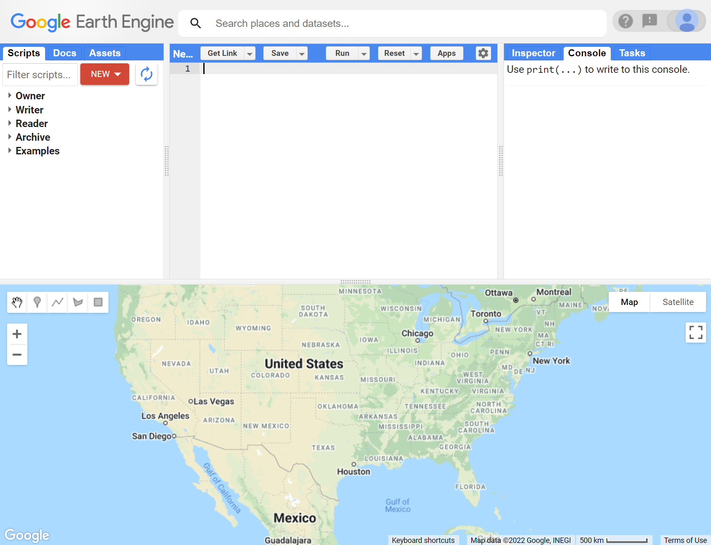
```

The Code Editor allows you to type JavaScript code and execute it. When you are first learning a new language and getting used to a new programming environment, it is customary to make a program to display your name or the words “Hello World.” This is a fun way to start coding that shows you how to give input to the program and how to execute it. It also shows where the program displays the output. Doing this in JavaScript is quite simple. Copy the following code into the center panel:

```{r eval=FALSE}
print('Hello World');
```

The line of code above uses the JavaScript `print()` function to print the text “Hello World” to the screen. Once you enter the code, click the __Run__ button. The output will be displayed on the upper right-hand panel under the __Console__ tab:

```{r PrintRun, fig.cap="Running code with GEE", echo=FALSE, message=FALSE}
knitr::include_graphics("images/PartI-PrintRun.PNG")
```

You now know where to type your code, how to run it, and where to look for the output. You just wrote your first Earth Engine script and may want to save it. Click the __Save__ button to save a script:

```{r Save, fig.cap="Saving a script", echo=FALSE, message=FALSE}
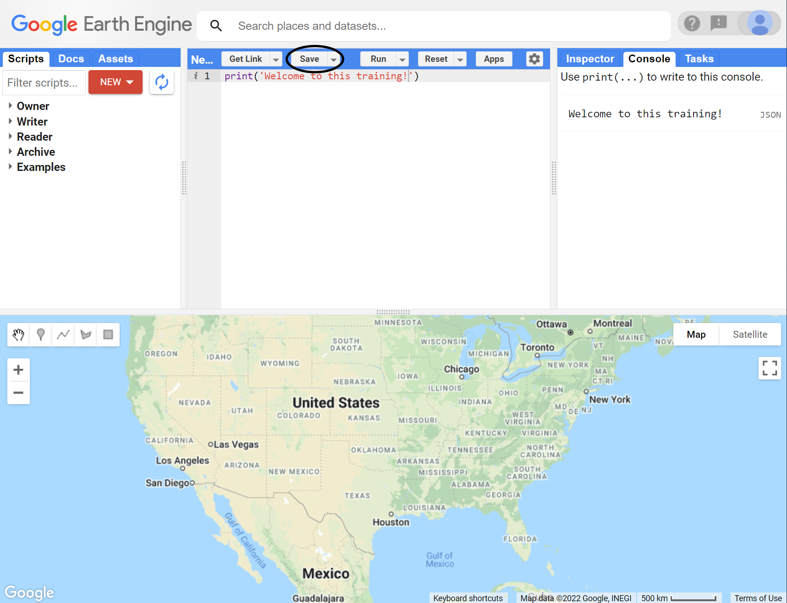
```

If this is your first time using the Code Editor, you will be prompted to create a home folder. This is a folder in the cloud where all your code will be saved:

```{r SaveII, fig.cap="Your first home folder", echo=FALSE, message=FALSE}
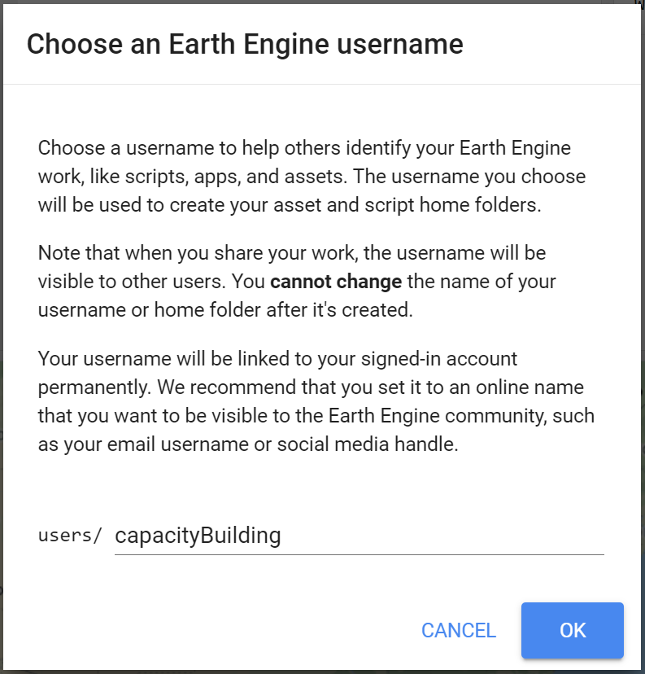
```

```{block, type='caution'}
You can pick a name of your choice, but remember that __it cannot be changed and will permanently be associated with your account__.
```

Once youre home folder is created, you will be prompted to create a *new repository*. A repository is a like a folder where you can save your scripts. You can also share entire repositories with other users. Your account can have multiple repositories and each one can hold multiple code scripts. Start by creating a repository:

```{r Repository, fig.cap="Your first repository", echo=FALSE, message=FALSE}
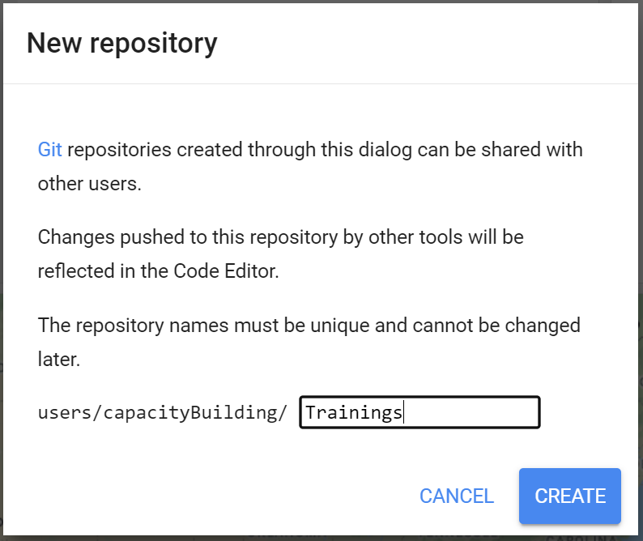
```

Finally, you will be able to save your script inside the newly created repository. Enter a name of your choice and click __OK__:

```{block, type='caution'}
Spaces are not allowed when naming scripts!
```

```{r SaveIII, fig.cap="Saving a script file", echo=FALSE, message=FALSE}
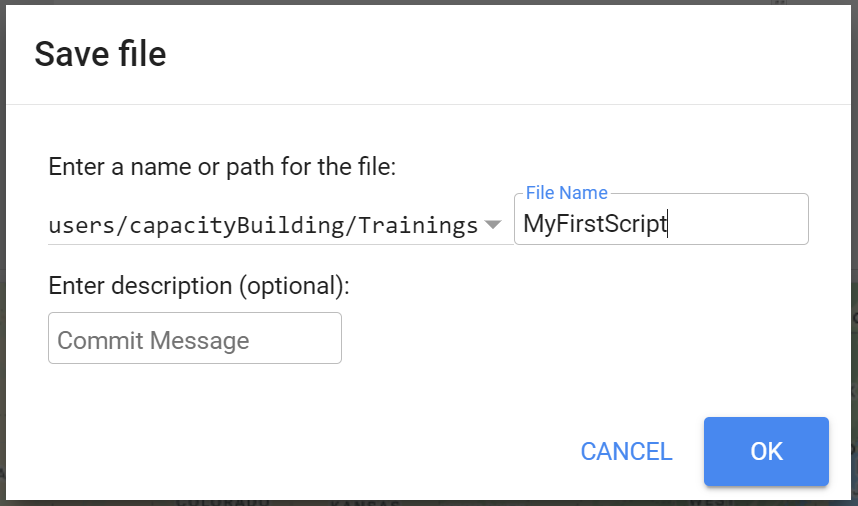
```

Once the script is saved, it will appear in the script manager panel. The scripts are saved in the cloud and will always be available to you when you open the Code Editor.

```{r Saved, fig.cap="Your first script in your repository", echo=FALSE, message=FALSE}
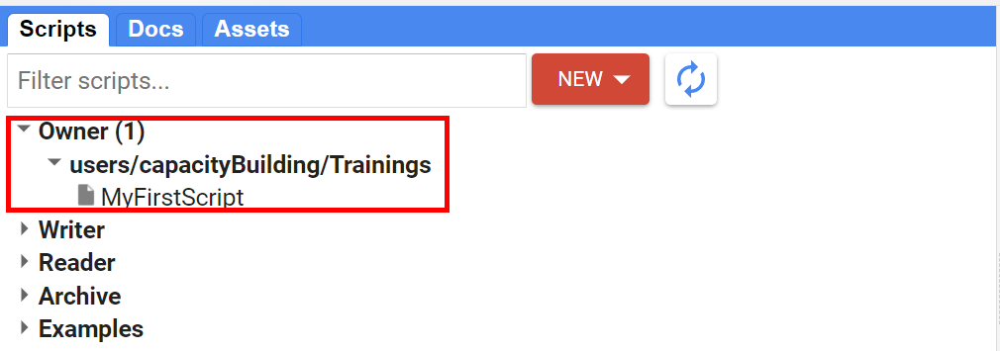
```

__JavaScript Basics: Data types__

Javascript is the language you will use to construct and set up your commands and analysis. This section covers the basics of the Java Script sintax and some basic data structures. In the following sections, more JavaScript code will be presented. Throughout this document, code will be presented with a distinct colored font and with shaded background. As you encounter code, copy and paste it into the Code Editor and click __Run__.

*___A) Variables___*

In a programming language, variables are used to store data values. In JavaScript, a variable is defined using the `var` keyword followed by the name of the variable. For instance, create a `var` named `city` that contain the text string `'Monrovia'`. Text strings in the code must be always in quotes. Google Earth Engine allows you to use single `'` or double `"` quotes, as long as they match in the beginning and end of the text string. We also usually end each statement on scripts with a semicolon `;`, although Earth Engine's code editor does not require it. A `i' will be shown in the line of the code where a semicolon is missing:

```{r Semicolon, fig.cap="Even though they are not a requirement, Google Earth Engine indicates that a semicolon is missing in the statement. You can hover the mouse cursor over the icon to reveal its meaning.", echo=FALSE, message=FALSE}

```

```{r eval=FALSE}
var city = 'Monrovia';
```

If you `print` the variable `city`, you will get the value stored (as a string because of the quotations) stored in the variable (Monrovia) printed in the __Console__.

```{r eval=FALSE}
print(city);
```

When you use quotations, the variable is automatically assigned the type *string*. You can also assign numbers to variables. For example, create the variables `population` and `area` and assing a number as their value. When assigning numbers, you do not use commas `,` for thousand separators. You do, however, use `.` for decimals:

```{r eval=FALSE}
var population = 939524;
var area = 194.25;
```

Print those variables to the __Console__. You can also add text to describe the variables printed in the __Console__. Simply add a text string within the `print` function along with the variable being printed separated with `,`. Use the code below as example:

```{r eval=FALSE}
print('Number of people in Monrovia:', population);
print(area, 'km squared');
```

*___B) Lists___*

In the previous examples, we created variables holding a single value (text or number). JavaScript provides a data structure called a *list* that can be used When you want to store multiple values in a single variable. You can create lists using square brackets `[]` and adding multiple values separated by `,`. Create a variable called `listofcities`, add values to it and print it to the __Console__:

``` {r eval=FALSE}
var listofcities = ['Monrovia', 'Gbarnga','Kakata', 'Bensonville'];
print('Largest cities in Liberia', listofcities);
```

Looking at the output in the __Console__, you will see `listofcities` with an expander arrow (▹) next to it. Expand the list by clicking on the arrow to show its content. You will notice that along with the items on the list, there will be a number next to each value you added. __This is the index of each item__. It allows you to refer to each item in the list using a numeric value that indicates its position in the list. This is useful when you want to extract a particular item from a list object.

```{r List, fig.cap="A JavaScript List.", echo=FALSE, message=FALSE}
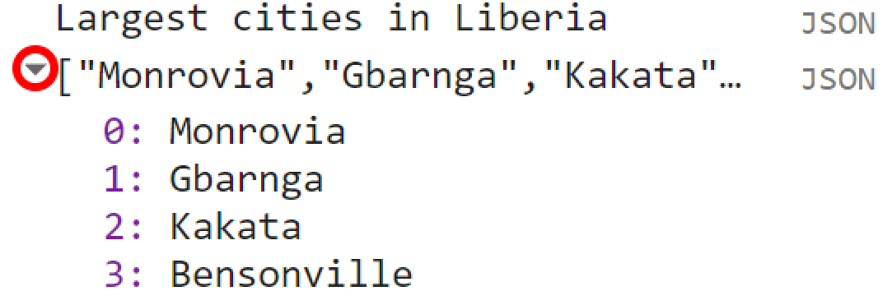
```

*___C) Objects and Dictionaries___*

While useful to hold multiple values, *lists* are not appropriate to hold more structured data. JavaScript allows you to store 'key-value' information in *objects* or *dictionaries*. In this type of data structure, you can refer to a value by its key rather than its position - like in *lists*. You can create objects using curly braces `{}`. Use the code below as an example of an object:

```{r eval=FALSE}
var cityData = {'city': 'Monrovia', 'population': 939524, 'area': 194.25, 'coordinates': [-10.790, 6.315]};
```

There are a few important things about the syntax of the code above: As objects tend to hold several keys and values, it can be difficult to read the code if it is written on a continuous string. To improve readability you can use multiple lines instead: 

```{r eval=FALSE}
var cityData = {
  'city': 'Monrovia',
  'population': 939524,
  'area': 194.25,
  'coordinates': [-10.790, 6.315]
};
```

Note how each key-value pair is on a different line. It is much easier to organize your key-value information this way. Additionally, the code can be more easily read.
Second, note that the object above can holds multiple types of types of values (string and numbers) and structure (list)!

If you print `cityData` to the __Console__, you can see that instead of a numeric index, each value will be identified by its *key*. 

```{r Dictionary, fig.cap="A JavaScript Object.", echo=FALSE, message=FALSE}
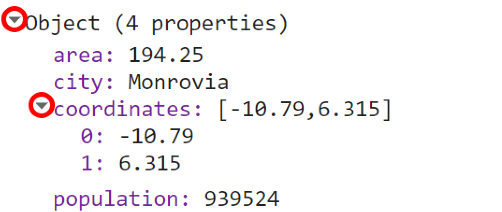
```

This key can also be used to retrieve the value of an item within an object or dictionary. If you want to retrieve a particular key from a dictionary, simply use `['key']`. For example, if you want to retrieve the population value from this object and print it individually to the __Console__, you can use a code like this:

```{r eval=FALSE}
print(cityData['population']);
```

The same logic can be applied to *lists*. Always remember that lists have numeric index. Therefore, when retrieving itens from a list, use the number of its position on the list:

```{r eval=FALSE}
print(listofcities['2']);
```

*___D) Functions___*

Functions are often used to group a set of operations and used to repeat the same operation with different set of parameters without having to rewrite the code for every iteration. In other words, you can call a function with different parameters to generate different outputs without changing the code.
Functions are defined using `function()`. They often take parameters which tell the function what to do. These parameters go inside the parentheses `()`. 
Below is an example of a function named `SumFunction` to calculate the sum of two numbers: `fistValue` and `secondValue`. The var `sum` adds those two parameters and `return` is used to generate the output of that operation

```{r eval=FALSE}
function SumFunction (firstValue, secondValue) {
  var sum = firstValue + secondValue;
  return sum;
}
```

Note that if you run the code above, nothing happens. This is just a function and it needs to be given the parameters. For example, if you need to add 37 to 584 using this function and print the result into the __Console__, you can use the code below:

```{r eval=FALSE}
var result = SumFunction(37,584);
print(result);
```

When you call `SumFunction`, it will always perform the operation `sum` with watever two parameters you define in `()`.
As mentioned, you can perform several operations at once using functions. For example, you can add other operations in the function above and return
a list or a dictionary with the results: 

```{r eval=FALSE}
function MathFunction (firstValue, secondValue) {
  var sum = firstValue + secondValue;
  var sub = firstValue - secondValue;
  var fraction = firstValue / secondValue;
  return {'Result Sum':sum, 'Result Substraction':sub, 'Result Division': fraction};
}
```

Using `MathFunction` with a pair of parameters (`firstValue` and `SecondValue`) will return an object with the results of each operation:

```{r eval=FALSE}
var results = MathFunction(500,5);
print(results);
```

```{r Results, fig.cap="Printed results of MathFunction.", echo=FALSE, message=FALSE}
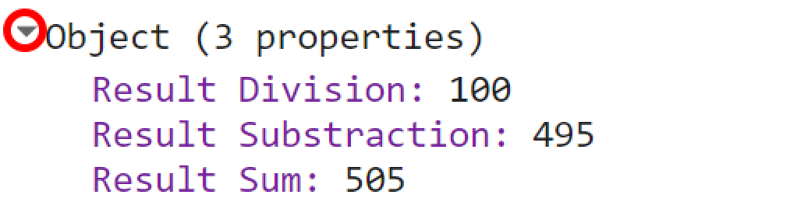
```

__Earth Engine Containers and Objects__

So far, you learned the different data structure/types you can use within Google Earth Engine. However, if you want to do any computation with the data stored in these different types of structure, you will have to use an Earth Engine container. The `ee` package is used for formulating requests to Earth Engine. In other words, `ee` (prefix for Earth Engine) allows you to request Earth Engine servers to perform a certain computation to an variable or object. Each `ee` object has many different *methods*. You can think of *methods* as the many different things and computations that can be done for an specific object. In the Code Editor, you can switch to the __Docs__ tab to see the API functions grouped by object types.

```{r Docs, fig.cap="List of available objects in the Docs tab of GEE API.", echo=FALSE, message=FALSE}
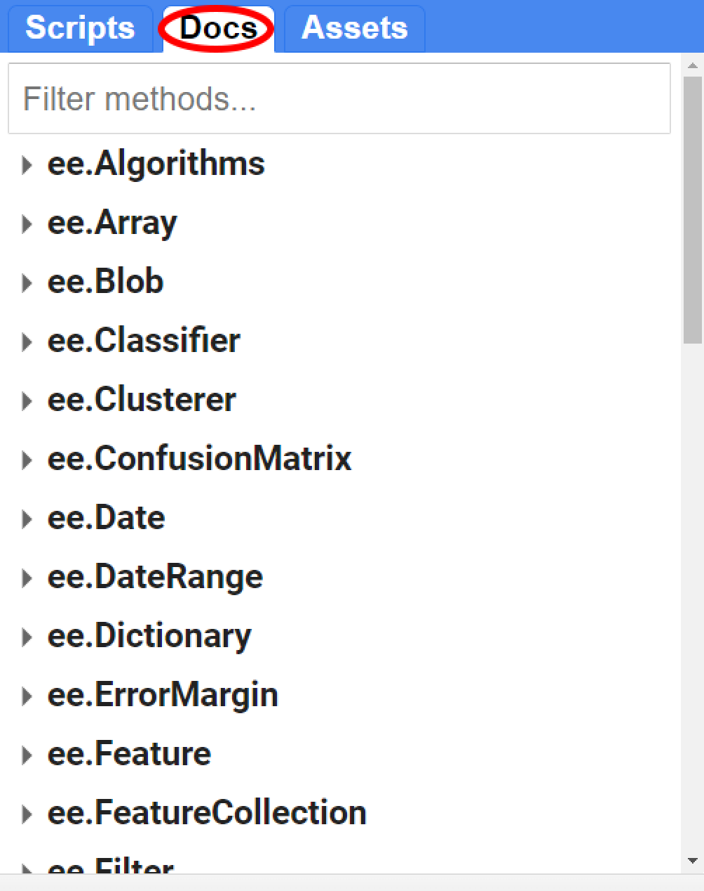
```

Below are some examples to ilustrate the concept behind an Earth Engine object:

*__A) Strings__*

You can put strings into a `ee.String` object to be sent to Earth Engine. Using an object/container allows you to do manipulate them in many different ways. For example, `ee.String` has the:
* `toLowerCase()` method. This method will convert any string in a `ee.String` object to lower case;
* `length()` method. This method will count the characters in your string;
* `cat()` method. This method will concatenate two strings into one;
* and many others! Make sure to check the __Docs__ tab for all the available methods for a given object.

The code below uses some of the methods of `ee.String` as an example:

```{r eval=FALSE}
var string = ee.String('HELLO EVERYONE, ');
print(string.toLowerCase());
print(string.length());
var string2 = ee.String('nice to meet you');
print(string.cat(string2));
```
In your console tab you will see that the 'HELLO EVERYONE, ' string is now all in lower case. You will also see that `.length()` returned 16 as the number of characters for that string.

Consider the code below:

```{r eval=FALSE}
var string = 'HELLO EVERYONE';
var string2 = 'nice to meet you';
print(string.cat(string2));
```

If you try to use a method on a non `ee` object, you will get an error. 

```{r Error, fig.cap="Trying to use a method on non-ee.Object will return an error", echo=FALSE, message=FALSE}
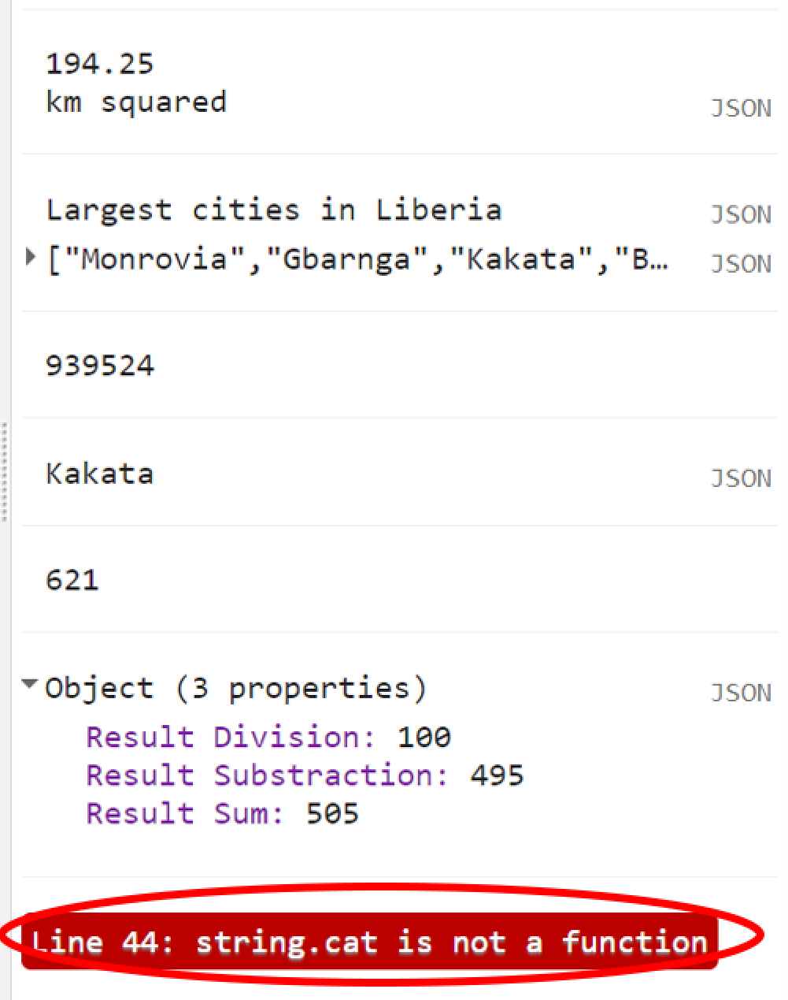
```

*__B) Numbers__*

`ee.Number` is just another example of an object from that list. Similarly to `ee.String`, it will have many methods to be used with. For example, `.add()`, `.subtract()`, `.divide()` and `.multiply ()` will perform  these operations on `ee.Number` objects. Make sure to consult the __Docs__ tab for all the different methods for each object.

```{r eval=FALSE}
var value1 = ee.Number(100);
var value2 = ee.Number(2);
print(value1.add(value2));
print(value1.subtract(value2));
print(value1.divide(value2));
print(value1.multiply(value2));
print(value1.log10());
```

*__B) Lists__*

You can also make a JavaScript list into an `ee.List` on Earth Engine server by simply casting your list into the container. There are many other useful methods to use when you have an `ee.List`. For instance, instead of making a JavaScript list by typing each value, you can use `ee.List.sequence()` to construct a list. This method will take many arguments, such as the value of the start of the list, the value at the end of the list, steps (increment) and count. Consider the examples below:

* Making a list with numbers from 0 to 10:
```{r eval=FALSE}
print('List 1', ee.List.sequence(0,10))
```
* Making a list from 0 to 10 with increments of 2:
```{r eval=FALSE}
print('List 2', ee.List.sequence(0,10,2))
```

```{block, type='rmdcomment'}
__Remember__: A `var string = 'text'` is a JavaScript string that does not allow computations. A `var string = ee.String('text')` is an Earth Engine object that allows computations!
```

### Exploring Image and Image Collection

Now that you learned the basics of JavaScript and Earth Engine objects, you have the tools at your disposal to start using the Earth Engine API to build scripts for remote sensing analysis. In this section, we explore satellite imagery, which are one of GEE's core capabilities!

*__A) Single band image__*

The first thing you need to know is that when working with images in Earth Engine, you will have to use an `ee.Image()` container. The argument provided to the constructor is the string ID of an image in the Earth Engine data catalog. (Remember to always see the __Docs__ tab for a full list of arguments to this container). To retrieve an image ID, you can search in the Earth Engine catalog using the search tool at the top of the Code Editor:

```{r Search, fig.cap="You can browse through Earth Engine's data catalog with the search tool", echo=FALSE, message=FALSE}
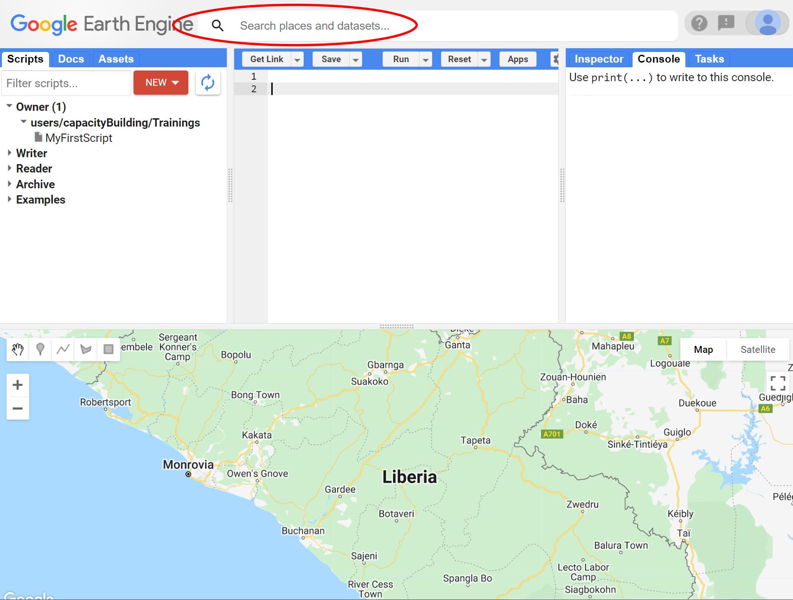
```

For example, try typing 'elevation' into the search field and note that a list of rasters is returned:

```{r SearchII, fig.cap="Typing in the search field. Google Earth Engine will show all datasets available with that criteria.", echo=FALSE, message=FALSE}
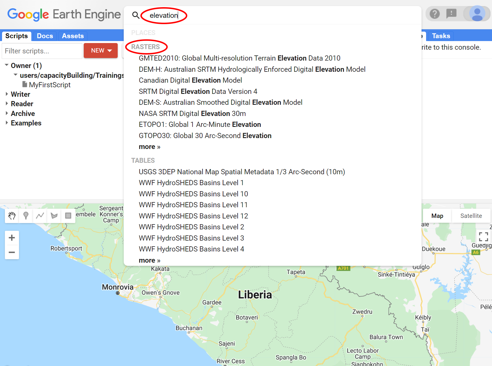
```

Click in any of the dataset entries to see more information about that dataset. From the list above, explore the dataset 'SRTM Digital Elevation Data Version 4'. You can also find more information about this dataset on the tabs on the top right side of the dataset description screen. On the left side of the dataset description screen, you can find the Image ID, which is what we use with the `ee.Image()`. Alternatively, you can use the __Import__ button on the dataset description. Using the __Import__ button, a variable is automatically created in a special section, named 'Imports', at the top of your script. You can rename the variable by clicking on its name in the imports section.

```{r DataInfo, fig.cap="Data description", echo=FALSE, message=FALSE}
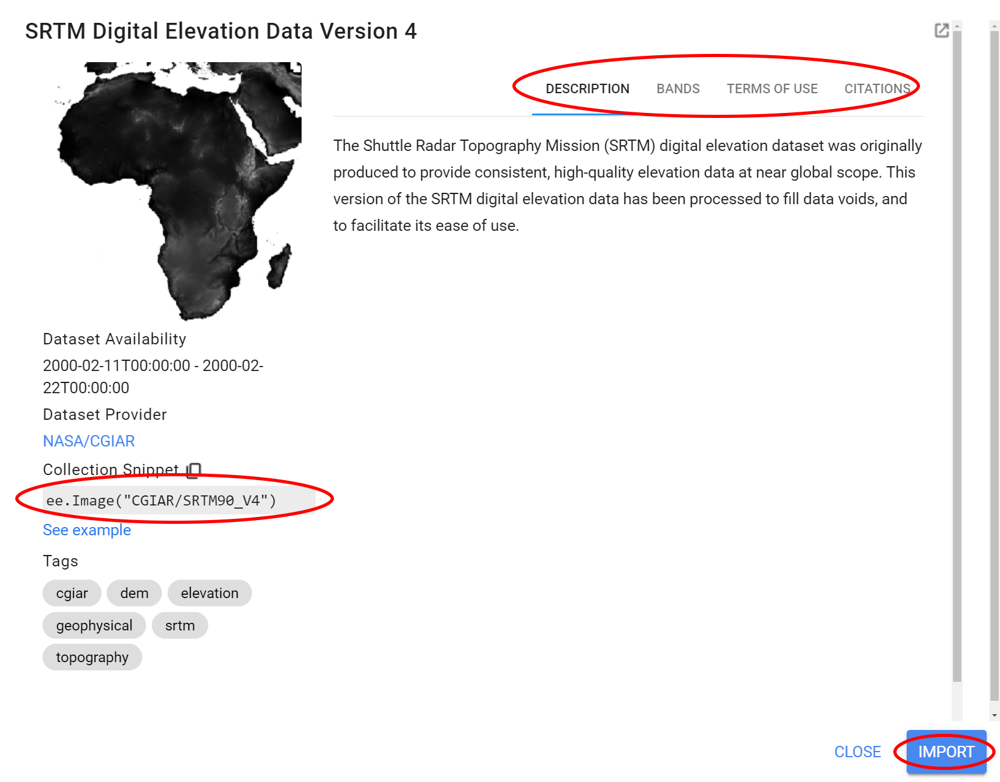
```

Copy the image ID from the screen above and add it to a `var` elevationImage with the `ee.Image()` container as shown below:

```{r eval= FALSE}
var elevationImage = ee.Image('CGIAR/SRTM90_V4');
```

You can also retrieve the metadata about this image by using `print()`. In the __Console__, click the expander arrows to show the information. You will discover that the SRTM image has one band called 'elevation'.

```{r eval= FALSE}
print(elevationImage);
```

```{r ImageInfo, fig.cap="Image description using `print()`", echo=FALSE, message=FALSE}
knitr::include_graphics("images/PartI-ImageInfo.png")
```

To display the image in the Map Editor, use the `Map` object's `.addLayer()` method. When you add an image to a map using `Map.addLayer()`, Earth Engine needs to determine how to map the values in the image band(s) to colors on the display. If a single-band image is added to a map - which is our case- by default Earth Engine displays the band in grayscale, where the minimum value is assigned to black, and the maximum value is assigned to white. If you don't specify what the minimum and maximum should be, Earth Engine will use default values.

```{r eval= FALSE}
Map.addLayer(elevationImage);
```

*Do not worry! You can make it look better with custom visualization parameters!*

To change the way the data are stretched, you can provide another parameter to the `Map.addLayer()` call. Specifically, the second parameter, `visParams`, lets you specify the minimum and maximum values to display. One way of gauging the range of values of an image is by activating the __Inspector__ tab and click around on the map. You will be able to see the value of that band for this dataset at that particular location:

```{r Inspector, fig.cap="Inspector tab. Click in the image and the inspector tab will display the data for that point", echo=FALSE, message=FALSE}
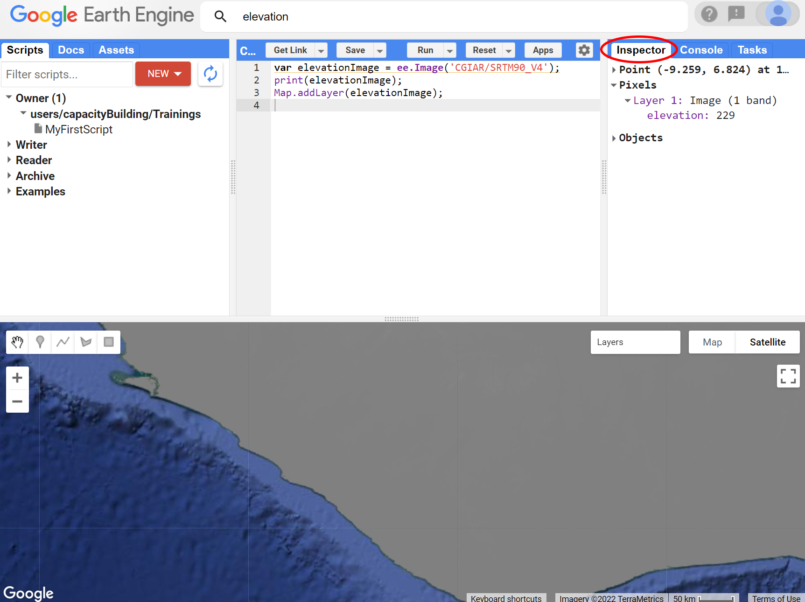
```

Click around the area of Liberia to have a sense of the range of values for this dataset. Suppose that, through further investigation, you determine that the best range of values to display elevation data in Liberia is [0,1000]. To display the data using this range, you can use a dictionary containing two keys: `min` and `max` and their respective values `0` and `1000`. A third parameter for `Map.addLayer()` is the name of the layer that is displayed in the Layer manager. Thus your code should be looking like the one below:

```{r eval= FALSE}
Map.addLayer(elevationImage, {min:0, max:1000}, 'Custom Visualization');
```

Run the code and you will see something like:

```{r ImageVis, fig.cap="Custom Visualization for the SRTM data based on range of values", echo=FALSE, message=FALSE}
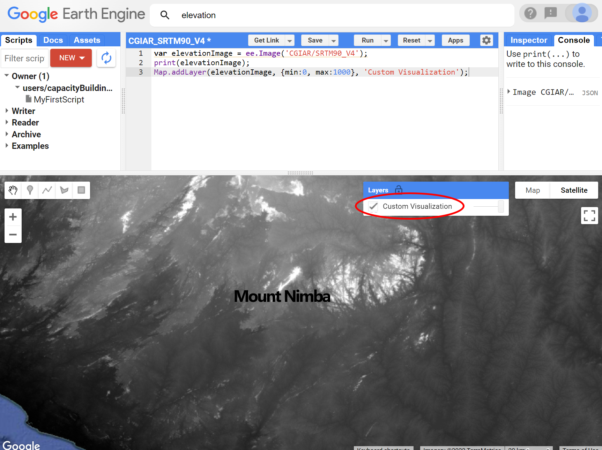
```


## Image Manipulation

### Band Math and VI Calculation

### Thresholds and Masks