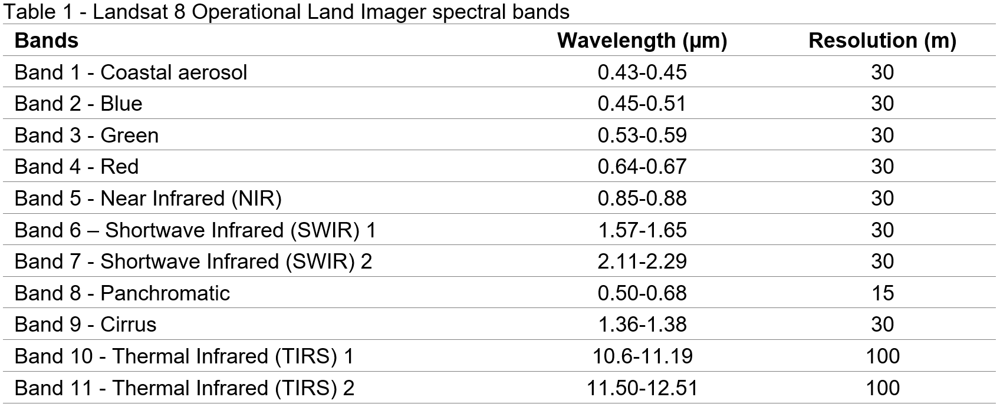

# Auxiliary functions

Objective: Here we aim to provide the initial functions and lines of code to assist the user to prepare, process and analyze Landsat 8/7 data for classification purposes.

## Cloud and cloud shadow masking
```{block, type='rmdcomment'}
[*Section Snapshot at GEE*](https://code.earthengine.google.com/cd7747671a8a2d411ae86afd1aebf084){target="_blank"}
```

This section demonstrates a way of masking clouds and cloud shadow pixels from Landsat 8/7 Surface Reflectance data based on file metadata. This function was created based on the documentation available for Landsat 8/7. Values for pixel bit and pixel band were found [*here.*](https://www.usgs.gov/core-science-systems/nli/landsat/landsat-collection-1-level-1-quality-assessment-band?qt-science_support_page_related_con=0#qt-science_support_page_related_con){target="_blank"}

The cloud masking function is as follows:
```{r eval=FALSE}
function maskL8sr(image) {
  // #Bits 3 and 5 are cloud shadow and cloud, respectively.
  var cloudShadowBitMask = ee.Number(2).pow(3).int();
  var cloudsBitMask = ee.Number(2).pow(5).int();
  // #Get the pixel QA band.
  var qa = image.select('pixel_qa');
  // #Both flags should be set to zero, indicating clear conditions.
  var mask = qa.bitwiseAnd(cloudShadowBitMask).eq(0)
      .and(qa.bitwiseAnd(cloudsBitMask).eq(0));
  // #Return the masked image, scaled to [0, 1].
  return image.updateMask(mask).divide(10000).copyProperties(image, ["system:time_start"]);
};
```

## Spectral Indices

This section demonstrates how to calculate and add spectral indices to each scene of a Landsat 8 image collection. The function below calculates and add spectral indices to an image collection taking into account the Landsat 8 spectral bands and their respective wavelengths:

```{r my-fig,  echo=FALSE, message=FALSE}

```

The function used to calculate several commonly used spectral indices follows this format:
```{r eval=FALSE}
var addIndicesL8 = function(img) {
  //# NDVI (Normalized Difference Vegetation Index)
  var ndvi = img.normalizedDifference(['B5','B4']).rename('NDVI');
  //# NDMI (Normalized Difference Mangrove Index - Shi et al 2016 )
  var ndmi = img.normalizedDifference(['B7','B3']).rename('NDMI');
  //# MNDWI (Modified Normalized Difference Water Index - Hanqiu Xu, 2006)
  var mndwi = img.normalizedDifference(['B3','B6']).rename('MNDWI');
  //# SR (Simple Ratio)
  var sr = img.select('B5').divide(img.select('B4')).rename('SR');
  //# Band Ratio 6/5
  var ratio65 = img.select('B6').divide(img.select('B5')).rename('R65');
  //# Band Ratio 4/6
  var ratio46 = img.select('B4').divide(img.select('B6')).rename('R46');
  //# GCVI (Green Chlorophyll Vegetation Index)
  var gcvi = img.expression('(NIR/GREEN)-1',{
    'NIR':img.select('B5'),
    'GREEN':img.select('B3')
  }).rename('GCVI');
   return img
    .addBands(ndvi) //# The .addBands will add each spectral index to each Landsat scene
    .addBands(ndmi)
    .addBands(mndwi)
    .addBands(sr)
    .addBands(ratio65)
    .addBands(ratio46)
    .addBands(gcvi);
};
```

Note that the function above shows several ways of doing band math operations. First, normalized difference indices can be calculated using `img.normalizedDifference`. For more intricate expressions, You can use the expression format as shown with the Green Chlorophyll Vegetation Index example.

```{r my-fig2, echo=FALSE, message=FALSE}
knitr::include_graphics("images/AttentionL7Bands.PNG")
```

```{block, type='caution'}
__IMPORTANT:__ The function above is also applicable to Landsat 7 image collections. However, be mindful that these sensors have slightly different bands and wavelengths. Therefore, the name of the bands on the above function for each spectral index will not match Landsat 7’s spectral bands. Make sure to select the appropriate Landsat 7 spectral band for each spectral index. Use Table 2 for reference.

```


```{r my-fig3, echo=FALSE, message=FALSE}

```

## Compositing
```{block, type='rmdcomment'}
[*Section Snapshot at GEE*](https://code.earthengine.google.com/2e97616e22317b07d3885130a5af7e1e){target="_blank"}
```

In the previous sections, we learn two useful functions: cloud masking and spectral indices calculation. In this section, we will learn about compositing and mosaicking Landsat scenes. In the next chapter, we will use all three functions covered in here to produce a cloud-free mosaic of Landsat 8 scenes and how to perform a random forest classification. 

You can composite any object containing an image collection using on a per-pixel, per- band basis using `.median()` or using quality bands such as ‘NDVI’ with `.qualityMosaic(‘NDVI’)`. The `.median()` will composite all the images in the collection to a single image using the median values of each band, at the pixel level; `.qualityMosaic(‘NDVI’)` will composite all the images in the collection and set each pixel in the composite based on which image in the collection has a maximum value for the specified band, in this case NDVI.

Although there are different methods for compositing, the median composite method is the state of the art in Google Earth Engine and it has been widely used in classification and change analysis studies. For instance, it was used in a [recent publication](https://doi.org/10.1016/j.jag.2018.11.014){target="_blank"} of September 2019 mapping cropland extent over southeast and northeast Asia using Landsat 8 and GEE. Median was also the compositing method chosen in [this study](https://doi.org/10.1016/j.rse.2017.05.025){target="_blank"} to showcase GEE’s array-based computational approach. The authors of this [study](https://doi.org/10.3390/rs8080681){target="_blank"} mapping land cover change in Namibia also used median composities in their analysis. The same approach was used [here](https://doi.org/10.1080/2150704X.2016.1182659){target="_blank"} to produce a land cover map for the entire Southeast Asia and [here](https://doi.org/10.1371/journal.pone.0184926){target="_blank"} to map land cover and land cover change over continental Africa. 

Additionally, methods such as maximum NDVI would present issues, especially over cloudy areas. As you composite using maximum values of NDVI, water bodies will be completely covered by clouds in the resulting composite as clouds have slightly higher NDVI than water. A second cleaning or compositing procedure would be necessary to avoid this issue over water bodies, which in this case is not ideal.

```{r my-fig4, fig.cap="Median (left) and Maximum NDVI (Greenest Pixel) (right) composites of Landsat 8 images over Lake Piso in Liberia. Clouds have slightly higher NDVI than water. Therefore, cloudy pixels over water bodies often occur with this compositing method.", echo=FALSE, message=FALSE}
knitr::include_graphics("images/CompositesEx.PNG")
```