# PART 2 - Advanced Google Earth Engine

## Advanced Image Manipulation: Pre-classification

In this section we will provide functions and lines of code to assist the user to prepare, process and analyze Landsat 8 data for classification purposes.

### Cloud and cloud shadow masking

This sub-section demonstrates a way of masking clouds and cloud shadow pixels from Landsat 8 Surface Reflectance Collection 2 data based on file metadata. You may have noticed when exploring Landsat images in the __Console__ tab that these images have a band called `QA_PIXEL` or *Quality Assessment* band. Briefly, this band contains values that represent bit-packed combinations of surface, atmospheric, and sensor conditions that can affect the overall usefulness of a given pixel. One of the many bits represented in this band is *cloud* (bit 3) and *cloud shadow* (bit 4):

```{r QA, fig.cap="Landsat's Quality Assessment (QA) band.", echo=FALSE, message=FALSE}
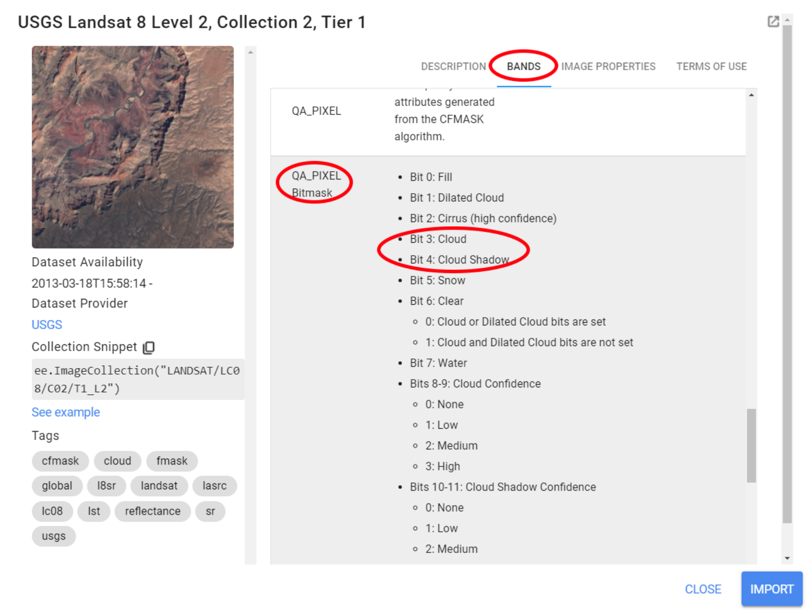
```

In essence, these values indicate which pixels might be affected by surface conditions such as cloud contamination. Therefore, this band can be used to construct filters to mask (or remove) pixels flagged as 'affected' by that condition. Here, we will provide a function for masking clouds and cloud shadow from Landsat 8 images based on the information stored in the *Quality Assessment* band. This function was created based on the documentation available for Landsat 8. Values for pixel bit and pixel band were found [*here.*](https://www.usgs.gov/core-science-systems/nli/landsat/landsat-collection-1-level-1-quality-assessment-band?qt-science_support_page_related_con=0#qt-science_support_page_related_con){target="_blank"}

The cloud masking function is as follows:

```{r eval=FALSE}
function maskClouds(image) {
  var cloudShadowBitMask = ee.Number(2).pow(3).int();
  var cloudsBitMask = ee.Number(2).pow(4).int();
  var QA = image.select('QA_PIXEL');
  var mask = QA.bitwiseAnd(cloudShadowBitMask).eq(0)
      .and(QA.bitwiseAnd(cloudsBitMask).eq(0));
  return image.updateMask(mask).divide(100000).select("SR_B[0-9]*").copyProperties(image, ["system:time_start"]);
}
```

Do not worry about the new methods within this function. What you need to know is that this function was constructed in a way that we are selecting the `QA_PIXEL` band from the Landsat image and creating a mask where only pixels flagged to 0 (indicating clear conditions) for bits 3 and 4 will be included; The function will return `image` - in this case the Landsat 8 image - masked for pixels that are not flagged 0 for bits 3 and 4. The `.divide()` was used simply to scale the band values to [0,1] and `.select()` to only select the spectral bands from Landsat (SR_B1-9). These steps are not necessary for the cloud masking to work! However, we can add these extra steps to further improve our image collection.


Now, to apply a function to every image in an image collection, we use the `.map()` method from the `ee.ImageCollection()` object. You can refer to the __Docs__ tab for more information on the methods available for `ee.ImageCollection()`. The only argument to `map()` is a function which takes one single parameter: an `ee.Image()`. Using `.map(maskClouds)` over an image collection will result in a collection where every image is masked for clouds and cloud shadows. 

To illustrate this, we will apply `maskClouds` over `collection` (created in the previous chapter) along with the same temporal and spatial filters to recreate `collectionFiltered`. Feel free to use your previous chapter's script and simply add `.map()` to the collections using the code below as an example:

```{r eval=FALSE}
var collection = ee.ImageCollection('LANDSAT/LC08/C02/T1_L2');
var startDate = '2022-01-01';
var endDate = '2022-04-30';

var collectionFilteredMasked = collection.filterBounds(aoi)
                                   .filterDate(startDate,endDate)
                                   .map(maskClouds);
```

Now, we will create a max value composite and compare it to the previous composite created with an image collection that __was not masked for clouds and cloud shadows__:

```{r eval=FALSE}
var compositeMax = collectionFilteredMasked.max();
Map.addLayer(compositeMax, {bands: ['SR_B4', 'SR_B3', 'SR_B2'], min:0, max:0.25}, 'Composite Max Value');
```

```{r CompositesMasked, fig.cap="A maximum value composite created with an image collection masked by clouds compared to a composite created using an unmasked collection.", echo=FALSE, message=FALSE}
knitr::include_graphics("images/PartII-CompositesMasked.png")
```

As mentioned in the previous chapter, a maximum value composite will likely highlight clouds as they are very reflective. However, by removing the cloud pixels from the images based on the Quality Assessment band information, the resulting maximum value composite greatly improves.

### Spectral indices

In the previous sub-section, we presented a function to mask cloud and cloud shadows from Landsat image collections. A function can also be created to perform band math to every image in an image collection. Building on the concepts of vegetation indices presented on the previous chapter, we will create a function that will calculate several vegetation indices for Landsat 8 images. You will recognize the NDVI and EVI indices from the previous chapters. This function includes other commonly used spectral indices to highlight features like open water, moisture, vegetation and soil:

* NDVI - Normalized Difference Vegetation Index;
* NBR - Normalized Burn Ratio;
* NDMI - Normalized Difference Mangrove Index;
* MNDWI - Modified Normalized Difference Water Index;
* SR - Simple Ratio;
* BI - Bare soil Index;
* GCVI - Green Chlorophyll Vegetation Index;
* EVI - Enhanced Vegetation Index, and;
* MSAVI - Modified Soil-Adjusted Vegetation Index.

```{r eval=FALSE}
function addIndices(image) {
  var ndvi = image.normalizedDifference(['SR_B5','SR_B4']).rename('NDVI');
  var nbr = image.normalizedDifference(['SR_B5','SR_B7']).rename('NBR');
  var ndmi = image.normalizedDifference(['SR_B7','SR_B3']).rename('NDMI');
  var mndwi = image.normalizedDifference(['SR_B3','SR_B6']).rename('MNDWI');
  var sr = image.select('SR_B5').divide(image.select('SR_B4')).rename('SR');
  var bare = image.normalizedDifference(['SR_B6','SR_B7']).rename('BI');
  var gcvi = image.expression('(NIR/GREEN)-1',{
    'NIR':image.select('SR_B5'),
    'GREEN':image.select('SR_B3')
  }).rename('GCVI');
  var evi = image.expression(
  '2.5 * ((NIR-RED) / (NIR + 6 * RED - 7.5* SR_BLUE +1))', {
    'NIR':image.select('SR_B5'),
    'RED':image.select('SR_B4'),
    'SR_BLUE':image.select('SR_B2')
  }).rename('EVI');
  var msavi = image.expression(
  '(2 * NIR + 1 - sqrt(pow((2 * NIR + 1), 2) - 8 * (NIR - RED)) ) / 2', {
    'NIR': image.select('SR_B5'), 
    'RED': image.select('SR_B4')}
).rename('MSAVI');
    return image
    .addBands(ndvi)
    .addBands(nbr)
    .addBands(ndmi)
    .addBands(mndwi)
    .addBands(sr)
    .addBands(evi)
    .addBands(msavi)
    .addBands(gcvi)
    .addBands(bare);
}
```

The `.addBands()` method is used to include an `ee.Image()` as a band to an existing image. Therefore, this function will calculate each index and include them as extra bands to every image in the image collection. 

As in the previous sub-section, we can use `.map()` to map this function over `collection`:

```{r eval=FALSE}
var collectionFilteredwithIndex = collection.filterBounds(aoi)
                                   .filterDate(startDate,endDate)
                                   .map(maskClouds)
                                   .map (addIndices);
```

Then we will create median composite based on this new collection. We will add it to the __Map Editor__ and will use the __Inspector__ tab to explore its band values at a given location:

```{r eval=FALSE}
var compositeMedian = collectionFilteredwithIndex.median();
Map.addLayer(compositeMedian, {bands: ['SR_B4', 'SR_B3', 'SR_B2'], min:0, max:0.25}, 'Composite Median');
```

You can toggle the data view from chart to values with the chart/value view button:

```{r VIS, fig.cap="A median composite created from the `collectionFilteredwithIndex` image collection. The function `addIndices` was used to calculate each index and add them as separate bands to every image in the collection. In this example, the spectral bands and spectral index values for a pixel at an arbitrary location within `compositeMedian`. You can toggle between the chart view and value view using the chart button (red circle).", echo=FALSE, message=FALSE}
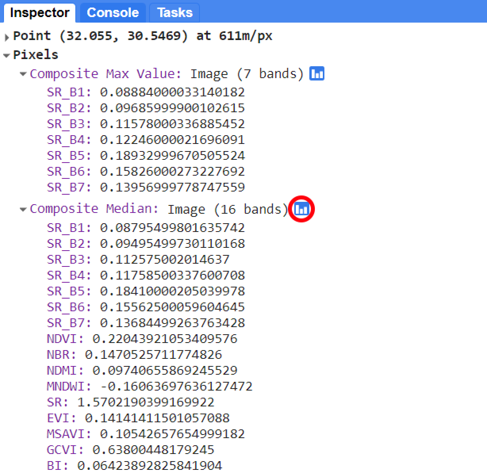
```

## Supervised Classification using Random Forest

As seen in Part 1, *Interpretation and Analysis* is one of the building blocks of any remote sensing system (see \@ref(fig:FigBuildingBlocks)).
Image classification is one of the many methods of image processing and it is the sole focus of this training material. So far, you have learned the basics of Java Script and Google Earth Engine and some pre-processing steps to perform an image classification using the Random Forest (RF) Classifier. Briefly, classifier is an ensemble of classification trees, where each tree contributes with a single vote for the assignment of the most frequent class to the input data. Different from Decision Trees, which use the best predictive variables at the split, RF uses a random subset of the predictive variables. To illustrate this concept, we will use a rather simplistic example:

Suppose you were given this list of attributes from three edible fruits:

```{r fruit, fig.cap="Simplistic list of predictive variables from three types of fruits.", echo=FALSE, message=FALSE}
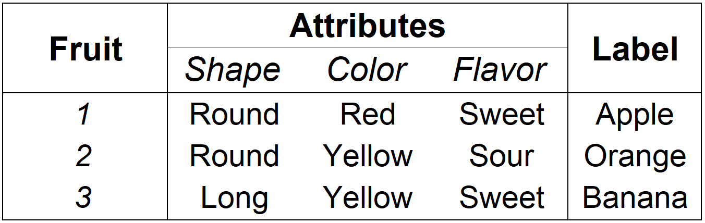
```

A random forest classifier can be created (or trained) using the sample above as a training sample set:

```{r RF, fig.cap="A Machine Learning Random Forest Classifier with 3 trees trained with the sample set above. Note that algorithm was able to 'learn' about each fruit separate them based on their attributes.", echo=FALSE, message=FALSE}
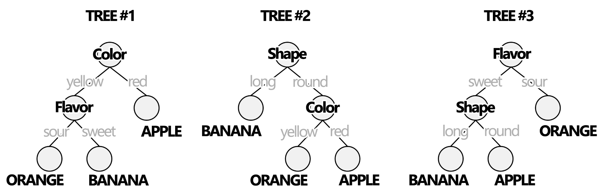
```

You can test this classifier and its accuracy using a testing sample set. A testing set is usually a subset of the training set that will be used only for testing the performance of the trained classifier. These testing samples will be run through each tree of the ensemble and the accuracy of the classifier will be based on whether or not it was able to classify that sample correctly:

```{r RFTesting, fig.cap="Testing a trained Random Forest Classifier. A testing sample is used to assess whether or not the classifier is able to correctly classify them. In this example, this sample was correctly classified by 2 out of the 3 trees in the ensenble.", echo=FALSE, message=FALSE}
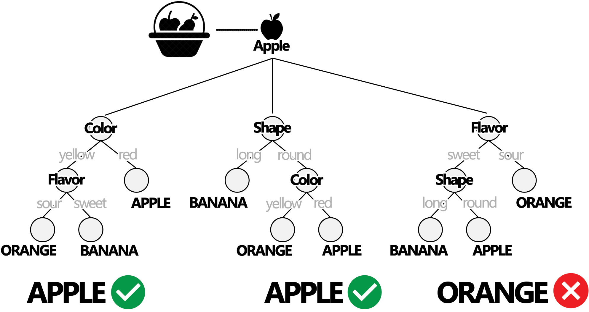
```

You can then classify unlabeled samples using the trained classfier. The final classification of a sample is based upon the majority of the votes of the trees in the ensemble:

```{r RFClass, fig.cap="The trained RF classifier is used to classify an unlabeled fruit sample. In this case, the majority of the votes (2 out of 3) was BANANA. Therefore, the final classification of this sample is BANANA.", echo=FALSE, message=FALSE}
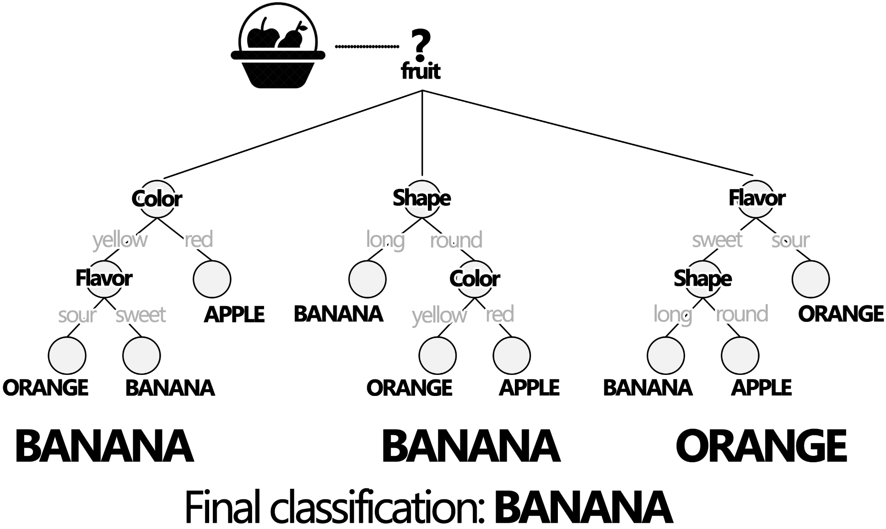
```

Even though this is a rather simplistic example, it can be easily translated into a land cover classification context: Instead of fruits, each unit being classified is a __Landsat image pixel__. Each pixel from each land cover class will contain different __spectral attributes__. These spectral attributes will be used at each branch of the trees in the ensemble. We can then used a trained Random Forest classifier to label hundreds of thousands Landsat pixels into different land cover classes. The RF is one of the most used and robust classifiers and it is fully implemented in GEE. In the following examples we will present the steps for land cover classification using the RF classifier and present some basic analysis that can be done using the classification output.

### Example 1: Land cover classification of Greater Cairo and Giza area, Egypt - Year 2022

The general steps for an image classification process with Landsat image is:

a) To use a cloud-masking function to mask clouds on Landsat 8 Imagery;

b) To calculate spectral indices that will be used as predictors for the Random Forest;

c) To produce a cloud-free composite mosaic using the median reducer, and;

d) To select training samples;

e) To classify the cloud-free composite mosaic of Landsat 8 scenes using Random Forest.

In this example we will classify the median composite (`compositeMedian`) created in the previous section. You can find the code for creating it [here.](https://code.earthengine.google.com/f6d329bb7a6dcec10609c118e0af57e7){target="_blank"}

```{block, type='rmdcomment'}
You have the option to classify the entire scene or clip it to an area of interest. You can create a geometry `AreaOfInterest` and clip your composite using `.clip(AreaOfInterest)`. You can also customize the composite visualization parameters by clicking on the settings icon (gear \u2⚙) next to the layer name (in this example: 'Composite Median')
```

So far, we have covered the steps *__a__*, *__b__* and *__c__*. 

* __Training sample selection__

For this example, let’s classify the 'composite' into four classes: *water*, *agricultural land*, *sand and bare areas* and *urbanization*. The first step is to create the training samples set to use into the Random Forest Model.

__Step 1__ - In the Geometry Imports, click *__+new layer__* and make four sets of geometries, each set will represent samples from the classes 'water', 'cropland', 'sand' and 'urban'.

```{r my-figGeom,   fig.cap="Geometry sets to hold samples for each of the four classes.", echo=FALSE, message=FALSE}
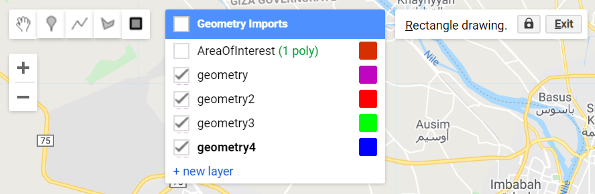
```

__Step 2__  - For each geometry in the list, click on the settings icon⚙: name them accordingly using the 'Name' box, choose a color for it using the color picker and import each geometry as *FeatureCollection*. Add a property called *landcover* by clicking on the *__+ Property__* and set a consecutive integer starting from 0 or 1 for each of the classes. You should achieve something similar to this:

```{r my-figGeom2,   fig.cap="Geometries used to create the training sample sets.", echo=FALSE, message=FALSE}
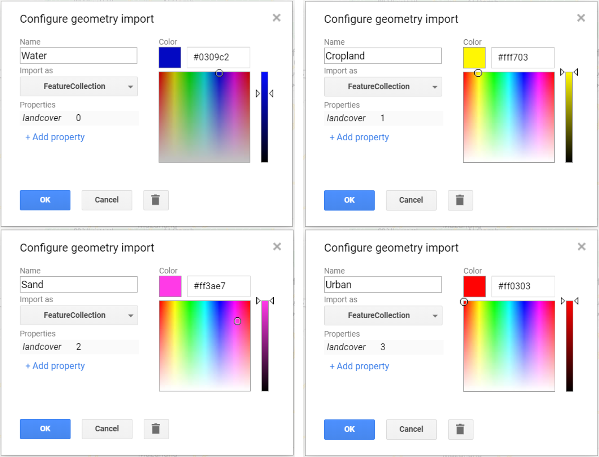
```

Your Geometry Imports should look like this:

```{r my-figGeom3,   fig.cap="Geometry Imports after creating geometry sets to hold training samples", echo=FALSE, message=FALSE}
knitr::include_graphics("images/Geo3.PNG")
```

Start selecting samples by clicking on the ‘Water’ geometry in the Geometry Imports. Choose the point drawing tool and place some points along the River Nile:

```{block, type='starcomment'}
Take advantage of the high resolution imagery to help you select samples for each class. You can toggle in between map and Google Earth imagery by using the buttons *__Map__* and *__Satellite__* in the upper right corner of the Map Editor. You can also toggle the Landsat composite ON and OFF by using the layer manager.
```

Instead of single points (i.e pixels), we can also use polygons containing a variable number of relatively homogenous pixels of a given land cover class. Switch to the polygon drawing tool and draw a few polygons over the River Nile:

```{r my-figNile,   fig.cap="Sample points and polygons for the Water class", echo=FALSE, message=FALSE}
knitr::include_graphics("images/Nile.PNG")
```

```{block, type='starcomment'}
Once you finish selecting samples, click the *__Exit__* button on the polygon editor dialogue box . 
Repeat the process for each of the other class. Make sure you select samples that are representative of each land cover class by selecting points and polygons of homogenous pixels.
```


```{r my-figAllSamples,   fig.cap="Example of sample points and polygons for ‘Water’ (blue), ‘Cropland’ (yellow), ‘Urban’ (red) and ‘Sand’ (pink). Each pixel within the polygons will be used as training inputs for the RF classifier.", echo=FALSE, message=FALSE}
knitr::include_graphics("images/AllSamples.PNG")
```

After selecting the samples, we will merge all the geometries together into an object var classes using the `.merge` method of the `ee.FeatureCollection() object`:

```{r eval=FALSE}
var classes = Water.merge(Cropland)
                   .merge(Sand)
                   .merge(Urban);

```

[Code Checkpoint](https://code.earthengine.google.com/0666bce96ffb1bd350cfc738f7b2aeab){target="_blank"}

* __Sample sets__

In this section, we will create the training (and testing) sample sets to be used in the classification with Random Forest. First, we will select the predictors to assign to each sample point in the sample sets. For this example, we will create a list 'bands' with the names of three spectral bands (`'SR_B4'`,`'SR_B5'`,`'SR_B6'`) and the spectral indices (`'NDVI'`,`'NBR'`,`'MNDWI'`,`'SR'`,`'GCVI'` and `'MSAVI'`).

```{r eval=FALSE}
var bands = ['SR_B4','SR_B5','SR_B6','NDVI','NBR','MNDWI','SR','GCVI','MSAVI'];
```

Next, we will sample the Landsat pixels by overlaying the geometries with the composite using `.sampleRegions()`. The main arguments of this method is the image to sample (in this case, `compositeMedian`), the regions to sample over (in this case, `classes`) and the list of properties to copy from each geometry (in this case __landcover__):

```{r eval=FALSE}
var samples = compositeMedian.select(bands).sampleRegions({
  collection: classes,       
  properties: ['landcover'],
  scale: 30                  
}).randomColumn('random');
```

In the `samples` object we have just created, each sample will include a column with the values from the list `bands` inherited from the `compositeMedian` and a column with their respective class label. Optionally, you can perform an accuracy assessment of the classifier by taking advantage of the identifiers assigned to the samples by the `.randomColumn('random')` within `samples`. This method adds a column to the feature collection populated with random numbers in the range of 0 to 1.
For this example, we will randomly partition the sample set into `training` (80% of the samples) and `testing` (20% of the samples) samples by filtering the samples by its random number column using the lower (`.lt`) and greater than or equal (`.gte`) filters:

```{r eval=FALSE}
var split = 0.8;
var training = samples.filter(ee.Filter.lt('random', split));
var testing = samples.filter(ee.Filter.gte('random', split));
```

For your information, you can inspect the size of a `ee.FeatureCollection` using the `.aggregate_count()` method. This method only takes a property of the feature collection being counted as its argument. In this case, we have a property called 'landcover' in our feature collection.
`.aggregate_count()` It is a useful tool to extract the number of features on your sample set: 

```{r eval=FALSE}
print('Samples n =', samples.aggregate_count('landcover'));
print('Training n =', training.aggregate_count('landcover'));
print('Testing n =', testing.aggregate_count('landcover'));
```

```{block, type='rmdcomment'}
If a feature collection do not have a property defined, you can still count its feature by using `'.all'` as an argument for `.aggregate_count()`.
```

Using the split value above, roughtly 80% of the features in `samples` will be `training` and 20% will be in `testing`:

```{r my-fig39,   fig.cap="Sample sets size for this example. Note that the number will vary based on the number of geometries (polygons and points) and the sample split value.", echo=FALSE, message=FALSE}
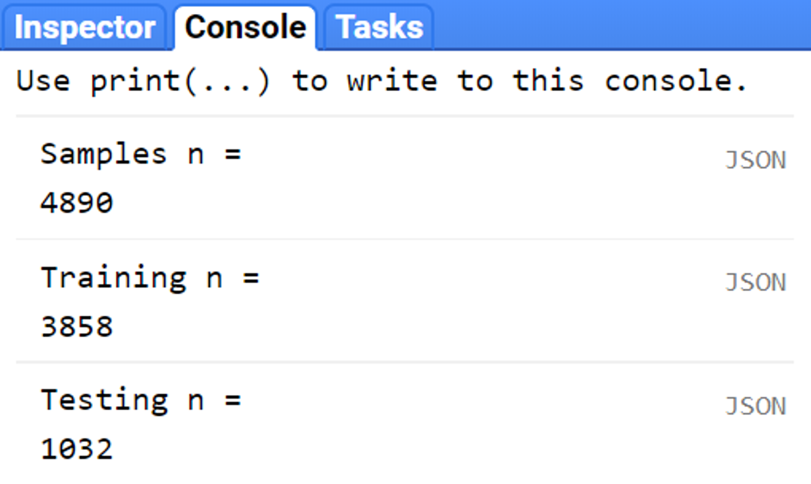
```

* __Classification__

Next, we will train a Random Forest classifier using the training sample set `training`. The Random Forest classifier `ee.Classifier.smileRandomForest` has several user-defined parameters. However, two of them are the most usually defined: the number of trees in the ensemble (a.k.a ‘forest’) and the number of predictors to randomly tested at each tree. Predictors, in this case, are the spectral bands and spectral indices associated to each training sample. If unspecified, it uses the square root of the number of predictors.

```{block, type='caution'}
__Higher number of trees and number of predictors tested at each node do not mean better performance and overall accuracy__.
```

For this example, we will use `200` trees and `8` randomly selected predictors to use in each tree and train Random Forest model called 'classifier' using the `.train()` method on the `.ee.Classifier.smileRandomForest()`:

```{r eval= FALSE}
var classifier = ee.Classifier.smileRandomForest(100,5).train({
  features: training,
  classProperty: 'landcover', 
  inputProperties: bands
});
```

In the `features` argument of the code above, make sure to select the predictors you want to use from the sample set (in this example, `training`) to train the model. In this case we are providing all of them. However, if you want to select a particular group of variables, you can use `.select(['variableName1','variableName2',..])`. Also, you must include the class property (`classProperty`) in which the class label is stored (in this example `'landcover'`).

You can test the accuracy of classifier by classifying the `testing` samples using `.classify()` method. Then, you can compute a 2D error matrix for the classified testing samples using `.errorMatrix()`. This method  will output an `ee.ConfusionMatrix()` object by comparing the two columns of the classified testing samples: one containing the actual labels (in our case, the property called 'landcover'), and one containing predicted values by the classifier (which defaults to 'classification'). Finally, you can use `.accuracy()` method of the `ee.ConfusionMatrix()` object to compute the overall accuracy of the classifier:

```{r eval=FALSE}
var validation = testing.classify(classifier);
var testAccuracy = validation.errorMatrix('landcover', 'classification');

print('Validation error matrix RF: ', testAccuracy);
print('Validation overall accuracy RF in %: ', testAccuracy.accuracy().multiply(100));
```

As explained earlier, the trained classifier can be used to classify the `compositeMedian`. Google Earth Engine will run each pixel through each of the 200 trees in the classifier and assing it the label which had the majority of votes among all the tree:

```{r eval=FALSE}
var classification = compositeMedian.select(bands).classify(classifier);
```

For visualization of the resulting classification output, we will create a color palette object `paletteMAP` with a list of colors for each class of the map. The order of the colors in the palette will follow the order of the classes:

```{r eval=FALSE}
var paletteMAP = [
  '#0040ff',  // Water (Class value 0)
  '#00ab0c',  // Croplands / Cultivated Areas (Class value 1)
  '#fbf2ad',  // Sand and bare areas (Class value 2)
  '#878587'   // Built-up and Urban Areas (Class value 3)
];
```

Finally, we will add `classification` to the map using `Map.addLayer()`: use `min: 0` (first class), `max: 3` (last class), add the color palette `paletteMAP` and a name for the layer:

```{r eval=FALSE}
Map.addLayer (classification, {min: 0, max: 3, palette:paletteMAP}, 'Classification');
```

After several seconds, you should see something similar to the figure below:

```{r ClassificationResult,   fig.cap="Random Forest classification output for 2022.", echo=FALSE, message=FALSE}
knitr::include_graphics("images/PartII-ClassificationResult.PNG")
```

[Code Checkpoint](https://code.earthengine.google.com/0444f1f7cc9783f36f6f6cb9626713c5){target="_blank"}

As an optional step, you can export your classification output as a Google Earth Engine asset. You can save geospatial datasets and analysis outputs into your Google Earth Engine account through the __Assets__ tab and the left side of the code Editor. 

```{r Assets,   fig.cap="Assets manager. Your Google Earth Engine account will be able to host around 200GB worth of assets. Externally imported assets as well as datasets exported from Earth Engine scripts will be found here.", echo=FALSE, message=FALSE}
knitr::include_graphics("images/PartII-Assets.PNG")
```

```{block, type='starcomment'}
You can also upload external datasets into your Google Earth Engine Assets with the __NEW__ button. (See Earth Engine's [Importing Raster Data](https://developers.google.com/earth-engine/guides/image_upload){target="_blank"} for instructions on uploading an image to your assets or [Importing Table/Shapefile Data](https://developers.google.com/earth-engine/guides/table_upload){target="_blank"} for more details).
```


We will export `classification` with the `Export.image.toAsset()` method. This method takes  a dictionary with several parameters such as:

* `image`: the image object you want to export;

* `description`: a description to be showing on the __Task__ tab. No spaces allowed;

* `assetId`: A name for your asset. No spaces allowed;

* `scale`: A scale to export;

* `region`: the region or area of your `image` you want to export. It takes a geometry/ feature collection;

* `maxPixels`: This is somewhat important argument. In order to avoid memory errors, the Earth Engine detault is 1x10e8 pixels. If you do not define your max pixels and your exports exceeds the default, you will get an error.  

We will create a geometry 'region' to encompass the entire classified scene in order to export the entire area. The code below will export the classification:

```{r eval=FALSE}
Export.image.toAsset({
  image: classification,
  description: 'ClassificationOutput', 
  assetId: 'Cairo2022',
  scale: 30,
  region: region,
  maxPixels:1e12
});
```

Running the code above, will create the exporting task named *__ClassificationOutput__* in the __Tasks__ tab. 

```{r Tasks,   fig.cap="Tasks manager.", echo=FALSE, message=FALSE}
knitr::include_graphics("images/PartII-Tasks.PNG")
```

Clicking the __Run__ button will start exporting your classification. You can check some of the parameters of the `Export.image.toAsset()` one more time before exporting the asset. You are allowed to change some of these parameters at this point. For our example, everything will follow the parameters we defined previously.

```{r ExportingAssets,   fig.cap="Tasks manager: Image Export.", echo=FALSE, message=FALSE}
knitr::include_graphics("images/PartII-ExportingAsset.PNG")
```

The time elapsed of your exporting task will be shown in the __Tasks__ tab.

```{r TimeElapsed,   fig.cap="Once a task has started the time elapsed will be shown in the __Tasks__ tab.", echo=FALSE, message=FALSE}
knitr::include_graphics("images/PartII-TimeElapsed.PNG")
```

I may take several minutes to export your classification image to your assets. 
Once your task is completed, it will be shown at the __Task__ tab as:

```{r Exported,   fig.cap="Exported asset.", echo=FALSE, message=FALSE}
knitr::include_graphics("images/PartII-Exported.PNG")
```

Finally, your export will be available as an Earth Engine asset:

```{r ExportedAsset,   fig.cap="Assets will be available through the __Assets__ tab. If they are not showing, try refreshing the folder with the refresh button.", echo=FALSE, message=FALSE}
knitr::include_graphics("images/PartII-FirstAsset.PNG")
```


### Example 2: 2015 - 2022 Map-to-Map change of greater Cairo and Giza area, Egypt

In this example, we will use the codes from *__Example 1__* to create a land cover classification for the year 2015 period. Following are the changes to be made on the codes from *__Example 1__*:

a)	The `year` object will have a value of `'2015'`;
d)	Repeat the training sample selection to make sure the samples reflect the correct land cover class for the L8 composite in the year 2015.

```{block, type='rmdcomment'}
You can access the edited script for two steps above [here.](https://code.earthengine.google.com/f2291692f2d12a7d6d80813e0436bad9){target="_blank"}
```

After following the 2 steps above, you should achieve a similar output as before:

```{r Cairo2015,   fig.cap="Random Forest classification output for 2015.", echo=FALSE, message=FALSE}
knitr::include_graphics("images/PartII-Cairo2015.PNG")
```

Export this new classification to you assets. Next, [open a new code editor page](https://code.earthengine.google.com/){target="_blank"} and add the classification exports to this script by clicking the *__Import into script__* button (blue arrow) for both classification assets in the __Assets__ tab: 

```{r imports,   fig.cap="Assets tab with classification maps. Clicking in the __Import into script__ button will add the assets to the script.", echo=FALSE, message=FALSE}
knitr::include_graphics("images/PartII-Imports.PNG")
```

Finally, rename each import by clicking on their names at the *__Imports__* header:

```{r importsheader,   fig.cap="Imports header. You can rename imported assets by clicking on its name.", echo=FALSE, message=FALSE}
knitr::include_graphics("images/PartII-ImportsHeader.PNG")
```

Alternatively, you can import assets to your scripts by using `ee.Image()` and their respective asset directory. For this example, you can use:

```{r eval=FALSE}
var Cairo2015 = ee.Image("users/capacityBuilding/Cairo2015");
var Cairo2022 = ee.Image("users/capacityBuilding/Cairo2022");
```

Add `Cairo2015` and `Cairo2022` to the map using the code below:

```{r eval=FALSE}
var paletteMAP = [
  '#0040ff',  // Water - pixel value = 0
  '#00ab0c',  // Croplands / Cultivated Areas - pixel value = 1
  '#fbf2ad',  // Sand and bare areas - pixel value = 2
  '#878587',  // Built-up and Urban Areas - pixel value = 3
];

Map.addLayer(Cairo2015, {min: 0, max: 3, palette:paletteMAP}, 'Cairo2015');
Map.addLayer(Cairo2022, {min: 0, max: 3, palette:paletteMAP}, 'Cairo2022');
```

You can examine both layers on the map and try to identify areas where classes have changed in the 7 years period. However, we can use a transition error matrix to quickly quantify these changes. This matrix can be used to assess how much each class has changed and to what they have changed based on sampling design of your choosing. To do that, we will start by stacking both maps `Cairo2015` and `Cairo20222` into a single object `stackedClassifications` and rename Cairo2015 and Cairo2022 as `'before'` and `'later'`, respectively:

```{r eval=FALSE}
var stackedClassifications = Cairo2018.rename('later').addBands(Cairo2000.rename('before'));
```

Next, we will create a testing sample set with 1000 points for each class using a stratified random sampling design.
In this sampling design each class has the same weight. Therefore, the same number of points will be placed in each class, regardless of its relative extent. This is important to consider as some classes may have very small area extent to be captured by a random sampling design. In this example, water bodies is relatively small compared to the other three land cover classes. Thus, a stratified sampling design will ensure that this class will have the same number of points. We can used `.stratifiedSample()` method. This method takes  a dictionary with several parameters such as:

* `numPoints`: Number of points you want to select by each class;

* `classBand`: The classification you want the sample points to inherit the class labels from;

* `scale`: Always remember to set the scale to match Landsat nomimal spatial resolution (30 m)

```{block, type='rmdcomment'}
Always remember to check the __Docs__ tab for more information on the parameters each method takes!
```

Using the information above, a stratified sample set can be created as following:

```{r eval=FALSE}
var samples = stackedClassifications.stratifiedSample({
numPoints: 1000,        
classBand: "before",   
scale: 30,             
geometries: true
});
```

Once the points are placed, they will inherit the class label (pixel value) from `Cairo2015` (`'before'`):

We can add the samples to the map using `Map.addLayer()`. To colorize geometries, you use  the `color` paramenter instead of `palette`:

```{r eval=FALSE}
Map.addLayer(samples, {color:'black'}, 'Stratified samples');
```

```{r StratSamples,   fig.cap="Stratified samples. 1000 samples were randomly selected within each strata (class).", echo=FALSE, message=FALSE}
knitr::include_graphics("images/PartII-StratSamples.PNG")
```

Next, we will create a transition matrix using the samples above. This matrix will show how many of these 1000 remained the same land cover class 7 years later (`Cairo2022`) and how many of them changed to a given class. You can use `.accuracy()` to calculate the % of these samples remained unchanged between the two periods:

```{r eval=FALSE}
var transitionMatrix = samples.errorMatrix({
  actual: 'before',
  predicted: 'later'
});

print('Transition Matrix', transitionMatrix);
print('% of Unchanged Samples: ', transitionMatrix.accuracy().multiply(100));
```

The matrix will be printed to the *__Console__* tab. The code above should produce something similar to figure below:

```{r matrix,   fig.cap="Transition matrix based on the 4000 (1000 for each class) samples.", echo=FALSE, message=FALSE}
knitr::include_graphics("images/PartII-Matrix.PNG")
```

In the transition matrix above you can draw information about how many samples transitioned to each class from 2015 to 2022. For example, from the 1000 samples of agriculture class (pixel value 1), 4 was classified (or ‘transitioned’) to water, 8 to sand and 53 to urban areas in 2022. 935 of them remained unchanged. Overall, 87% of these samples from all classes remained unchanged.

* __Cropland area expansion and conversion in the Nile Delta from 2015-2022__

Another quick analysis that can be done with land cover class maps in two points in time is highlighting areas in which a particular class has changed. In this example, we will assess the cultivated/cropland change between the 2015 and 2022. First, we will isolate the agricultural land class (pixel value `1`) from both years into separate objects `class2015` and `class2022` using the `.select()` and `.eq()` methods. Secondly, we will calculate the change by simply subtracting both objects:

```{r eval=FALSE}
var class2015 = Cairo2015.select(['classification']).eq(1);
var class2022 = Cairo2022.select(['classification']).eq(1);
var change = class2022.subtract(class2015);
```

By default, the new objects `class2015` and `class2022` will have values of 1 where the `'classification'` has the label equals (`.eq`) to 1 (agriculture) in the land cover map. __This will be the case regardless of the label value__. By using the `.select()` and `.eq()`, the new image object will default to value of 1 where that condition was met. Thus, the object `change` will have values of `-1`, `0` and `1`, that represents loss/conversion, no change and gains, respectively: 

* `-1` = No crops in 2022 - crops in 2015 (0 - 1 = -1);

* `0` = crops in 2022 - crops in 2015 (1 - 1 = 0);

* `1` = crops in 2022 - no crops in 2015 (1 - 0 = 1)

We will add `change` to the map.

```{r eval=FALSE}
var paletteCHANGE = [
  'red',    // Loss/conversion
  'white',  // No Change
  'green',  // Gain/Expansion
];

Map.addLayer(change, {palette: paletteCHANGE}, 'Change 2015-2022');
```

The resulting change map will look similar to figure below. Green pixels represent 'gains' while red pixels represent 'conversions':

```{r change,   fig.cap="Subset of the 2015-2022 Change Map. Conversion/loss of classifiedagricultural areas.", echo=FALSE, message=FALSE}
knitr::include_graphics("images/PartII-Change.PNG")
```

This code can easily be used to investigate the other classes as well. Simply change the class value within `.select(['classification']).eq(classValueHere)`.

In the example below, we changed the value from `1` to `3` to highlight the expansion of urban/built up areas. 

```{r change2,   fig.cap="Subset of the 2015-2022 Change Map. Expansion of the future capital of Egypt, New Cairo City.", echo=FALSE, message=FALSE}
knitr::include_graphics("images/PartII-Change2.PNG")
```

You can calculate the area of expansion/conversion by isolating the pixels of gain/loss from the `change` object into `gain` and `loss`. Then, calculate the area of each pixel using `ee.Image.pixelArea()` and multiplying by the count of pixels in `gain` and `loss` using `multiply`. The default unit is square meters (m²). You can use `.divide()` to transform into square kilometers (`.divide(1000000)`) or hectares (`.divide(10000)`):

```{r eval=FALSE}
var gainArea = gain.multiply(ee.Image.pixelArea().divide(1000000));
var lossArea = loss.multiply(ee.Image.pixelArea().divide(1000000));
```

These objects will hold the area calculation for a single pixel. Then, we can use `.reduceRegion()` method, from the `ee.Image()` container. This will apply a reducer to all the pixels in a specific region. This method will take the `reducer` parameter, which will contain the type of mathematical operation you wish to compute for all these pixels. In this case, we will use `ee.Reducer.sum()`, to sum up all the single area values for all the pixels within `gainArea` and `lossArea`:

```{block, type='starcomment'}
Make sure to create a geometry around an area of interest in order to calculate the area (extent) for the pixels of a given class within that geometry! In this example, we used a geometry around New Cairo City called 'AOI'.
```

```{r eval=FALSE}
var statsgain = gainArea.reduceRegion({
  reducer: ee.Reducer.sum(), // Sum of all the area values.
  scale: 30,                 // Landsat scale.
  geometry: AOI,
  maxPixels: 1e14
});

var statsloss = lossArea.reduceRegion({
  reducer: ee.Reducer.sum(),
  scale: 30,
  geometry: AOI,
  maxPixels: 1e14
});
```

Finally, you can print these values using the code below:

```{r eval=FALSE}
print(statsgain.get('classification'), 'km² of new built up areas in New Cairo City'); 
```

```{r AreaCairo,   fig.cap="Subset of the 2015-2022 Change Map. Expansion of the future capital of Egypt, New Cairo City. The `.reduceRegion()` method was used to calculate the extent of gains for the urban/built up class. Finally `print()` was used to print the result to the __Console__ tab. ", echo=FALSE, message=FALSE}
knitr::include_graphics("images/PartII-AreaCairo.PNG")
```

## Post-classification processing

So far you have learned the basics of creating a classification output using a machine learning algorithm such as Random Forest. The objective of this section is to provide useful post-classification steps for corrections and general improvement of a random forest classification output.

### Re-classification

Classification outputs often times will need some degree of correction or adjustment. Some of these corrections and adjustments include, for example, the Correction for missclassification erros in specific areas and changing class labels (pixel values) or class order. In this section we will explore the function `remap()`. This function maps from input values to output values, represented by two parallel lists: one includes the original number of classes and their value; the other represents which class (or classes) is being remapped and what it is being remapped to. 
To ilustrate this concept, consider the following example:

- The previously produced land cover maps include four classes: Water (pixel value = 0), Cropland / Cultivated Areas (pixel value = 1), Sand and bare areas (pixel value = 2) and Built-up and Urban Areas (pixel value = 3) (List 1). If any of these class values needs to be changed, the new value for that class is placed in the *List 2*, in the position of the class that needs changing (Figure 1).

```{r my-remap,  fig.cap="The `remap` function for the land cover classification of the Greater Cairo. ", echo=FALSE, message=FALSE}
knitr::include_graphics("images/remap.png")
```

To test this function, start by [opening a new code editor page](https://code.earthengine.google.com/){target="_blank"} and importing one of the classification assets you used [in the previous section][Example 1: Land cover classification of Greater Cairo and Giza area, Egypt - Year 2022]. In this example, we will importe the latest land cover map from the year 2022 as a variable called 'Cairo2022' and we will add it to the map editor using the same color scheme from `paletteMAP` used in the previous section:

```{r eval=FALSE}
var Cairo2022 = ee.Image("users/capacityBuilding/Cairo2022");
var paletteMAP = [
  '#0040ff',  // Water
  '#00ab0c',  // Croplands / Cultivated Areas
  '#fbf2ad',  // Sand and bare areas
  '#878587',  // Built-up and Urban Areas
];

Map.centerObject(Cairo2022);
Map.addLayer(Cairo2022, {min: 0, max: 3, palette:paletteMAP}, 'Cairo2022');
```

```{block, type='starcomment'}
Using `Map.centerObject()` will center the map view on a given object you click the __Run__ button. It is always a good practice to set the center on your main object so you can always come back to it! In this example you can center the map view to your classification object `Cairo2022`.
```

Now, to illustrate the `.remap()` method, let's consider the following scenarios:

*__Scenario 1__

A new version of the `Cairo2022` map where *__Sand and bare areas (pixel value = 2)__* and *__Built-up and Urban Areas (pixel value = 3)__* switch orders in the final map. In this case, we can use the `.remap()` method to change the pixel value of *Built-up and Urban Areas* to __2__ and *Sand and bare areas* to __3__ in their respective position on list 2:

```{r my-remap2,  fig.cap="Sand (2) and Cities (3) changing orders in the image output using `.remap` ", echo=FALSE, message=FALSE}
knitr::include_graphics("images/remap2.png")
```

As a guide, the figure above can be used to create a new variable `CairoV1` with the new order for the classes using `.remap()`:

```{r eval=FALSE}
var CairoV1 = Cairo2022.remap([0,1,2,3],[0,1,3,2]);
```

Add the `CairoV1` to the the map using the original color scheme `paletteMAP`:

```{r eval=FALSE}
Map.addLayer(CairoV1, {min: 0, max: 3, palette:paletteMAP}, 'Cairo V1');
```

```{r my-CairoV1,  fig.cap="`Cairo2022` and `CairoV1` maps using the original `paletteMap`. Note that Sand and bare areas and Built-up and Urban areas switched colors as we switched their order.  ", echo=FALSE, message=FALSE}
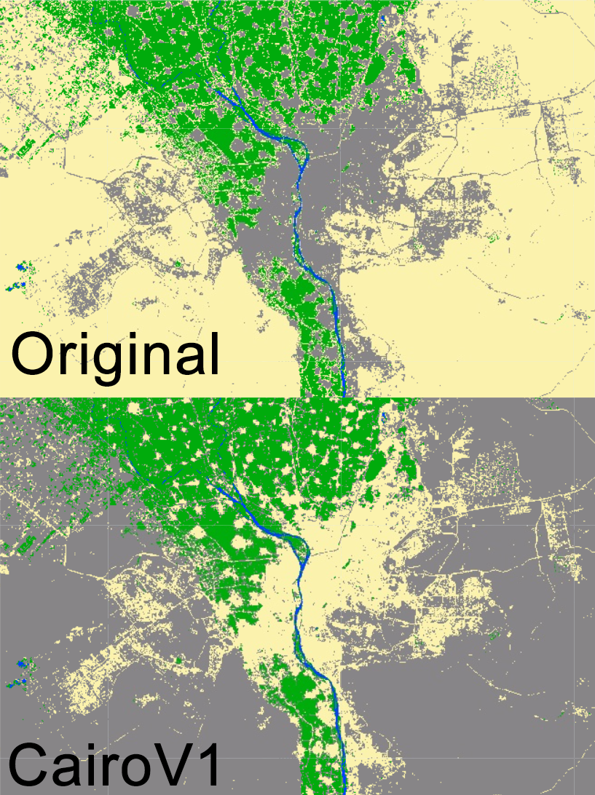
```

*__Scenario 2__

A new version of the `Cairo2022` map where *__Sand and bare areas (pixel value = 2)__* and *__Built-up and Urban Areas (pixel value = 3)__* are merged into a new class called *__Barren land and Articicial Surfaces (pixel value = 2)__*. Note that this new class can assume any value when merging, as long as both classes have the same value: 

```{r my-remap3,  fig.cap="Sand and bare areas merging with Built-up and Urban area into a new class value (2). New classes can assume any value when merging, as long as these values are the same for both classes.", echo=FALSE, message=FALSE}
knitr::include_graphics("images/remap3.png")
```

For this example, we will keep the value *__2__* for this new class in a new variable `CairoV2` for the new map:

```{r eval=FALSE}
var CairoV2 = Cairo2022.remap([0,1,2,3],[0,1,2,2]);
```

We will add the `CairoV2` to the the map using the original color scheme `paletteMAP`.

```{r eval=FALSE}
Map.addLayer(CairoV2, {min: 0, max: 3, palette:paletteMAP}, 'Cairo V2');
```

```{block, type='rmdcomment'}
Note that the `min` and `max` range of values changed from 0-3 (4 classes) to 0-2 (three classes) in `CairoV2`. You can still maintain the original `min` and `max` range of values in this particular case because `Map.addLayer()` would only map the color scheme to the first three values of`Cairov2` (0, 1 and 2). However, it is always good practice to set the `min` and `max` range of values to match the actual number of classes along with editing the color palette to have the same number of colors as the number of classes in your map.
```

```{r my-CairoV2,  fig.cap="`Cairo2022` and `CairoV2` maps using the original `paletteMap`. Note that *Sand and bare areas* and *Built-up and Urban areas* have the same color as they were merged under the same pixel value (2).", echo=FALSE, message=FALSE}
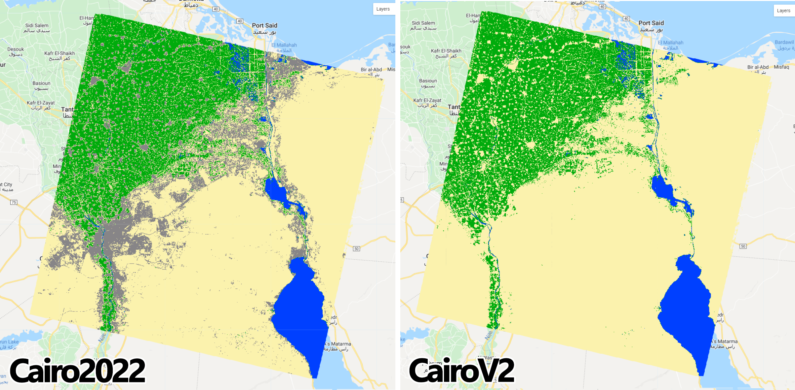
```

*__Scenario 2__

A new version of the `Cairo2022` map where only a portion of it is remapped to a given class.
This scenario is one of the most commonly used post-classification procedure where the goal is to remap specific areas to fix for classification errors. To ilustrate, we will consider the following example:

*Upon close inspection, the `Cairo2022` map showed some cropland/cultivated areas within zones of dense urbanization of New Cairo City. A team on the ground went to the area and confirmed that is indeed dense urbanization and no agricultural land was found in that area. Therefore, that portion of the map needs to be rectified in order to reflect the actual land cover. In this case, the `.where()` method of an `ee.Image()` object is used. This function performs conditional replacement of values, following the formula `input.where(test,value)`. For each pixel in each band of `input`, if the corresponding pixel in `test` is nonzero, Google Earth Engine will output the corresponding pixel in `value`, otherwise it will output the `input` pixel. Translating this function to this example, `input` is the land cover map in which we aim to perform the reclassification - in this case `Cairo2020`; `test` is the area or region of the map `value` will take place, and; `value` is the correct classification that will be included in the final map:*

```{r my-where,  fig.cap=" The `.where` function applied to this example.", echo=FALSE, message=FALSE}
knitr::include_graphics("images/WhereFunction.png")
```

In your own version of `Cairo2022` map, create an new geometry over an area of your interest and name it `aoi`: 

```{r my-regionwhere,  fig.cap="A geometry over an area of `Cairo2020` highlighting cultivated areas next to urbanization.", echo=FALSE, message=FALSE}
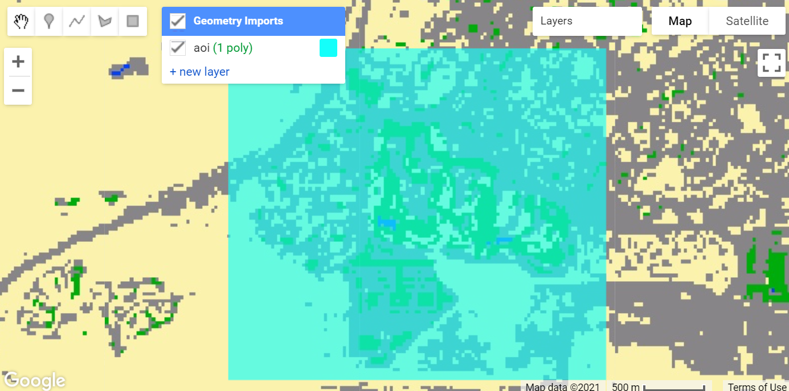
```

The method `.where()` only uses `ee.Image()` objects as `test`. Therefore, using the geometry/feature `aoi` is not allowed. 
An easy and effective way to go around this rule is to create an image with `ee.Image()` and clip it for the region of interest:

```{r eval=FALSE}
var region = ee.Image(1).clip(aoi);
```

The function above will create an image with value of 1 and will clip it for the area of interest `aoi`. Next, using the same approach from *Scenario 1* and *2*, we will create a new version of `Cairo2022` called ''subistitute', where the *__Cropland/Cultivated Areas__* class is remapped to *__Built-up and Urban Areas__*: the position 2 on list 2 (belonging to agricultural/cultivated areas) receives the value *__3__* from *__Built-up and Urban Areas__* on list 1:

```{r eval=FALSE}
var substitute = Cairo2020.remap([0,1,2,3],[0,3,2,3]);
```

Now, using `.where()` we will create a new map `CairoV3` following the formula (\@ref(fig:my-where)) and add it to the map editor:

```{r eval=FALSE}
var CairoV3 = Cairo2022.where(region,substitute);
Map.addLayer(CairoV3, {min: 0, max: 3, palette:paletteMAP}, 'Cairo V3');
```

Compare the two classification objects: you will notice that every pixel of *__Cropland/Cultivated Areas__* (green, pixel value = 2) within the `aoi` in `Cairo2022` is now remapped to *__Built-up and Urban Areas__* (grey, pixel value = 3) in `CairoV3`:

```{r my-cairov3,  fig.cap="`CairoV3` showing the pixels of Cropland/Cultivated Areas remapped as Built-up and Urban Areas within `aoi`.", echo=FALSE, message=FALSE}
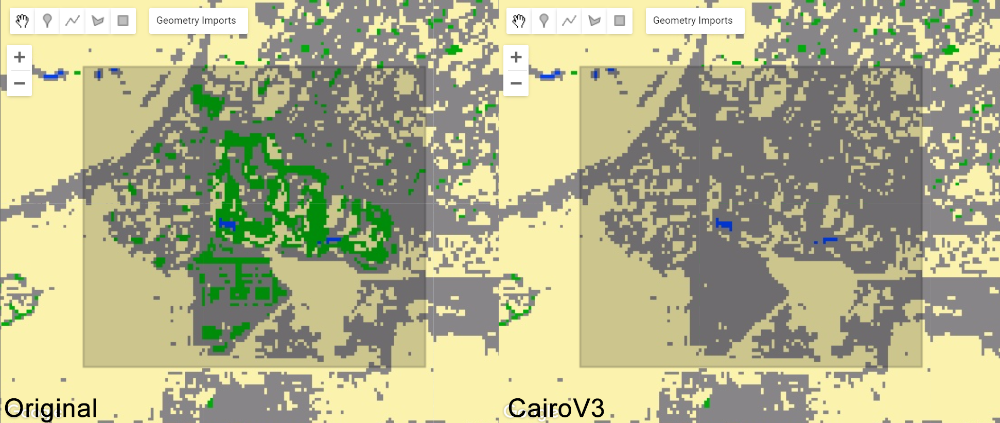
```

### Map spatial smoothing

Spatial smoothing is another post-classification procedure to enhance the quality of a land cover classification output. A common issue that arises from the pixel-based classification of fine/medium spatial resolution imagery is the “salt-and-pepper” effect. This happens when individual pixels are classified differently from their neighbors, creating speckles of isolated pixels of different classes. There are several ways to minimize this issue, such as:

- image pre-processing, such as low-pass filter and texture analysis;

- contextual classification, and;

- post-classification processing, such as median and mode filtering.

In this section, we will focus on a post-classification technique to reduce the salt and pepper effect and edge roughness of land cover maps using focal median filtering (`ee.Image.focal_median()`).

We will apply the `.focal_median()` method to `Cairo2022`. This method is a simple sliding-window spatial filter that replaces the center value (or class) in the window with the median of all the pixel values in the window. The window, or kernel, is usually square but can be any shape. The `.focal_median()` method usually is expressed as:

```{r my-focal,  fig.cap="`.focal_median` spatial filter.", echo=FALSE, message=FALSE}
knitr::include_graphics("images/focal.png")
```

In the function above, the `radius` parameter specifies the number of pixels from the center that the kernel will cover. This radius value can be expressed as number of pixels or meters. The `kernelType` specifies the type of kernel to use.

```{block, type='rmdcomment'}
Either `.focal_median(1, 'square', 'pixels')` or `.focal_median(30, 'square', 'meters')` will produce a 3x3 pixel sliding-window, as you are specifing 1 pixel (or 30 meters which is equal to one Landsat pixel) in each direction from the center pixel. Similarly, a `radius` of 2 pixels or 60 meters will produce a 5x5 sliding-window: a center pixel plus 2 pixels in each direction. 
```

Following Figure \@ref(fig:my-focal) and the example above, we will apply the `.focal_median()` filtering with two `radius` sizes (30 and 60 meters) to `Cairo2022`, add `Cairo30` and `Cairo60` to the map editor and compare the results:

```{r eval=FALSE}
var Cairo30 = Cairo2022.focal_median(30,'square', 'meters');
var Cairo60 = Cairo2022.focal_median(60,'square', 'meters');
Map.addLayer(Cairo30, {min: 0, max: 3, palette:paletteMAP}, 'Cairo 3x3');
Map.addLayer(Cairo60, {min: 0, max: 3, palette:paletteMAP}, 'Cairo 5x5');
```

```{r my-smooth1,  fig.cap="`Cairo2022` processed with `.focal_median` spatial filter two radius sizes.", echo=FALSE, message=FALSE}
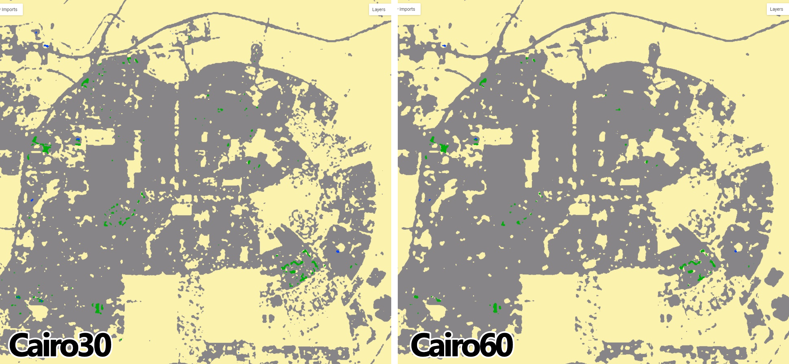
```

```{block, type='caution'}
__IMPORTANT:__ The `.focal_median(1, 'square', 'pixels')`* and `.focal_median(30, 'square', 'meters')` will only achieve the intended final result if you reproject it back to the original scale and projection from the original map. Note that this technique while effective in removing the "salt-and-pepper" effect from the original map, it creates edges that are not in the same resolution and projection as the original map. Therefore, creating fairly rounded boundaries for the classes. This is not ideal as it is usually intended for these maps to keep the same resolution as the original map, as well as to preserve the boundaries between classes. To account for this issue, you can reproject this output back the original scale so it is formed by 30 x 30 meter pixels. To do that, simply use `.reproject(projection.atScale(scale))` within the `.focal_median` filter. The `.reproject` function will take two arguments: projection and scale. You can extract this information from the original map with `.projection()` and `.nominalScale()`:
```

```{r eval=FALSE}
var projection = Cairo2022.projection();
var scale = projection.nominalScale();
```

Then, we re-aply the `.focal_median()` filter with `.reproject(projection.atScale(scale))`:

```{r eval=FALSE}
var newCairo30 = Cairo2022.focal_median(1,'square', 'pixels')
                       .reproject(projection.atScale(scale));
                       
var newCairo60 = Cairo2022.focal_median(60,'square', 'meters')
                       .reproject(prj.atScale(scale));
```

```{r my-smooth2,  fig.cap="`Cairo2022` processed with `.focal_median` spatial filter with 3x3 and 5x5 pixel windows. Note that the function was reprojected to match `Cairo2022`'s projection and scale. Now the discrete boundaries of classes are pixelated back to 30 meters.", echo=FALSE, message=FALSE}
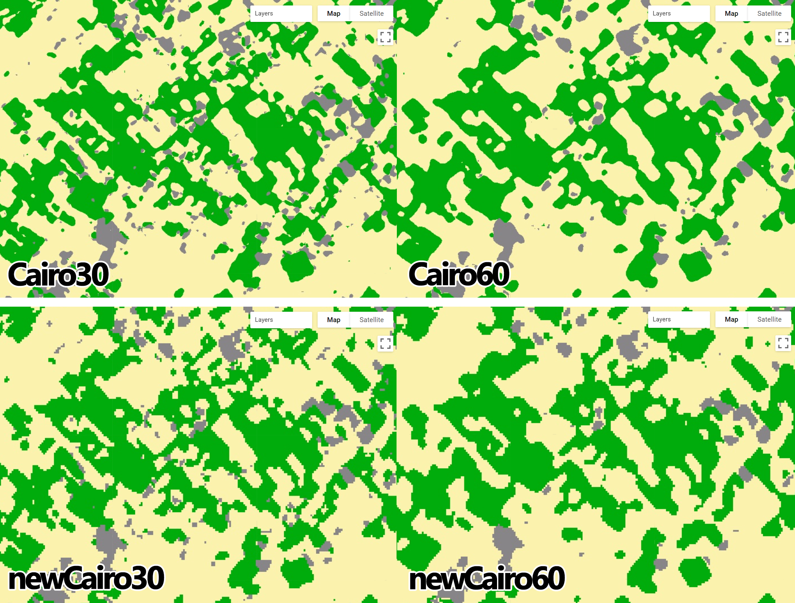
```

Note that even though the boundaries of the classes are smoother, they are formed by the 30 x 30 meter pixels. 
Usually, a `radius` of 1 (3x3 square window) removes most of the salt-and-pepper effect, smoothens the boundaries in between classes while preserving the overall shape of the classes.

Access the full scrip for this section [here.](https://code.earthengine.google.com/c1151eecd2e21f2ae43aa37cf1fd80d2){target="_blank"}