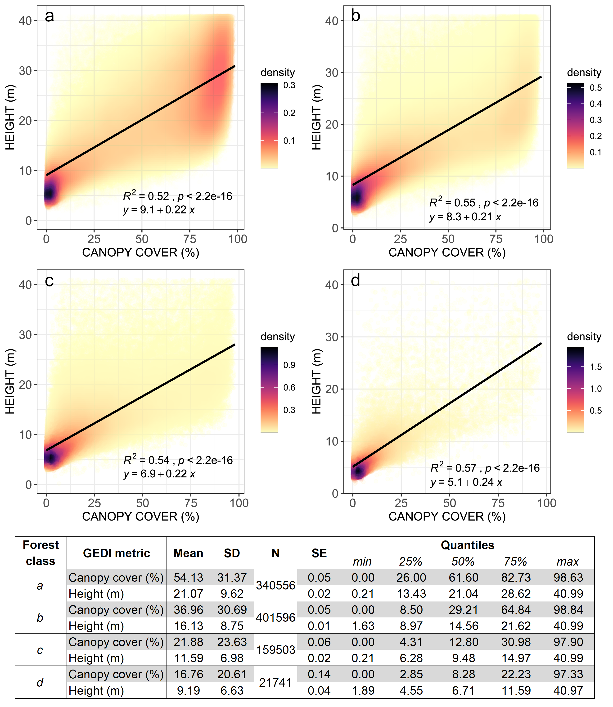

# PART 3 - Country-specific Applications

In this part we will explore examples of class-specific classification using previously used functions as well as useful land cover classification-based analysis.

## Guinea

Description of Guinea here

### Mangrove mapping in Guinea, West Africa

In this example, we will use the codes from the previous parts for mangrove mapping in Guinea, in West Africa. We will also introduce the use of other datasets for masking and sample selection to assist in the classification workflow.

We will start by [opening a new code editor page](https://code.earthengine.google.com/){target="_blank"} and
by defining the spatial and temporal parameters of the composite you wish to classify, just like the other examples. For the temporal parameters, let’s use an annual 2021 composite:

```{r eval=FALSE}
var year = 2021;
var startDay = (year)+'-01-01';
var endDay = (year)+'-12-30';
```

For the spatial parameters, we can use the *Large Scale International Boundary (LSIB)* dataset and select Guinea’s national border. First, we will load the dataset into an object  called 'countries' using the `ee.FeatureCollection()` object and the feature collection ID 'USDOS/LSIB/2013'. Secondly, we will filter the dataset using `.filterMetadata()` and select Guinea from the list of countries and storing it in `aoi`:

```{block, type='rmdcomment'}
Note that you can select any country border by filtering *'USDOS/LSIB/2013'* dataset by using *.filterMetadata('name' , 'equals', 'NAME OF THE COUNTRY IN CAPITAL LETTERS')*. 
```

Alternatively, you can use any previously uploaded Guinea's boundary datasets available [here.](https://code.earthengine.google.com/16fbfeb335381c203fed98eb81712dda){target="_blank"} Select a dataset from the list, copy its Asset ID and load it with `ee.FeatureCollection` into `aoi`. 

```{r my-borders,  fig.cap="Examples of Guinea's administrative borders.", echo=FALSE, message=FALSE}
knitr::include_graphics("images/borders.png")
```

In this example, we aim to map of Guinea's mangroves. Therefore, we will choose `prefectures5k` as it encompasses the entirety of Guinea's coast:

```{r eval=FALSE}
var aoi = ee.FeatureCollection('users/capacityBuilding/Guinea/prefectures5k');
```

```{block, type='caution'}
*__Important__*: All these datasets were made available through our collaboration with our colleagues in Guinea and the World Bank and they were modified with a GIS software for the sole purpose of this exercise. You can upload any geographical dataset (both raster or shapefile) into GEE with the *__NEW__* button in the __Assets__ table. 
```

As auxiliary functions for cloud masking and spectral index calculation, we will use the same functions provided in PART 2:

```{r eval=FALSE}
function maskClouds(image) {
  var cloudShadowBitMask = ee.Number(2).pow(3).int();
  var cloudsBitMask = ee.Number(2).pow(4).int();
  var QA = image.select('QA_PIXEL');
  var mask = QA.bitwiseAnd(cloudShadowBitMask).eq(0)
      .and(QA.bitwiseAnd(cloudsBitMask).eq(0));
  return image.updateMask(mask).divide(100000).select("SR_B[0-9]*").copyProperties(image, ["system:time_start"]);
}

function addIndices(image) {
  var ndvi = image.normalizedDifference(['SR_B5','SR_B4']).rename('NDVI');
  var nbr = image.normalizedDifference(['SR_B5','SR_B7']).rename('NBR');
  var ndmi = image.normalizedDifference(['SR_B7','SR_B3']).rename('NDMI');
  var mndwi = image.normalizedDifference(['SR_B3','SR_B6']).rename('MNDWI');
  var sr = image.select('SR_B5').divide(image.select('SR_B4')).rename('SR');
  var bare = image.normalizedDifference(['SR_B6','SR_B7']).rename('BI');
  var gcvi = image.expression('(NIR/GREEN)-1',{
    'NIR':image.select('SR_B5'),
    'GREEN':image.select('SR_B3')
  }).rename('GCVI');
  var evi = image.expression(
  '2.5 * ((NIR-RED) / (NIR + 6 * RED - 7.5* SR_BLUE +1))', {
    'NIR':image.select('SR_B5'),
    'RED':image.select('SR_B4'),
    'SR_BLUE':image.select('SR_B2')
  }).rename('EVI');
  var msavi = image.expression(
  '(2 * NIR + 1 - sqrt(pow((2 * NIR + 1), 2) - 8 * (NIR - RED)) ) / 2', {
    'NIR': image.select('SR_B5'), 
    'RED': image.select('SR_B4')}
).rename('MSAVI');
    return image
    .addBands(ndvi)
    .addBands(nbr)
    .addBands(ndmi)
    .addBands(mndwi)
    .addBands(sr)
    .addBands(evi)
    .addBands(msavi)
    .addBands(gcvi)
    .addBands(bare);
}
```

__1) Masking__

In this example, we will focus on mangrove forest mapping. Therefore, other known classes can be masked from the analysis.  

```{r eval=FALSE}
var globalwater = ee.Image('JRC/GSW1_0/GlobalSurfaceWater');
```

The Global Water Dataset `'JRC/GSW1_0/GlobalSurfaceWater'` has different bands: one of them `'occurrence'`. This band shows how many times (expressed as %) a given pixel was classified as water relative to the total time span of the dataset. Let’s isolate the `'occurrence'` band from the globalwater object:

```{r eval=FALSE}
var occurrence = globalwater.select('occurrence');
```

__Masks__ are composed by zeros and non-zero values. When you set or apply a mask to an image, the output image will keep its original values where the mask has non-zero values and pixels will be masked where the mask has zeros:

```{r my-mask,  fig.cap="Masking procedure. In this figure, the mask was applied to the raster image generating an output image where pixels are visible only where the correspondent mask pixel has non-zero values.", echo=FALSE, message=FALSE}
knitr::include_graphics("images/maskexample.png")
```

For this example, we want to create a water mask. Thus, the water mask has to have zeros where there is water and non-zero values for non-water pixels. Consequently, when we apply this mask to a Landsat image, pixels of water will be invisible (transparent) while all the other pixels will remain visible in the composite. For the mask using the JRC Global Water dataset, make sure you are selecting "permanent" water. One way of doing this is by filtering the dataset for water pixels that occurred more than 50% of the time over the 35 years time spam for this dataset. You can be more or less restrictive with the water extent by changing the 50% threshold.

```{r eval=FALSE}
var waterMask = occurrence.lt(50).unmask(1);
```

Note that `.lt(50)` was used to select pixels from `occurrence` that are __smaller__ (or lower) than 50%. Automatically, the values above 50% will be set to 0 which is what is needed for this mask. In this particular case, we use `.unmask(1)` to set to 1 (or unmask) all the other areas that were originally masked in the JRC Global Water dataset.

```{r my-watermask,  fig.cap="Global water mask produced with JRC’s Global Surface Water dataset and Guinea's coastal prefectures (`aoi`) in red for reference. You can add this mask to the map editor (and clip for `aoi`) using `Map.addLayer(waterMask.clip(aoi), {}, 'Water Mask')`. Areas in black (0) will be masked in the composite while areas in white (1) will remain.", echo=FALSE, message=FALSE}
knitr::include_graphics("images/watermask.png")
```

- *__Elevation mask__*

The purpose of this mask is to further remove pixels that are unlikely to be mangrove forests based on altitude values. Generally, mangroves will occur near shore where elevation and slope are relatively low. Similar to the water mask, we will create a mask using the SRTM Elevation Data:

```{r eval=FALSE}
var srtm = ee.Image('USGS/SRTMGL1_003');
```

Similarly to the previous dataset, we will select the band of interest by using the `.select()` method. The altitude values for the SRTM dataset are stored in the elevation band  called 'elevation'. We will create a mask 'elevMask' where pixels that have elevation values *greater than 25 meters* are removed. For that, you select everything that is *__lower__* than (`.lte`) 25 meters; any other value above 25 meters will be set to 0 automatically when using `.select()`:

```{r eval=FALSE}
var elevation = srtm.select('elevation');
var elevMask = elevation.lte(25);
```

```{r my-elevmask,  fig.cap="Global elevation (> 25 m) mask produced with the Shuttle Radar Topography Mission dataset and Guinea's coastal prefectures (`aoi`) in red for reference. You can add this mask to the map editor (and clip for `aoi`) using *Map.addLayer(elevMask.clip(aoi), {}, 'Elevation Mask')*. Areas in black (0) will be masked in the composite while areas in white (1) will remain.", echo=FALSE, message=FALSE}
knitr::include_graphics("images/elevmask.PNG")
```

[Code Checkpoint](https://code.earthengine.google.com/62a8bbb4bef12c7c998dd7fe665a6d66){target="_blank"}

__2) Landsat 8 Image Collection and Cloud-free Mosaic__

Similarly to the examples from PART 2, we will load the Landsat 8 Surface Reflectance data archive into an object called 'collection' by using the container `ee.ImageCollection()` and the collection ID `'LANDSAT/LC08/C02/T1_L2'`. Secondly, we will filter this image collection for the temporal parameters by using the method `.filterDate()`. Finally, we will map the cloud-masking and spectral indices functions to the collection:

```{r eval=FALSE}
var collection = ee.ImageCollection('LANDSAT/LC08/C02/T1_L2')
                   .filterDate(startDay,endDay)
                   .map(maskClouds)
                   .map(addIndices);
```

Then, in an object called 'composite', we will reduce the image collection into an annual composite using the `.median()` method. Next, we will mask the composite using the masks `waterMask` and `elevMask` using `.mask()` method for the first mask and then `.updateMask()` for the second. This container is necessary as we are *__updating__* the raster that will have been masked by the first mask.  

```{r my-updatemask,  fig.cap="Output raster from .`mask()` and `.updateMask()` of a previously masked input raster. `.updateMask()` will only mask areas that have not been masked previously; if `.mask()` is used for a second mask, areas that have been previously invisible (i.e masked) will then assume the values of the mask used.", echo=FALSE, message=FALSE}
knitr::include_graphics("images/updateMask.png")
```

```{block, type='rmdcomment'}
As a rule of thumb: the *first* mask applied to the raster is done by *.mask()* and then use *.updateMask()* for any subsequent masks.
```

Finally, we will clip the composite to our area of interest `aoi` using the container `.clip()` method:

```{r eval=FALSE}
var composite = collection
                .median()
                .mask(waterMask)
                .updateMask(elevMask)
                .clip(aoi);
```

```{block, type='starcomment'}
Setting your code with indents is very helpful!. It will allow you to "turn on" and "turn off" certain portions of a code with comment bars. In the example above, you can turn off any mask by just adding // before the full period.
```

```{r eval=FALSE}
var composite = collection
                .median()
                //.mask(waterMask)
                //.updateMask(elevMask)
                .clip(aoi);
```

```{block, type='starcomment'}
The code above is just for illustration purposes! Remember to remove the // from the portion of the code that you want Earth Engine to read.
```

Finally, add the composite to the Map editor using the code below.

```{r eval=FALSE}
Map.centerObject(aoi);
Map.addLayer(composite, {bands: ['SR_B5', 'SR_B6', 'SR_B4'], min:0.1, max:0.2}, 'Composite');
```

This band composition (RGB 564) is a good composition to highlight mangrove forests:

```{r CompositeMaskedGuinea,  fig.cap="Masked composite displayed with an RGB564 composition highlighting mangrove forests in dark red. Notice that areas of open water and higher altitudes were masked as they are not relevant to our example. Unmasked composite was added for comparison purposes: you can take advantage of indenting to turn masks on/off with // comment bars.", echo=FALSE, message=FALSE}

```

[Code Checkpoint](https://code.earthengine.google.com/912be20630ba0aa4c86d0d12b3d76f94){target="_blank"}

__3) Supervised Classification with Random Forest__

- *__Strata for Sample Selection__*

As shown in Part 1 and Part 2, the first step to perform a supervised classification is to select the training samples. One way of selecting the training samples for the Random Forest classifier was shown in the training sample selection section of Part 2. Alternatively, you can automatically select random points based on a stratification map using `.stratifiedSample()`. In this case, the stratification map will have two classes: Mangroves and Non-mangroves. You can create a mangrove stratum for sample selection using available mangrove datasets, such as:

- Global Mangrove Forest Distribution dataset (raster) for the year 2000, available through Google Earth Engine (`ee.ImageCollection('LANDSAT/MANGROVE_FORESTS')`), or;

- The latest global Mangrove Extent from the [Global Mangrove Watch](https://www.globalmangrovewatch.org/country/GIN?map=eyJiYXNlbWFwIjoibGlnaHQiLCJ2aWV3cG9ydCI6eyJsYXRpdHVkZSI6OS45NDcyMTU4OTUwNDI0NzIsImxvbmdpdHVkZSI6LTE1Ljk0Njk3MjgyMzgwNzMzOCwiem9vbSI6Ni4xMzk0MjcyMjU1NDAzMjcsImJlYXJpbmciOjAsInBpdGNoIjowfX0%3D){target="_blank"}, available for download [here.](https://data.unep-wcmc.org/datasets/45){target="_blank"}

- Or any other dataset that you may have available;

a) *Mangroves*: For this example, we will use the GMW Global mangrove extent dataset for 2016 that was previously downloaded and added as an asset to Google Earth Engine. First, load the mangrove extent shapefile into a `ee.FeatureCollection` object:

```{r eval=FALSE}
var mangroveDataset = ee.FeatureCollection('users/capacityBuilding/Guinea/Mangroves2016');
```

As seen in Part 2, to create the mangrove stratification class, we simply create an image with `ee.Image(1)` and clip it using `mangroveDataset`:

```{r eval = FALSE}
var mangrove = ee.Image(1).clip(mangroveDataset);
```

b) *Non-mangroves*: Using `.where()` (See its formula here: \@ref(fig:my-where)), we will create an image of zeros where the value two (2) will be added where there is a pixel of any band from the `composite`:

```{r eval = FALSE}
var nonmangrove = ee.Image(0).where(composite.select('SR_B1'),2).selfMask();
```

```{block, type='starcomment'}
Notice that a new method was used in the code above. The method `.selfMask()` is an method from an `ee.Image()` object that is used when you want to mask an image with itself. In other words, when an ee.Image has zeros in it, you can use `.selfMask()` to remove the zeros, just like an other mask.
```

Finally, to create a stratification classes map called 'strata', we will use `.where()` to set `nonmangrove` pixels to *1* where it overlaps with pixels of the mangrove stratum (`mangrove`) and use `.rename()` to rename it to `'stratificationClass'`:

```{r eval = FALSE}
var strata = nonmangrove.where(mangrove,1).rename('stratificationClass');
```

The object `strata` is an image with one band called `'stratificationClass'`, with Mangrove pixes have value of 1 and non-mangrove pixels have value of 2. It is good practice to rename this band to something easy to remember because `.stratifiedSample()` requires the image and the band name with which the samples will be selected.

Add `strata` to the map editor to visualize:

```{r eval = FALSE}
Map.addLayer (strata, {palette:['#6D8B74','#D0C9C0'], min:1, max:2}, 'Stratification Map');
```

```{r my-strata,  fig.cap="Stratification map `strata` showing Global Mangrove Watch's 2016 Mangrove extent (`stratificationClass: 1`) and non-mangrove areas (`stratificationClass: 2`). The `.stratifiedSample()` method will generate a set of random points to each of these classes.", echo=FALSE, message=FALSE}

```

- *__Random training sample selection__*

Now that we have the stratification map `strata` for mangroves and all other areas, we will use `.stratifiedSample()` method below to select 1000 points (`classPoints`) for each of the two classes (`classValues`):


```{r eval = FALSE}
var stratified = strata.addBands(ee.Image.pixelLonLat()).stratifiedSample({
      numPoints: 1,
      classBand: 'stratificationClass',
      scale: 30,
      region: aoi,
      classValues:[1,2],       
      classPoints:[1000,1000]  
    }).map(function(f) {       
       return f.setGeometry(ee.Geometry.Point([f.get('longitude'), f.get('latitude')]));
    });
```

The code above includes:

a) `.addBands(ee.Image.pixelLonLat())` to add a band to `strata` that will have the latitude and longitude for each pixel;

b) `numPoints` is the default number of points to sample in each class in `strata`. If `numPoints` is set to 2000, 1000 points will be selected for each of the two classes in `strata`. This, however, can be overridden for specific classes using the `classValues` and `classPoints` properties. In this case, these properties allow which classes you want to use from your stratification map and how many points for each of these classes you want to select.

c) `classBand: 'stratificationClass'` to define the band from `strata` that will be used to select the random samples;

d) `scale` sets the scale to 30 meters to match Landsat nominal spatial resolution;

e) The rest of the code will set these samples as geometry and get their lat/long coordinates.

You can use the code below to colorize these point samples based on a color palette for visualization. First, the color pallete for this particular case will be slightly different that the color palettes that have been used throught this tutorial so far: it will be created as a `ee.List()` of colors including a null color:

```{r eval=FALSE}
var paletteSamples = ee.List([
  'FFFFFF',  // NULL
  '6D8B74',  // Mangrove
  'D0C9C0',  // Non-Mangrove
 ]);
```

Then, a 'features' object will be created to include the colorized version of `stratified` based on the code:

```{r eval=FALSE}
var features = stratified.map(function(f) {
  var landcover = f.get('stratificationClass');
  return ee.Feature(ee.Geometry.Point([f.get('longitude'), f.get('latitude')]), f.toDictionary()).set({style: {color: paletteSamples.get(landcover) }}); 
}); 
```

Finally, we will add `features` to the map editor using `Map.addLayer` and `.style()` following the formula below:

```{r eval = FALSE}
Map.addLayer(features.style({styleProperty: "style"}),{}, 'Samples/Location');
```

```{block, type='rmdcomment'}
Remember, __these steps are not necessary to the classification workflow__. However, it allows you to visualize the selected samples with a color palette of your choice.
```

```{r StratificationSamples,  fig.cap="Stratified random samples. The `.stratifiedSample()` method generates a set of random points to each of these strata.", echo=FALSE, message=FALSE}
knitr::include_graphics("images/PartIII-StratificationSamples.png")
```

[Code Checkpoint](https://code.earthengine.google.com/9eebb9a441f2e4e6cff74329e8aa9563){target="_blank"}

- *__Classification__*

As seen in in Part 2, one of the first steps to train a Random Forest classifier is select the predictors to assign to each sample point in the sample set. For this example, we will create a list ('bands') with the names of three spectral bands (`'SR_B4'`,`'SR_B5'`,`'SR_B6'`) and the spectral indices (`'NDVI'`,`'NBR'`,`'MNDWI'`,`'SR'`,`'GCVI'` and `'MSAVI'`).

```{r eval=FALSE}
var bands = ['SR_B4','SR_B5','SR_B6','NDVI','NBR','MNDWI','SR','GCVI','MSAVI'];
```


```{r eval=FALSE}
var samplesAutomatic = composite.select(bands).sampleRegions({
  collection: stratified,   
  properties: ['stratificationClass'],
  scale: 30,
  geometries: true,
});
```

A second sample set ('groundtruth') will be used to illusrate a validation process for the mangrove extent map. First, we will load a pre-selected set of samples using `ee.FeatureCollection()` then create 'samplesgroundtruth' similarly to the previous set of samples:

```{r eval=FALSE}
var groundtruth = ee.FeatureCollection('users/capacityBuilding/Guinea/Groundtruth');
```

If you print `groundtruth` to the __Console__ tab, you will see that its property is called `landcover`. Therefore, in the code below, the argument `properties` will be a 'landcover':

```{r eval=FALSE}
var samplesgroundtruth = composite.select(bands).sampleRegions({
  collection: groundtruth,
  properties: ['landcover'],
  scale: 30,
  geometries: true,
});
```

Next, we will train a Random Forest classifier using the `samplesAutomatic` as training samples. In this example, we will use 200 trees and 8 predictors to be tested at each tree node:

```{r eval=FALSE}
var RandomForest = ee.Classifier.smileRandomForest(200,8).train({
  features: samplesAutomatic, 
  classProperty: 'stratificationClass', 
  inputProperties: bands
});
```

Finally, we will classify `composite` into a mangrove extent map using the trained classifier and add the output to the map editor using a color palette of your choice:

```{r eval=FALSE}
var classification = composite.select(bands).classify(RandomForest);

var paletteMAP = [
  '01937C', // Mangrove
  'B6C867', // Non-Mangrove
];

Map.addLayer (classification, {min: 1, max: 2, palette:paletteMAP}, 'Classification with Automatic Samples');
```

```{r my-classficationmangrove,  fig.cap="Random forest classification output produced with automatic sample selection", echo=FALSE, message=FALSE}
knitr::include_graphics("images/PartIII-RFMangroveGuinea.png")
```

[Code Checkpoint](https://code.earthengine.google.com/0a0e15f94c78cb1516c90de46ec1fe10){target="_blank"}

- *__Validation__*

For the validation of the mangrove extent map we will use `.classify()` and `.errorMatrix()`.The `.classify` method will classify the ground truth samples with the trained random forest classifier; `.errorMatrix()` will compare the result of this classification with their own class label: 

```{r eval=FALSE}
var validation = samplesgroundtruth.classify(RandomForest);
var testAccuracy = validation.errorMatrix('landcover', 'classification');
```

Print the results to the __Console__:

```{r eval=FALSE}
print('Map Overall Accuracy: ', testAccuracy.accuracy());
print('Kappa: ', testAccuracy.kappa());
print('Validation error matrix Map: ', testAccuracy);
```

```{r ValidationGuinea,  fig.cap="Validation results for this example. Ground truth data (in this context it refers to independent samples) were used to calculate the overall accuracy and kappa values.", echo=FALSE, message=FALSE}
knitr::include_graphics("images/PartIII-ValidationGuinea.png")
```

## Liberia

In this example, we will use the codes from the previous sections for (a) mapping and detecting individual classes such as plantations; (b) a class by class land cover mapping approach. 

### Anomaly-based plantation detection

Spectral confusion between planted tree crops with native vegetation is a well-known challenge in using moderate resolution optical remote sensing data for mapping plantations. Cultivated land in Liberia primarily consists of woody commodity crops (oil palm and rubber trees). Even with the availability of forest concessions datasets to constrain the classification of these crops, the Random Forest relies on spectral predictors that are almost identical to native vegetation. Aditionally, small scale plantations intermixed with evergreen forest will also add to the challenges of separating these classes. However, areas of plantation usually undergo harvesting cycles, which creates a temporal signature that is different than evergreen natural vegetation: every few years, the spectral signature of these areas will show traces of bare soil due to harvesting and replanting.
We can take advantage of this interannual differences by doing an __anomaly analysis__. By definition, anomaly is anything that deviates from what is standard, normal, or expected. Usually, anomalies are calculated by subtracting a long-term average of a variable from the actual value of that variable at a given time. For example, if X = actual value of average NDVI for vegetation in 2020, and Y = long-term average NDVI of vegetation (an average over many years), then the anomaly = X − Y. If the anomaly values are zero (or very close to zero), it means that NDVI remained relatively stable in that period, which indicates that there has not been any significant disturbance in that area. On the other hand, a positive anomaly means that the NDVI signal is greater than its long-term average, which indicates that vegetation has shown growth in that area; similarly, a negative anomaly means that the NDVI signal is weaker than its long-term average, indicating a potential loss in the area.

This is a very useful tool to detect changes over time. Depending on where and how these changes happen over time, you can then conclude that that area is being planted and harvested.

Next, we will provide several blocks of code to perform a quick anomaly analysis over Liberia and potentially identifying areas of plantation.

* Harmonizing Landsat 5/7/8 Image Collections

The Landsat TM/ETM+ and OLI sensors present differences between their spectral characteristics. Thus, to ensure inter-sensor harmonized spectral information and temporal continuity, we will harmonize the entire Landsat image archive using the statistical functions presented in Roy et al. (2016). For that, we will start by defining the temporal parameters for the harmonization:

```{r eval=FALSE}
var startYear = 1984;    
var endyear   = 2021;   
var startDay  = '01-01';
var endDay    = '12-31';
```

Here we used the entire Landsat archive. Next, we will create several functions for the harmonization of the Landsat archive:

__Harmonization Function__: `harmonizationRoy` uses the regression coefficients (slopes and intercepts) retrieved from Roy et al. (2016) and performs a linear transformation of ETM+ spectral space to OLI spectral space:

```{r eval=FALSE}
var harmonizationRoy = function(oli) {
var slopes = ee.Image.constant([0.9785, 0.9542, 0.9825, 1.0073, 1.0171, 0.9949]);        
var itcp = ee.Image.constant([-0.0095, -0.0016, -0.0022, -0.0021, -0.0030, 0.0029]);     
var y = oli.select(['B2','B3','B4','B5','B6','B7'],['B1', 'B2', 'B3', 'B4', 'B5', 'B7']) 
            .resample('bicubic')                                                         
            .subtract(itcp.multiply(10000)).divide(slopes)                                
            .set('system:time_start', oli.get('system:time_start'));
return y.toShort();                                                                       
};
```

__Retrieve a Particular Sensor Function__: `getSRcollection` will be used to retrieve individual sensor collections based on the temporal parameters and the harmonization function above. Additionally, this function will mask cloud, cloud shadow, and snow based on the Landsat quality assessment bands:

```{r eval=FALSE}
var getSRcollection = function(year, startDay, endYear, endDay, sensor) {
    var srCollection = ee.ImageCollection('LANDSAT/'+ sensor + '/C01/T1_SR')
                                         .filterDate(year+'-'+startDay, endYear+'-'+endDay);
        srCollection = srCollection.map(function(img) {
          var dat = ee.Image(ee.Algorithms.If(
                    sensor == 'LC08',                                                  
                    harmonizationRoy(img.unmask()),                                    
                    img.select(['B1', 'B2', 'B3', 'B4', 'B5', 'B7'])
                       .unmask()  
                       .resample('bicubic')
                       .set('system:time_start', img.get('system:time_start'))
                  )
                );
    // Cloud, cloud shadow and snow mask
    var qa = img.select('pixel_qa');                                       
      var mask = qa.bitwiseAnd(8).eq(0).and(
                 qa.bitwiseAnd(16).eq(0)).and(
                 qa.bitwiseAnd(32).eq(0));
      return dat.mask(mask); 
      });
return srCollection;
};
```

__Combining the Collections Function__: `getCombinedSRcollection` will merge all the individual L5/L7/L8 collections into one:

```{r eval=FALSE}
var getCombinedSRcollection = function(year, startDay, endYear,endDay) {
  var lt5 = getSRcollection(year, startDay, endYear, endDay, 'LT05');
  var le7 = getSRcollection(year, startDay, endYear, endDay, 'LE07');
  var lc8 = getSRcollection(year, startDay, endYear, endDay, 'LC08');
  var mergedCollection = ee.ImageCollection(le7.merge(lc8).merge(lt5));
return mergedCollection;
};
```

__Vegetation Indices__: `addIndices` calculates several vegetation/spectral indices based on the harmonized Landsat bands. In this example, we are including the Normalized Difference Vegetation Index (NDVI), the Enhanced Vegetation Index (EVI), the Soil Adjusted Vegetation Index (SAVI), the Normalized Difference Mangrove Index (NDMI), the Normalized Difference Water index (NDWI), the Modified Normalized Difference Water Index (MNDWI) and many others. Here is where you can include your own vegetation indices:

```{r eval=FALSE}
var addIndices = function(image) {
  var ndvi = image.normalizedDifference(['B4', 'B3']).rename('NDVI');
  var evi = image.expression(
      '2.5 * ((NIR - RED) / (NIR + 6 * RED - 7.5 * BLUE + 1))', {
      'NIR': image.select('B4'),
      'RED': image.select('B3'),
      'BLUE': image.select('B1')
}).rename('EVI');
  var savi = image.expression(
      '((NIR - RED) / (NIR + RED + 0.5) * (0.5 + 1))', {
      'NIR': image.select('B4'),
      'RED': image.select('B3'),
      'BLUE': image.select('B1')
}).rename('SAVI');
  var ndmi = image.normalizedDifference(['B7','B2']).rename('NDMI');
  var nbr = image.normalizedDifference(['B4', 'B7']).rename('NBR');
  var ndwi = image.normalizedDifference(['B5','B4']).rename('NDWI');
  var mndwi = image.normalizedDifference(['B2','B5']).rename('MNDWI');
return image.addBands(ndvi)
            .addBands(evi)
            .addBands(savi)
            .addBands(ndmi)
            .addBands(nbr)
            .addBands(ndwi)
            .addBands(mndwi);
};
```

Finally, `collectionL5L7L8` will include the final harmonized collection with all the sensors based on the temporal parameters defined previously, with all spectral bands and vegetation/spectral indices, filtered to include only scenes over Liberia:

``` {r eval=FALSE}
var aoi = ee.FeatureCollection('users/capacityBuilding/Liberia/LiberiaCounties');
var collectionL5L7L8 = getCombinedSRcollection(startYear, startDay,
    endyear, endDay).map(addIndices).filterBounds(aoi);
```

[Code Checkpoint](https://code.earthengine.google.com/2b0953555f853f377200d7ed8d3954a4){target="_blank"}

* Vegetation Index Anomaly

To calculate the anomaly, we will start by defining the index we want to compute the anomaly for and the reference period to get the average value of that index over time. In this example, we will use the Normalized Burn Ratio (NBR) index, which is useful to highligh burned / bare areas and 

``` {r eval = FALSE}
var index = 'NBR';
var ref_start = '1985-01-01';
var ref_end = '2010-12-31';
```

Next, we will create the reference collection using `collectionL5L7L8` and the parameters above. You can print the size of this reference collection to the console using `print()` and `.size()`:

```{r eval=FALSE}
var reference = collectionL5L7L8
    .filterDate(ref_start, ref_end)
    .select(index)
    .sort('system:time_start', true);
    
print('Number of images in Reference Collection', reference.size());
```

```{r PartIII-ReferenceColSize,  fig.cap="Number of scenes in the reference collection that will be used to calculate the reference value for the anomaly.", echo=FALSE, message=FALSE}

```

We can now calculate the mean value (and other statistics) for the reference collection reference using the `.median()` and `.mean()` methods:

```{r eval = FALSE}
var mean = reference.mean().clip(aoi);
var median = reference.median().clip(aoi);
```

Now that we have the long-term reference metrics, we can define the period for which you want to compute the the anomaly. In this example, we will use yearly intervals starting in 2016 until 2020. We are interested to see where we can observe cycles of planting and harvesting for plantations in Liberia. However, any combination of years is possible depending on what period you are interested in. Then, an anomaly function can be created to subtract the metric from the average of your period of interest:

```{r eval= FALSE}
var period_start = '2016-01-01';
var period_end =  '2016-12-30';

var anomalyFunction = function(image){
              return image.subtract(median)
              .set('system:time_start', 
              image.get('system:time_start'))};
```

Finally, we will map the `anomalyFunction` to the Landsat collection `collectionL5L7L8` filtered by the `period_start` and `period_end`:

```{r eval= FALSE}
var series = collectionL5L7L8.filterDate(period_start, period_end).map(anomalyFunction);
```

The object `series` will have all the spectral bands and vegetation/spectral indices for the time period defined above. Their values, however, will be different from the original collection since we subtracted the average value of the reference period. The next step is to sum all the values for the index from series and divide by the number of images available. You can achieve that by using the `.sum()` and `.count()` methods:

```{r eval=FALSE}
var seriesSum = series.select(index).sum();
var numImages = series.select(index).count();
var anomaly = seriesSum.divide(numImages);
```

So far, the steps we have taken were:

* Created a reference value (median) for the NBR index for the 1985-2010 period;
* Then subtracted this median value from every scene in the period of interest (year 2016)
* Averaged the anomaly values for that year by adding all values and dividing by the number of observations (images within that period).

We can add the object `anomaly` to the Map Editor using a color ramp:

```{r eval = FALSE}
var visAnom = {
    min: -0.20,
    max: 0.20,
    palette: ['#481567FF', '#482677FF', '#453781FF', '#404788FF',
              '#39568CFF', '#33638DFF', '#2D708EFF', '#287D8EFF','#238A8DFF',
              '#1F968BFF', '#20A387FF', '#29AF7FFF', '#3CBB75FF','#55C667FF',
              '#73D055FF', '#95D840FF', '#B8DE29FF', '#DCE319FF','#FDE725FF' ]
};
Map.addLayer(anomaly, visAnom, index + ' anomaly');
```

```{r Anomally,  fig.cap="Normalized Burn Ratio (NBR) index anomaly over Liberia. Areas of negative anomaly are shown in purple/dark blue.", echo=FALSE, message=FALSE}

```

A negative anomaly (in purple in the figure above) means that the NBR signal in 2016 is weaker than its long-term average, indicating a potential loss in the area for that year. Notice that in some areas you can see regular shapes, which means that those losses are potential harvested plantation. On the other hand, positive anomaly (in yellow) will show areas where soil is no longer exposed, giving us an indication of potential areas being replanted.

```{block, type='caution'}
__Not every negative anomaly will be harvesting of planted areas nor every positive anomaly will be areas being replanted. The anomaly can give us an indication of where these areas MAY be, based on the pattern observed__.
```

Investigate the following years by changing the values for `period_start` and `period_end`. By doing so, we can have an informed idea where these planted areas are, which would be rather challenging to detected using only the Landsat composite.

We will export each anomaly individually. For that, change the values for `period_start` and `period_end` for the year 2016 and use the code below to export the anomaly:

```{r eval=FALSE}
Export.image.toAsset({
  image: anomaly,
  description: 'Anomaly2016',
  assetId: 'Anomaly2016',
  crs:'EPSG:4326',
  crsTransform:[0.0002777777777777778,0,-180.0001388888889,0,-0.0002777777777777778,60.00013888888889],
  maxPixels:1e13,
  region: aoi,
  });
```

Repeat the process for 2017, 2018, 2019 and 2020.

__* Planted areas__

On a [new Code Editor page](https://code.earthengine.google.com/){target="_blank"}, import the anomalies to the script. 

``` {r eval = FALSE}
var nbr16 = ee.Image('users/celiohelder/Liberia/NBR_Anomaly2016');
var nbr17 = ee.Image('users/celiohelder/Liberia/NBR_Anomaly2017');
var nbr18 = ee.Image('users/celiohelder/Liberia/NBR_Anomaly2018');
var nbr19 = ee.Image('users/celiohelder/Liberia/NBR_Anomaly2019');
var nbr20 = ee.Image('users/celiohelder/Liberia/NBR_Anomaly2020');
```

As mentioned previously, not every negative anomaly will be harvesting of planted areas nor every positive anomaly will be areas being replanted. The anomaly can give us an indication of where these areas may be, based on the pattern observed. We can also focus on concessions. A concession is a license, permit, or other contract that gives private companies the rights to establish a plantation on public land. Here we will also focus on areas of Rubber and Oil Palm Concessions. The data was previously uploaded into GEE and you can have access to it by loading it into your script with `ee.FeatureCollection('users/capacityBuilding/Liberia/Rubber')` and `ee.FeatureCollection('users/capacityBuilding/Liberia/OilPalm')`:

``` {r eval=FALSE}
var rubber = ee.FeatureCollection('users/capacityBuilding/Liberia/Rubber');
var oilpalm = ee.FeatureCollection('users/capacityBuilding/Liberia/OilPalm');
var concessions = rubber.merge(oilpalm);
```

Add the anomalies and the concessions data to the __Map Editor__:

```{r eval = FALSE}
var visAnom = {
    min: -0.20,
    max: 0.20,
    palette: ['#481567FF', '#482677FF', '#453781FF', '#404788FF',
              '#39568CFF', '#33638DFF', '#2D708EFF', '#287D8EFF','#238A8DFF',
              '#1F968BFF', '#20A387FF', '#29AF7FFF', '#3CBB75FF','#55C667FF',
              '#73D055FF', '#95D840FF', '#B8DE29FF', '#DCE319FF','#FDE725FF' ]
};

Map.addLayer(nbr16,visAnom, 'NBR anomaly 2016');
Map.addLayer(nbr17,visAnom, 'NBR anomaly 2017');
Map.addLayer(nbr18,visAnom, 'NBR anomaly 2018');
Map.addLayer(nbr19,visAnom, 'NBR anomaly 2019');
Map.addLayer(nbr20,visAnom, 'NBR anomaly 2020');

Map.addLayer(ee.Image().paint(oilpalm, 0, 2), {palette:['black']}, 'OilPalm');
Map.addLayer(ee.Image().paint(rubber, 0, 2), {palette:['purple']}, 'Rubber');
```

```{r PartIII-Anomally2,fig.cap="2016 NBR Anomaly and the oil palm and rubber plantation concessions.", echo=FALSE, message=FALSE}

```

Note that even before the addition of the concession dataset, we could outline potential areas of plantation based on the anomaly values. Now, overlaying these concessions borders with the anomaly layer, we have strong evidence that those are indeed planted areas.

Due to their distinct anomaly values compare do their surrounding classes and their distinct pattern (particularly in the area within the concessions), we are able to separate them with value threshold. Using the __Inspector__ tab, investigate the anomaly values for the dark blue/purple (negative anomaly) and the yellow (positive anomaly) areas. Upon close inspection, we concluded lower values than -0.1 can capture the areas of losses; on the other hand, values greater than 0.1 capture the areas of gains.

We can apply the conditionals `.lte()` and `.gt()` to the NBR Anomaly layers to extract these areas:

```{r eval=FALSE}
var lossanomaly1617 = nbr16.lt(-0.10);
var gainanomaly1617 = nbr16.gt(0.10);

var lossanomaly1718 = nbr17.lt(-0.10);
var gainanomaly1718 = nbr17.gt(0.10);

var lossanomaly1819 = nbr18.lt(-0.10);
var gainanomaly1819 = nbr18.gt(0.10);

var lossanomaly1920 = nbr19.lt(-0.10);
var gainanomaly1920 = nbr19.gt(0.10);

var lossanomaly2021 = nbr20.lt(-0.10);
var gainanomaly2021 = nbr20.gt(0.10);

Map.addLayer(lossanomaly1617.selfMask(), {palette:'F94C66'}, 'LossNBRanomaly2016-2017');
Map.addLayer(gainanomaly1617.selfMask(), {palette:'F7EC09'}, 'GainNBRanomaly2016-2017');

```


```{r PartIII-AnomallyPlantation,fig.cap="Areas of losses/harvest and gains/planting based on threshold values of NBR anomaly.", echo=FALSE, message=FALSE}
knitr::include_graphics("images/PartIII-AnomallyPlantation.png")
```

By stacking 2016, 2017, 2018, 2019 and 2020 losses and gains and using the concession datasets as a constraint, we can create a Plantation layer for Liberia. We can construct this layer in a way to include the years where harvest and planting was observed.
To do so, we will add the layers together. However, we have to set a flag value to each year. The steps below presents a simplistic way to create this flag:

First, we will multiply each loss and gains layer by 10000,1000,100,10 and 1:

```{r eval=FALSE}
var loss16 = lossanomaly1617.multiply(10000);
var loss17 = lossanomaly1718.multiply(1000);
var loss18 = lossanomaly1819.multiply(100);
var loss19 = lossanomaly1920.multiply(10);
var loss20 = lossanomaly2021.multiply(1);
```

Now, we can stack these layers using `.add()`. The result will be a layer with values raging from 1 to 11111, where the position of the digit represents the year and the value 0 and 1 represent absence and presence, respectively. For example, a pixel with value of 10110 in this flag will mean that losses/harvest derived from the negative anomaly were observed in 2016, not in 2017, in 2018 and in 2019 and not in 2020.

```{r eval = FALSE}
var lossFlag = loss16.add(loss17)
                     .add(loss18)
                     .add(loss19)
                     .add(loss20);
```

Similarly, we can create a gains flag:

```{r eval=FALSE}
var gain16 = gainanomaly1617.multiply(10000);
var gain17 = gainanomaly1718.multiply(1000);
var gain18 = gainanomaly1819.multiply(100);
var gain19 = gainanomaly1920.multiply(10);
var gain20 = gainanomaly2021.multiply(1);

var recoveryFlag = gain16.add(gain17)
                     .add(gain18)
                     .add(gain19)
                     .add(gain20);
```

Several information can be inferred based on the combination of years and each individual flag. For example, one can decide that a plantation class will be anything that shows clearing in one year and recovery in the next; or, two consecutive years of exposed soil followed by 3 years of recovery. Also, extending the anomaly analysis to years prior to 2015, increasing the study period.
Thus, it is up to the user to come up to a rule to define the final plantation layer.
Finally, as you may have noticed, this technique can also be used to inspect changes elsewhere, chief among them __areas of native vegetation that has been cleared__. This is a very versitile analysis that can provide very useful information about vegetation change.

Export these flags (`lossFlag` and `recoveryFlag`):

```{r eval=FALSE}
Export.image.toAsset({
  image: recoveryFlag,
  description: 'RecoveryFlag',
  assetId: 'RecoveryFlag',
  crs:'EPSG:4326',
  crsTransform:[0.0002777777777777778,0,-180.0001388888889,0,-0.0002777777777777778,60.00013888888889],
  maxPixels:1e13,
  });
```

[Code Checkpoint](https://code.earthengine.google.com/1cf253a5bdd30568fd693f89076f11a0){target="_blanket"}

_____________________

### Class-by-class land cover mapping

We will start by [opening a new code editor page](https://code.earthengine.google.com/){target="_blank"} and
by defining the spatial and temporal parameters of the composite you wish to classify, just like the other examples. As explained in Part 1, GEE’s cloud screening algorithm based on quality assessment bands (QA) can be applied to remove cloud and cloud shadow contaminated pixels for each of the Landsat scene covering y. This method greatly improves the final composite (See \@ref(fig:CompositesMasked)). However, creating an annual *completely cloud-free* imagery composition for Liberia is a challenging task because of the west African monsoon, which causes constant clouds across the Gulf of Guinea most of the time. The rainy season in Liberia ranges from May to October and it frequently rains in other months, except in the short dry season that runs from December to February/March. Hence, __multi-year composites are necessary in attaining wall-to-wall cloud-free mosaics over Liberia__. 

In order to ensure that an adequate cloud-free composite is achieved, we will use a composite circa 2021-2022. Then the temporal parameters can be defined as:

```{r eval=FALSE}
var year = 2021;
var startDay = (year)+'-01-01';
var endDay = (year+1)+'-05-30';
```

Note that this time range will include all available Landsat 8 Surface Reflectance images from January 2021 through May 2022 (`year+1`).

For the spatial parameters, we can use the *Large Scale International Boundary (LSIB)* dataset and select Liberia’s national border. First, we will load the dataset into an object called 'countries' using the `ee.FeatureCollection()` object and the feature collection ID 'USDOS/LSIB/2013'. Secondly, we will filter the dataset using `.filterMetadata()` and select Liberia from the list of countries and storing it in `nationalBorder`:

```{block, type='rmdcomment'}
Note that you can select a any country border by filtering *'USDOS/LSIB/2013'* dataset by using *.filterMetadata('name' , 'equals', 'NAME OF THE COUNTRY IN CAPITAL LETTERS')*. 
```

If you want to visualize your feature collection, you can add it to the map using the `Map.addLayer()`:

```{r eval=FALSE}
var countries = ee.FeatureCollection('USDOS/LSIB/2013');
var nationalBorder = countries.filterMetadata('name' , 'equals', 'LIBERIA');
Map.centerObject(nationalBorder);
Map.addLayer(nationalBorder, {color: 'Blue'}, 'Liberia National Borders');
```

```{r LiberiaBorder,  fig.cap="Liberia border extracted from the *Large Scale International Boundary (LSIB)* dataset.", echo=FALSE, message=FALSE}

```

Alternatively, you can import your own border shapefile to your assets using the __NEW__ button in the __Assets__ tab. (See Earth Engine's [Importing Raster Data](https://developers.google.com/earth-engine/guides/image_upload){target="_blank"} for instructions on uploading an image to your assets or [Importing Table/Shapefile Data](https://developers.google.com/earth-engine/guides/table_upload){target="_blank"} for more details).

In this example, we imported a shapefile containing all of Liberia's counties to our assets:

```{r ImportingShapefile,  fig.cap="Importing shapefiles to your assets.", echo=FALSE, message=FALSE}

```

Once the upload is completed, the imported dataset can be accessed in the __Assets__ tab. We will import it to the script using its 'ID' and add to the map editor: 

```{r eval=FALSE}
var aoi = ee.FeatureCollection('users/capacityBuilding/Liberia/LiberiaCounties');
Map.addLayer(aoi, {color: 'red'}, 'LiberiaCounties');
```

```{r Counties,  fig.cap="`aoi` and its multiple features (counties)", echo=FALSE, message=FALSE}
knitr::include_graphics("images/PartIII-Counties.png")
```

In this particular case, this dataset includes multiple features (or polygons) with several properties for each feature. One of them is called 'NAME_1', which includes the names of each county in Liberia: 

```{r AssetDetail,  fig.cap="Asset information. This imported dataset includes multiple features.", echo=FALSE, message=FALSE}
knitr::include_graphics("images/PartIII-AssetDetail.png")
```

You can also print `aoi` to the __Console__ tab:

```{r eval=FALSE}
print(aoi);
```

```{r FCProperties,  fig.cap="Feature collection information printed to the console. This imported dataset includes multiple features.", echo=FALSE, message=FALSE}
knitr::include_graphics("images/PartIII-FCProperties.png")
```

This type of metadata can be used to filter a feature collection. The `ee.Filter.inList()` method is very helpful when you want to filter multiple properties at once. First, we will create an object called 'filterCounties' with a list of 4 of the 15 counties in Liberia. In this example, we selected the counties of Bomi, Montserrado, Margibi and Grand Bassa. Finally, we use `filter()` to filter `aoi` for the list of counties provided in `filterCounties`:

```{r eval=FALSE}
var filterCounties = ee.Filter.inList('NAME_1', ['Bomi', 'Montserrado','Margibi','GrandBassa']);
var filteredAOI = aoi.filter(filterCounties);
Map.addLayer(filteredAOI, {color: 'green'}, 'filteredArea');
```

```{r FilteredCounties,  fig.cap="The `aoi` feature collection filtered by metadata. Here, a filter to select the counties of Bomi, Montserrado, Margibi and Grand Bassa was used. ", echo=FALSE, message=FALSE}
knitr::include_graphics("images/PartIII-FilteredCounties.png")
```

Now that both temporal and spatial parameters are defined, As auxiliary functions for cloud masking and spectral index calculation, we will use the same functions provided in PART 2:

```{r eval=FALSE}
function maskClouds(image) {
  var cloudShadowBitMask = ee.Number(2).pow(3).int();
  var cloudsBitMask = ee.Number(2).pow(4).int();
  var QA = image.select('QA_PIXEL');
  var mask = QA.bitwiseAnd(cloudShadowBitMask).eq(0)
      .and(QA.bitwiseAnd(cloudsBitMask).eq(0));
  return image.updateMask(mask).divide(100000).select("SR_B[0-9]*").copyProperties(image, ["system:time_start"]);
}

function addIndices(image) {
  var ndvi = image.normalizedDifference(['SR_B5','SR_B4']).rename('NDVI');
  var nbr = image.normalizedDifference(['SR_B5','SR_B7']).rename('NBR');
  var ndmi = image.normalizedDifference(['SR_B7','SR_B3']).rename('NDMI');
  var mndwi = image.normalizedDifference(['SR_B3','SR_B6']).rename('MNDWI');
  var sr = image.select('SR_B5').divide(image.select('SR_B4')).rename('SR');
  var bare = image.normalizedDifference(['SR_B6','SR_B7']).rename('BI');
  var gcvi = image.expression('(NIR/GREEN)-1',{
    'NIR':image.select('SR_B5'),
    'GREEN':image.select('SR_B3')
  }).rename('GCVI');
  var evi = image.expression(
  '2.5 * ((NIR-RED) / (NIR + 6 * RED - 7.5* SR_BLUE +1))', {
    'NIR':image.select('SR_B5'),
    'RED':image.select('SR_B4'),
    'SR_BLUE':image.select('SR_B2')
  }).rename('EVI');
  var msavi = image.expression(
  '(2 * NIR + 1 - sqrt(pow((2 * NIR + 1), 2) - 8 * (NIR - RED)) ) / 2', {
    'NIR': image.select('SR_B5'), 
    'RED': image.select('SR_B4')}
).rename('MSAVI');
    return image
    .addBands(ndvi)
    .addBands(nbr)
    .addBands(ndmi)
    .addBands(mndwi)
    .addBands(sr)
    .addBands(evi)
    .addBands(msavi)
    .addBands(gcvi)
    .addBands(bare);
}
```

__1) Landsat 8 Image Collection and Cloud-free Mosaic__

Similarly to the examples from PART 2 and PART 3.1, we will load the Landsat 8 Surface Reflectance data archive into an object called 'collection' by using the container `ee.ImageCollection()` and the collection ID `'LANDSAT/LC08/C02/T1_L2'`. Secondly, we will filter this image collection for the temporal parameters by using the method `.filterDate()`. Finally, we will map the cloud-masking and spectral indices functions to the collection:

```{r eval=FALSE}
var collection = ee.ImageCollection('LANDSAT/LC08/C02/T1_L2')
                   .filterDate(startDay,endDay)
                   .map(maskClouds)
                   .map(addIndices);
```

Then, in an object called 'composite', we will reduce the image collection into a 2021/2022 composite using the `.median()` method. Finally, we will clip the composite to our area of interest `filteredAOI` using the container `.clip()` method:

```{r eval=FALSE}
var composite = collection
                .median()
                .clip(filteredAOI);
```

We will add `composite` to the Map editor:

```{r eval=FALSE}
Map.addLayer(composite, {bands: ['SR_B5', 'SR_B6', 'SR_B4'], min:0.1, max:0.2}, 'Composite',false);
```

```{r LiberiaComposite,  fig.cap="A RGB564 composition of `composite`. ", echo=FALSE, message=FALSE}
knitr::include_graphics("images/PartIII-LiberiaComposite.png")
```

Finally, we can export this composite as an asset. This will save you some time in the next steps where we will be using this same composite for classifying multiple land cover. For this example, we will use the `Export.image.toAsset()` as follows:

```{r eval=FALSE}
Export.image.toAsset({
  image: composite,
  description: 'CompositeLiberia2021',
  assetId: 'CompositeLiberia2021',
  crs:'EPSG:4326',
  crsTransform:[0.0002777777777777778,0,-180.0001388888889,0,-0.0002777777777777778,60.00013888888889],
  maxPixels:1e13,
  });
```

The code above will export the `composite` to your asset folder using the coordinate reference system (crs) and its affine. This is a necessary step to avoid a 15 meter pixel shift when using the default export parameters. Choose your folder and your asset ID anc click run:

```{r PartIII-CompositeExport,  fig.cap="Exporting the composite as an asset. ", echo=FALSE, message=FALSE}
knitr::include_graphics("images/PartIII-CompositeExport.png")
```

[Code Checkpoint](https://code.earthengine.google.com/714db6d9b8c8d00fd4473ac627b7cf3b){target="_blank"}

__2) Classification: Class-by-class__

A class-by-class classification approach will follow the steps depicted in the figure below:

```{r ClassificationApproach,  fig.cap="A class by class classification approach. ", echo=FALSE, message=FALSE}

```

So, far we have covered a multi-class classification approach. This is the most common way to perform a classification of multiple classes: feed the classifier all the samples from the different classes and post-process the outputs.
However, we can include a pre-classification step to isolate the class of interest and then perform the classification for that particular land cover. Later, we will mask this class from the composite in order to exclude those pixels from the classification process and potentially avoid comission and omission errors. Why is this relevant/important? - Answer: Pixel-based classification may generate a large number of misclassified pixels (the "salt-and-pepper effect") due to the spectral diversity within the same land cover type and spectral confusion between land cover types.
For that, a spectral signature analysis can be performed for identifying potential spectral bands and reflectance-based spectral indices thresholds for differentiating between two classes: the land cover class being mapped and the remaining land cover classes merged as a single class called “Other”.

__*Water bodies*__

Water bodies are usually the easiest class to start with. Not many other land cover classes will have a similar spectral signature. Therefore, it is good practice to start with classes that are easily classifiable.
As mentioned previously, we will use a pre-classification step to isolate the class of interest and then perform the classification for that particular land cover. We can do that by using a Masking Phase (Se Figure \@ref(fig:ClassificationApproach)). In this phase, we use a band/ index threshold analysis to create a mask that will remove most pixels that are unlikely to be the class of interest - in this particular case, water bodies.
In this example we will use the Modified Normalized Difference Water Index (MNDWI) that was calculated and added as a separate band to the `composite` using the `addIndices` function. This index will usually have mostly positive values for wet areas and negative values for other land cover classes.
Therefore we can creat a 'wetMask' using a value thresold:

```{r eval=FALSE}
var wetMask = composite.select('MNDWI').gte(-0.1).clip(filteredAOI);
```

The code above is selecting the pixels from the band "MNDWI" from `composite` that has values that are equal or greater than -0.1. Automatically, `wetMask` will be an image of ones (1) where the pixels meet the criteria above (MNDWI values greater than -0.1) and zeros (0) everywhere else. You can add `wetMask` to the map to check how constrictive your threshold values are:

``` {r eval=FALSE}
Map.addLayer(wetMask.selfMask(), {palette:'blue'}, 'WetMask');
```

```{r PartIII-Watermask,  fig.cap="A mask created based on the MNDWI values that are equal or greater than -0.1. ", echo=FALSE, message=FALSE}
knitr::include_graphics("images/PartIII-Watermask.png")
```

Note that this mask includes all the water pixels (in black as seen in the RGB 564 color composition) plus other areas that area not open water bodies but include some level of wetness to them (usually mangroves and wetlands). The objective of this phase *__IS NOT__* to remove *__ALL__* pixels that are not water; rather, is to remove *__MOST__* pixels that are not water. You can think of this as a classification process that preceeds the actual random forest classification. Instead of having to classify the entire composite into two classes, this way you can reduce the number of pixels going into the Random Forest Classification, speeding up the process. Also, this process already eliminated pixels that are unlikely to be water, reducing even further the chances of missclassification.

We will use this mask to mask `composite`:

``` {r eval=FALSE}
var compositemasked = composite.mask(wetMask);
Map.addLayer(compositemasked, {bands: ['SR_B5', 'SR_B6', 'SR_B4'], min:0.1, max:0.2}, 'Composite Masked');
```

```{r PartIII-MaskedComposite,  fig.cap="`composite` masked using `wetMask`. ", echo=FALSE, message=FALSE}
knitr::include_graphics("images/PartIII-MaskedComposite.png")
```

This is the resulting Landsat composite that will be used in this first classification iteration! The next steps should be familiar to you:
* Selecting training samples - here we will create the two geometries to hold the 'water' and 'other' samples. Remember to set a property called 'landcover':

```{r PartIII-WaterSamples,  fig.cap=" Geometry imports to hold the training samples. ", echo=FALSE, message=FALSE}
knitr::include_graphics("images/PartIII-WaterSamples.png")
```

[Code Checkpoint](https://code.earthengine.google.com/4a32727cbaefeb2d4f60037073884618){target="_blank"}

* Training a random forest classifier:

``` {r eval=FALSE}
var classes = Water.merge(Other);
var bands = ['SR_B4','SR_B5','SR_B6','NDVI','NBR','MNDWI','SR','GCVI','MSAVI'];

var samples = compositemasked.select(bands).sampleRegions({
  collection: classes,       
  properties: ['landcover'],
  scale: 30                  
}).randomColumn('random');

var split = 0.8;
var training = samples.filter(ee.Filter.lt('random', split));
var testing = samples.filter(ee.Filter.gte('random', split));

print('Samples n =', samples.aggregate_count('landcover'));
print('Training n =', training.aggregate_count('landcover'));
print('Testing n =', testing.aggregate_count('landcover'));

var classifier = ee.Classifier.smileRandomForest(100,5).train({
  features: training,
  classProperty: 'landcover', 
  inputProperties: bands
});

var validation = testing.classify(classifier);
var testAccuracy = validation.errorMatrix('landcover', 'classification');

print('Validation error matrix RF: ', testAccuracy);
print('Validation overall accuracy RF in %: ', testAccuracy.accuracy().multiply(100));
```

* Classifying `compositemasked` into 'Water' and 'Others'.

```{r eval=FALSE}
var classification = compositemasked.select(bands).classify(classifier);

var paletteMAP = [
  '#35ff17',  // Other (Class value 0)
  '#1c48d6',  // Water (Class value 1)
];

Map.addLayer (classification, {min: 0, max: 1, palette:paletteMAP}, 'Classification');
```

You should get something similar to this:

```{r PartIII-WaterClass,  fig.cap=" Classification output. ", echo=FALSE, message=FALSE}
knitr::include_graphics("images/PartIII-WaterClass.png")
```

Finally, we will save this output to our Assets folder using the `Export.image.toAsset()`:

```{r eval=FALSE}
Export.image.toAsset({
  image: classification,
  description: 'WaterClassification',
  assetId: '1-Water',
  crs:'EPSG:4326',
  crsTransform:[0.0002777777777777778,0,-180.0001388888889,0,-0.0002777777777777778,60.00013888888889],
  maxPixels:1e13,
  });
```

This export may take several minutes. This asset will be used in the next classification to mask the composite for this class!

[Code Checkpoint](https://code.earthengine.google.com/8487823c78141fce13374e5c060902e0){target="_blank"}

__*Mangroves*__

Congratulations! You have classified your first land cover class! Next on the list is 'Mangroves'. This one is fairly straighforward to classify as this type of vegetation will have traces of the water spectral signature. We can use a similar index threshold approach for this class. Adittionally, we can use other datasets to mask other pixels that are unlikely to be Mangroves, such as elevation (Please refer to the Guinea section of this chapter for more information).

First, we will open a [new Code Editor page](https://code.earthengine.google.com/){target="_blank"} and import the Landsat composite, the feature collection of Liberia counties and the water classification:

```{r eval=FALSE}
var composite = ee.Image('users/capacityBuilding/Liberia/CompositeLiberia2021');
var aoi = ee.FeatureCollection('users/capacityBuilding/Liberia/LiberiaCounties');
var filterCounties = ee.Filter.inList('NAME_1', ['Bomi', 'Montserrado','Margibi','GrandBassa']);
var filteredAOI = aoi.filter(filterCounties);
var waterClass = ee.Image('users/capacityBuilding/Liberia/1-Water');
Map.addLayer(composite, {bands: ['SR_B5', 'SR_B6', 'SR_B4'], min:0.1, max:0.2}, 'Composite');
```

In this step, we will create three masks: one based the class we already have (water class),one based on elevation (mangroves tend to ocurr in flat areas near the shore. Thus an elevation cut off can be use to eliminate most of other pixels) and, finally, one based on spectral threshold (similarly to what we have done in the previous step). The resulting composite will be what we will use for classifying Mangroves:

A) Mask I - Water Class

Here, we will create a mask based on the water classification. For that, we will create a `ee.Image` populate it with 1 and where it overlaps with the water class, populate it with 0. This way, when we apply this mask to the `composite`, the classified water pixels will be masked, leaving only the other pixels available for classification:

```{r eval = FALSE}
var waterMask = ee.Image(1). where(waterClass.select(['classification']).eq(1),0).clip(filteredAOI);
Map.addLayer(waterMask.selfMask(), {palette:['yellow']}, 'Water Mask');
```

Note that the value provided within `eq()` needs to match the value of your class.

B) Mask II - Elevation (See \@ref(fig:my-elevmask))

For the elevation mask, we will take advantage of the Shuttle Radar Topography Mission's elevation data available on GEE. We will use an elevation cut off of 25 meters: the composite will be masked where pixels have values > 25 m of elevation: 

```{r eval=FALSE}
var elevation = ee.Image('USGS/SRTMGL1_003').select('elevation');
var elevationMask = elevation.lte(25).clip(filteredAOI);
Map.addLayer(elevationMask.selfMask(), {palette:['pink']}, 'Elevation Mask');
```

C) Mask III - Index Threshold
For the threshold mask, we will use the same index we used in the Water classification masking phase:

```{r eval=FALSE}
var wetMask = composite.select('MNDWI').gte(-0.12);
Map.addLayer(wetMask.selfMask(), {palette:['blue']}, 'Wet Mask');
```

These are the three masks that will be applied to `composite`:

```{r PartIII-MASKS,  fig.cap= "When applying these three masks to the composite, pixels will only remain where the three masks overlap.", echo=FALSE, message=FALSE}
knitr::include_graphics("images/PartIII-MASKS.png")
```

Finally, we will apply these masks to the `composite` using `.mask()` for the first mask and `.updateMask()` for the others:
```{r eval=FALSE}
var compositemasked = composite.mask(waterMask)
                               .updateMask(elevationMask)
                               .updateMask(wetMask);

Map.addLayer(compositemasked, {bands: ['SR_B5', 'SR_B6', 'SR_B4'], min:0.1, max:0.2}, 'Composite Masked');
```

You should achieve something like this:

```{r PartIII-CompositeMaskedII,  fig.cap= "Masked composite.", echo=FALSE, message=FALSE}
knitr::include_graphics("images/PartIII-CompositeMaskedII.png")
```

Next, we will repeat the sampling selection and classification. As a tip for selection accurate samples, mangroves will be in a darker shade of red/orange in this RGB 564 color composition while other vegetative classes (e.g. evergreen forests) will have a lighter red/orange shade. Make sure to take advantage of the high resolution imagery using the __Satellite__ button:

```{r PartIII-Mangrove,  fig.cap= "Mangroves and other vegetation classes in Liberia.", echo=FALSE, message=FALSE}

```

```{r eval=FALSE}
var classes = Mangrove.merge(Other);
var bands = ['SR_B4','SR_B5','SR_B6','NDVI','NBR','MNDWI','SR','GCVI','MSAVI'];

var samples = compositemasked.select(bands).sampleRegions({
  collection: classes,       
  properties: ['landcover'],
  scale: 30                  
}).randomColumn('random');

var split = 0.8;
var training = samples.filter(ee.Filter.lt('random', split));
var testing = samples.filter(ee.Filter.gte('random', split));

print('Samples n =', samples.aggregate_count('landcover'));
print('Training n =', training.aggregate_count('landcover'));
print('Testing n =', testing.aggregate_count('landcover'));

var classifier = ee.Classifier.smileRandomForest(100,5).train({
  features: training,
  classProperty: 'landcover', 
  inputProperties: bands
});

var validation = testing.classify(classifier);
var testAccuracy = validation.errorMatrix('landcover', 'classification');

print('Validation error matrix RF: ', testAccuracy);
print('Validation overall accuracy RF in %: ', testAccuracy.accuracy().multiply(100));

var classification = compositemasked.select(bands).classify(classifier);

var paletteMAP = [
  '#35ff17',  // Other (Class value 0)
  '#ce0dd6',  // Mangroves (Class value 1)
];

Map.addLayer (classification, {min: 0, max: 1, palette:paletteMAP}, 'Classification');
```

```{r PartIII-Mangroves,  fig.cap= "Classification output.", echo=FALSE, message=FALSE}

```

Finally, we will export the classification:

```{r eval=FALSE}
Export.image.toAsset({
  image: classification,
  description: 'MangroveClassification',
  assetId: '2-Mangroves',
  crs:'EPSG:4326',
  crsTransform:[0.0002777777777777778,0,-180.0001388888889,0,-0.0002777777777777778,60.00013888888889],
  maxPixels:1e13,
  });
```

[Code Checkpoint](https://code.earthengine.google.com/91448c680e2b1a24414c6f97984edf1d){target="_blank"}

__*Settlements*__

Now, we are moving into classes that require not only a spectral analysis but also a contextual one to be accurately classified. A good example is the artificial surfaces/ settlements class. In the case of Liberia, these areas will have very similar spectral behavior as exposed soil and bare areas, as most of the villages and small towns are usually located within these land cover classes. Therefore, a contextual evaluation needs to be included to ensure that bare areas are not being missclassified as settlements. In this case, we can use datasets like the location of these settlements and population density. These are extra pieces of information that we can use to constrain the classification to the correct area. In this example, we will use the [Liberia census population dataset from 2007-2008](https://energydata.info/dataset/liberia-populated-settlements){target="_blank"} created by Liberia Institute of Statistics and Geo-Information Services (LISGIS). The dataset contains a list of all the settlements that are geo-located and have attributes with their administrative units and population data (total, male, female and number of households). 
Additionally, we can use the Global Population Density dataset to further refine our classification.

Similarly to the last classification, we will open a [new Code Editor page](https://code.earthengine.google.com/){target="_blank"} and import the Landsat composite, the feature collection of Liberia counties, the feature collection of Liberia settlements, the global population density dataset (available through GEE) and the water and mangrove classification outputs:

```{r eval= FALSE}
var composite = ee.Image('users/capacityBuilding/Liberia/CompositeLiberia2021');
var aoi = ee.FeatureCollection('users/capacityBuilding/Liberia/LiberiaCounties');
var filterCounties = ee.Filter.inList('NAME_1', ['Bomi', 'Montserrado','Margibi','GrandBassa']);
var filteredAOI = aoi.filter(filterCounties);

var settlements = ee.FeatureCollection('users/capacityBuilding/Liberia/PopulatedSettlements2007');
var PopulationCount = ee.Image('JRC/GHSL/P2016/POP_GPW_GLOBE_V1/2015');

var waterClass = ee.Image('users/capacityBuilding/Liberia/1-Water');
var mangroveClass = ee.Image('users/capacityBuilding/Liberia/2-Mangroves');
```

You can add these layers to the Map Editor for inspection:

```{r eval=FALSE}
Map.addLayer(composite, {bands: ['SR_B5', 'SR_B6', 'SR_B4'], min:0.1, max:0.2}, 'Composite');
Map.addLayer(PopulationCount.clip(filteredAOI), {palette:["ffffe7","FFc869","ffac1d","e17735","f2552c","9f0c21"], min:0, max:500}, 'Population Count');
Map.addLayer(settlements, {}, 'Settlements');
```

```{r PartIII-Pop,  fig.cap= "Ancillary datasets for classification of human settlements in Liberia. The population density and small settlement locations is helpful to constrain the classification in certain areas and help reduce misclassification errors with spectrally similar classes such as bare soil.", echo=FALSE, message=FALSE}
knitr::include_graphics("images/PartIII-Pop.png")
```

Similarly to the previous classification, we will create the masks based on these datasets to apply to the composite:

A) Mask I - Water and Mangrove class masks

```{r eval=FALSE}
var waterMask = ee.Image(1). where(waterClass.select(['classification']).eq(1),0).clip(filteredAOI);
var mangroveMask = ee.Image(1). where(mangroveClass.select(['classification']).eq(1),0).clip(filteredAOI);
```

B) Mask II - Population Masks

In this particular case, we are using two different datasets: one is an `ee.Image()` (`PopulationCount`) and the other is a `ee.FeatureCollection()` (`settlements`). Fot that we will create two different masks and merge them together as a single mask. First, we will create a population count mask based on the number of people per pixel. Using the same construction as before, we will create a `ee.Image()` of value 1 and populate it with zeros where `PopulationCount` is equal or lower than 100 people. In other words, we are creating a mask to remove pixels where there is less than 100 people, which is an indication that this area may not be a fully established settlement:

```{r eval=FALSE}
var popMask = ee.Image(1). where(PopulationCount.select(['population_count']).lte(100),0).clip(filteredAOI);
Map.addLayer(popMask.selfMask(), {palette:['green']}, 'Population Mask');
```

```{r PartIII-PopMask,  fig.cap= "Population mask created by selecting areas that have more than 100 people/pixel. Once this mask is applied, areas with less than 100 people per pixel will be masked.", echo=FALSE, message=FALSE}
knitr::include_graphics("images/PartIII-PopMask.png")
```

Next, we will use `settlements`. As you may have noticed, `settlements` contains the location of each small human settlement based on the 2007 census. We can then create a buffer of a certain size around each of these locations to create areas of likelihood for human settlements. We will first create a function to apply a buffer of a 1000 meters around the feature and then map it to `settlements` using `.map()` method:

```{r eval=FALSE}
var bufferSet = function(feature) {
  return feature.buffer(1000);   
};
var setLocation = settlements.map(bufferSet);
Map.addLayer(setLocation, {color:'purple'}, 'Settlements');
```

```{r PartIII-SetBuffer,  fig.cap= "1000 m buffer around each settlement location.", echo=FALSE, message=FALSE}
knitr::include_graphics("images/PartIII-SetBuffer.png")
```

Now, we can merge them into a final mask by creating an `ee.Image()` of 1 and clip it using the buffered locations, the `.clip()` method and add it to `popMask` using `.add()`:

```{r eval=FALSE}
var populationMask = ee.Image(1).clip(setLocation).unmask().add(popMask);
Map.addLayer(populationMask.selfMask(), {palette:'blue'}, 'Population Mask Final');
```

```{block, type='starcomment'}
Note that the code above used `.unmask()` after `.clip()`. In order to mathematically add two images, they have to have values. `.clip()` will cut an image for the extent of the feature used. Therefore, the rest will be automatically masked. Using `.unmask()` allows you to reaply 0 values to the masked areas, allowing you to do mathematical operations with it!
```

```{r PartIII-PopMaskFinal,  fig.cap= "Final population Mask.", echo=FALSE, message=FALSE}
knitr::include_graphics("images/PartIII-PopMaskFinal.png")
```

Finally, we will apply these masks to the composite:

```{r eval=FALSE}
var compositemasked = composite.mask(waterMask)
                              .updateMask(mangroveMask)
                              .updateMask(populationMask);

Map.addLayer(compositemasked, {bands: ['SR_B5', 'SR_B6', 'SR_B4'], min:0.1, max:0.2}, 'Composite Masked');
```

```{r PartIII-MaskedCompositeII,  fig.cap= "Masked composite using `waterMask`, `mangroveMask` and `populationMask`.", echo=FALSE, message=FALSE}

```

C) Mask III - Index Threshold

As an additional mask, you can create a NBR-based mask to only highlight areas that are exposed and has no vegetation to it. Since we already applied the population and location based masks, this one can further remove extra pixels that are not likely to be human settlements, for instance, highly vegetated areas:

```{r eval=FALSE}
var bareMask = compositemasked.select('NBR').lte(0.25);
var compositeMasked = compositemasked.updateMask(bareMask);
Map.addLayer(compositeMasked, {bands: ['SR_B5', 'SR_B6', 'SR_B4'], min:0.1, max:0.2}, 'Composite Masked Final');
```

```{r PartIII-MaskedCompositeIII,  fig.cap= "Masked composite using `waterMask`, `mangroveMask` and `populationMask` and `bareMask` showing areas of higher likelihood to be human settlements class.", echo=FALSE, message=FALSE}

```

[Code Checkpoint](https://code.earthengine.google.com/d60cf84c3a0e870b51c7c9f469c96139){target="_blank"}

Similarly to the other classes, we will collect samples of urban areas and other classes and train a classifier. Finally, We can apply the random forest classifier to this resulting composite.

```{r eval=FALSE}
var classes = City.merge(Other);
var bands = ['SR_B4','SR_B5','SR_B6','NDVI','NBR','MNDWI','SR','GCVI','MSAVI'];

var samples = compositeMasked.select(bands).sampleRegions({
  collection: classes,       
  properties: ['landcover'],
  scale: 30                  
}).randomColumn('random');

var split = 0.8;
var training = samples.filter(ee.Filter.lt('random', split));
var testing = samples.filter(ee.Filter.gte('random', split));

print('Samples n =', samples.aggregate_count('landcover'));
print('Training n =', training.aggregate_count('landcover'));
print('Testing n =', testing.aggregate_count('landcover'));

var classifier = ee.Classifier.smileRandomForest(100,5).train({
  features: training,
  classProperty: 'landcover', 
  inputProperties: bands
});

var validation = testing.classify(classifier);
var testAccuracy = validation.errorMatrix('landcover', 'classification');

print('Validation error matrix RF: ', testAccuracy);
print('Validation overall accuracy RF in %: ', testAccuracy.accuracy().multiply(100));

var classification = compositeMasked.select(bands).classify(classifier);

var paletteMAP = [
  '#ffc82d',  // Other (Class value 0)
  '#0c4f95',  // Settlements (Class value 1)
];

Map.addLayer (classification, {min: 0, max: 1, palette:paletteMAP}, 'Classification');
```

```{r PartIII-Settlements,  fig.cap= "Classification Output.", echo=FALSE, message=FALSE}
knitr::include_graphics("images/PartIII-Settlements.png")
```

[Code Checkpoint](https://code.earthengine.google.com/6c955c227802dd65606864f4792392b7){target="_blank"}

__*Grasslands/ Herbaceous Vegetation*__

After classifying Human Settlements, the next class we will be focusing on is Grasslands/ Herbaceous Vegetation. Similarly to the previous class, this one have a spectral signature that follows the overall behavior of bare soil. Barren Lands and Grasslands are likely to be very heterogeneous and often show intermixing with other land cover classes and with each other.
In this case, we can take advantage of bareness-related indices to highlight these areas and use them as potential masks to assist in the classification. For example, the Normalized Burn Ratio is often used to highlight burned and bare areas:

```{r PartIII-Grasslands,  fig.cap= "The Normalized Burn Ratio and Grasslands. Areas with little to no vegetation cover is shown in black.", echo=FALSE, message=FALSE}
knitr::include_graphics("images/PartIII-Grasslands.png")
```

First, we will start importing the same assets as before and the classes we have so far: water bodies, mangroves and human settlements:

```{r eval=FALSE}
var composite = ee.Image('users/capacityBuilding/Liberia/CompositeLiberia2021');
var aoi = ee.FeatureCollection('users/capacityBuilding/Liberia/LiberiaCounties');
var filterCounties = ee.Filter.inList('NAME_1', ['Bomi', 'Montserrado','Margibi','GrandBassa']);
var filteredAOI = aoi.filter(filterCounties);

var waterClass = ee.Image('users/capacityBuilding/Liberia/1-Water');
var mangroveClass = ee.Image('users/capacityBuilding/Liberia/2-Mangroves');
var settlementClass = ee.Image('users/capacityBuilding/Liberia/3-Settlements');
```

Next, we will create the masks based on the classes we have so far and applying to the `composite`:

```{r eval=FALSE}
var waterMask = ee.Image(1). where(waterClass.select(['classification']).eq(1),0).clip(filteredAOI);
var mangroveMask = ee.Image(1). where(mangroveClass.select(['classification']).eq(1),0).clip(filteredAOI);
var settlementMask = ee.Image(1). where(settlementClass.select(['classification']).eq(1),0).clip(filteredAOI);
var compositemasked = composite.mask(waterMask)
                               .updateMask(mangroveMask)
                               .updateMask(settlementMask);
Map.addLayer(compositemasked, {bands: ['SR_B5', 'SR_B6', 'SR_B4'], min:0.1, max:0.2}, 'Composite Masked');
```

At this point, the composite is masked for three classes and what is left is mostly vegetative classes (ever green forests and plantation) with the exception of little to no vegetation cover classes such as herbaceous vegetation/ grasslands and bare areas.
For these low biomass/bare classes, we can still use the random forest classification route: collecting training samples and classifying `composite`.
However, due to their distinct spectral signature compare do their surrounding classes and their distinct pattern (particularly in the area highlighted in this example), you may even be able to separate them with index threshold.
In this example, we will use this technique for the sake of demonstration. We will use the NBR index as an example:

__The lower the values of NBR, the more exposed/bare that particular area is. Therefore, after inspecting the values over areas of bare soil and grasslands, we concluded that bare soil had, in average, lower values than 0.05, while grasslands had between 0.05 and 0.2. Remember to always use the Inspector tab if you want to learn more about the values of a particular pixel in that image!__

```{block, type='starcomment'}
You can check the average value of pixels within a region by using `ee.ReduceRegions()` and `ee.Reducer.mean()`:

```{r eval=FALSE}
var averageNBR = compositemasked.select('NBR').reduceRegions({
  collection: Bare.geometry(),
  reducer: ee.Reducer.mean(),
  scale: 30,
});

print(averageNBR)
```

Thus we can apply the conditionals `.lte()` and `.gt()` to the NBR band from `composite` to extract these classes:

```{r eval=FALSE}
var bareClass = compositemasked.select('NBR').lte(0.05).rename('bare');
Map.addLayer(bareClass.selfMask(), {palette:'red'}, 'bareClass');
```

For grasslands, we can combine conditionals using `.and()`:

```{r eval=FALSE}
var grassClass = compositemasked.select('NBR').gt(0.05).and(compositemasked.select('NBR').lte(0.2)).rename('grass');
Map.addLayer(grassClass.selfMask(), {palette:'green'}, 'grassClass');
```

```{r PartIII-GrasslandsandBare,  fig.cap= "Extracting the herbaceous vegetation/grass and bare areas using NBR thresholds.", echo=FALSE, message=FALSE}
knitr::include_graphics("images/PartIII-GrasslandsandBare.png")
```

Finally, we will export these classes to the assets following the same code as before:

```{r eval=FALSE}
Export.image.toAsset({
  image: bareClass,
  description: 'BareClassification',
  assetId: '4-Bareareas',
  crs:'EPSG:4326',
  crsTransform:[0.0002777777777777778,0,-180.0001388888889,0,-0.0002777777777777778,60.00013888888889],
  maxPixels:1e13,
  });

Export.image.toAsset({
  image: grassClass,
  description: 'GrassClassification',
  assetId: '5-Grasslands',
  crs:'EPSG:4326',
  crsTransform:[0.0002777777777777778,0,-180.0001388888889,0,-0.0002777777777777778,60.00013888888889],
  maxPixels:1e13,
  });
```

[Code Checkpoint](https://code.earthengine.google.com/6bbff33c6ccde7e494b36f5f3205ece2){target="_blank"}

__*Plantation*__

Cultivated land in Liberia primarily consists of woody commodity crops (oil palm and rubber trees). 

```{r PartIII-Concessions,  fig.cap= "Rubber (red) and Oil Palm (green) concessions in Liberia. The spectral signature of these woody crops are identical with those of natural vegetation making it very challenging to classify.", echo=FALSE, message=FALSE}
knitr::include_graphics("images/PartIII-Concessions.png")
```

As seen in the previous section (3.2.1), areas of plantation usually undergo harvesting cycles, which creates a temporal signature that is different than evergreen natural vegetation. We took the advantage of this interannual differences by doing an anomaly analysis and creating losses/harvest and gains/planting flag layers.

We will start by opening a [new Code Editor page](https://code.earthengine.google.com/){target="_blank"} and importing the flag layers, the composite and the Liberia counties feature collection:

```{r eval=FALSE}
var lossFlag = ee.Image('users/capacityBuilding/Liberia/LossFlag');
var recoveryFlag = ee.Image('users/capacityBuilding/Liberia/RecoveryFlag');

var composite = ee.Image('users/capacityBuilding/Liberia/CompositeLiberia2021');
var aoi = ee.FeatureCollection('users/capacityBuilding/Liberia/LiberiaCounties');
var filterCounties = ee.Filter.inList('NAME_1', ['Bomi', 'Montserrado','Margibi','GrandBassa']);
var filteredAOI = aoi.filter(filterCounties);
```

These flag layers have pixels with 5 digit combinations of 0 and 1 value representing absence and presence, respectively
It is up to the user to come up to a rule to define the final plantation layer based on the combination of years (see section (3.2.1)). Examples of this would be pixels that showed losses for at least 2 consecutive years, no matter what year:

* 11000 - 2016 and 2017

* 01100 - 2017 and 2018

* 00110 - 2018 and 2019

* 00011 - 2019 and 2020

* 11100 - 2016, 2017 and 2018

* 01110 - 2017, 2018 and 2019

* 00111 - 2018, 2019 and 2020

* 11110 - 2016, 2017, 2018 and 2019

* 01111 - 2017, 2018, 2019 and 2020

Or selecting pixels that showed losses on consecutive years:

```{r eval=FALSE}
var disturbance1year = lossFlag.eq(10000); // 2016
var disturbance2years = lossFlag.eq(11000);// 2016, 2017
var disturbance3years = lossFlag.eq(11100);// 2016, 2017, 2018
var disturbance4years = lossFlag.eq(11110);// 2016, 2017, 2018, 2019
var disturbance5years = lossFlag.eq(11111);// 2016, 2017, 2018, 2019, 2020

Map.addLayer(lossFlag.selfMask(), {palette:['white']}, 'LossFlag');
Map.addLayer(disturbance1year.selfMask(), {palette:['E0C097']}, 'Disturbance 1 Year');
Map.addLayer(disturbance2years.selfMask(), {palette:['D79771']}, 'Disturbance 2 Years');
Map.addLayer(disturbance3years.selfMask(), {palette:['B85C38']}, 'Disturbance 3 Years');
Map.addLayer(disturbance4years.selfMask(), {palette:['753422']}, 'Disturbance 4 Years');
Map.addLayer(disturbance5years.selfMask(), {palette:['2D2424']}, 'Disturbance All Years');
```

```{r PartIII-PlantationS,  fig.cap= "The loss flag (in white) and selected flag values.", echo=FALSE, message=FALSE}

```

For this example, we will consider plantation, every pixel that shows at least 1 year of loss/harvest and at least 1 year of gain/planting in those flags. In other words, both loss/harvest and gain/planting flags. Thus, we will add `lossFlag` and `recoveryFlag`, create an image of 0 and where the sum overlaps this image, populate it with 1. Finally clip it for the area of study (`filteredAOI`):

``` {r eval= FALSE}
var plantations = ee.Image(0).where(lossFlag.add(recoveryFlag),1).clip(filteredAOI);
Map.addLayer(plantations.selfMask(), {palette:['green']}, 'Plantation');
```

```{r PartIII-PlantationClassI,  fig.cap= "Plantation class derived from the `lossFlag` and `recoveryFlag`", echo=FALSE, message=FALSE}
knitr::include_graphics("images/PartIII-PlantationClassI.png")
```

*__One last step remains to finalize the plantation class layer__*: Remember that every other class prior to this one was created from a classified Landsat composite that was masked each time using the previous class. Therefore, we need to mask `plantations` so it matches with how it would have been if it were created with the Landsat composite. Similarly to the previous classes, we will add the class assets, and use them to create masks for `plantations`:

```{r eval=FALSE}
var waterClass = ee.Image('users/capacityBuilding/Liberia/1-Water');
var mangroveClass = ee.Image('users/capacityBuilding/Liberia/2-Mangroves');
var settlementClass = ee.Image('users/capacityBuilding/Liberia/3-Settlements');
var bareClass = ee.Image('users/capacityBuilding/Liberia/4-Bareareas');
var grassClass = ee.Image('users/capacityBuilding/Liberia/5-Grasslands');

var waterMask = ee.Image(1). where(waterClass.select(['classification']).eq(1),0).clip(filteredAOI);
var mangroveMask = ee.Image(1). where(mangroveClass.select(['classification']).eq(1),0).clip(filteredAOI);
var settlementMask = ee.Image(1). where(settlementClass.select(['classification']).eq(1),0).clip(filteredAOI);
var bareMask = ee.Image(1). where(bareClass.select(['bare']).eq(1),0).clip(filteredAOI);
var grassMask = ee.Image(1). where(grassClass.select(['grass']).eq(1),0).clip(filteredAOI);
```

Then, mask `plantations` using the masks with the method `mask()` for the first and `.updateMask()` for the rest:

``` {r eval= FALSE}
var plantationClass = plantations.mask(waterMask)
                                 .updateMask(mangroveMask)
                                 .updateMask(settlementMask)
                                 .updateMask(bareMask)
                                 .updateMask(grassMask)
                                 .rename ('plantations');
```

```{block, type='rmdcomment'}
It is a good practice to use `.rename()` to give a name to the image you just created. If you choose not to rename your image, its band name will default to 'constant'.
```

Finally, export this layer as an asset:

```{r eval= FALSE}
Export.image.toAsset({
  image: plantationClass,
  description: 'plantationClass',
  assetId: '6-Plantations',
  crs:'EPSG:4326',
  crsTransform:[0.0002777777777777778,0,-180.0001388888889,0,-0.0002777777777777778,60.00013888888889],
  region: filteredAOI,
  maxPixels:1e13,
  });
```

[Code checkpoint](https://code.earthengine.google.com/4a7d0eef77edecce93805485a8b3a6f6){target="_blank"}

*__Forests__*

According to a [report by the World Bank](https://openknowledge.worldbank.org/handle/10986/34438){target="_blank"}, "*Liberia is one of the most forested countries in West Africa, with more than two thirds of its land surface covered by forest. The National Forest Inventory, conducted by the Liberia Forestry Development Authority in 2018 and 2019, estimates the forest cover in Liberia to be 6.69 million hectares which is approximately 69 percent of the total landmass.*"

Thus, it comes as no surprise that the vast majority of the Landsat composite we have been using is comprised of tree covered areas. So far, we have have 6 land cover and land-use classes: *water bodies*, *mangroves*, *human settlements*, *bare areas*, *grasslands* and *plantations*. Then, the remaining of the composite is covered by trees. According to Liberia's forest definition, *forests are areas of at least 0.5 ha covered by trees that have more than 30% canopy cover and are at least 5 meters of height*. Forests can be classified in different ways and to different degrees of specificity. 

For this example, we will categorize the tree-cover/forest class in Liberia into three sub-classes: __primary/dense__, __secondary/open__ and __degraded/sparse__.

Separating different types of forests and/or different forest condition (e.g. primary and secondary) can become increasingly challenging because: (1) sometimes it requires the incorporation of complex physical models associated with specific forest types, making it difficult for widespread use, and (2) it requires multi-source high resolution auxiliary data such as 3D vegetation structure data. However, 3D vegetation structure datasets are vastly more scarce than spaceborne 2D data and, in most cases, only covers certain periods of time.

In a previous study, we investigated the integrity of forests in Liberia in 2018, using the Global Ecosystem Dynamics Investigation (GEDI)'s L2B Canopy Cover and Vertical Profile metrics acquired between April 2018 and November 2020, available from the NASA/USGS Land Processes Distributed Active Archive Center (DAAC). At each GEDI footprint we extracted the relative height metric RH100 (100th percentile of beam return height in meters relative to the ground) and total canopy cover (percent) gridded to the Landsat 30-meter pixel. Using these metrics, we observed that the distribution of canopy height values of open/secondary forests will be shorter than older dense/primary forests. Similarly, open/secondary forests will be characterized by lower values of canopy cover compared to dense/primary forests. Finally, spase/degraded forests will have lower canopy cover and height values compared to the other classes:

```{r PartIII-GEDIForests,  fig.cap= "GEDI-based measurements of Liberia’s forest’s integrity. Canopy height (in meters) and canopy cover (in %) was extracted from each GEDI footprint within dense tree-covered areas (a), open tree-covered areas (b), mixed vegetation (c) and all other classes (d). The summary statistics for the canopy cover and canopy height values for each class (and all other classes) is also shown (SD = standard deviation; N = count; SE = standard error of the mean).", echo=FALSE, message=FALSE}

```

We can use the information above to derive __primary/dense__, __secondary/open__ and __degraded/sparse__ based on height values or canopy cover.

The [2019 Potapov’s (University of Maryland) global canopy height dataset](https://glad.umd.edu/dataset/gedi){target="_blank"} offers a 30-m spatial resolution global forest canopy height map and was developed through the integration of the Global Ecosystem Dynamics Investigation (GEDI) lidar forest structure measurements and Landsat analysis-ready data time-series. Our previous study on forest structure in Liberia and this dataset are a good starting point to categorize the tree-cover/forest classes in Liberia.

First, we will start by importing all the relevant datasets into a [new Code Editor](https://code.earthengine.google.com/){target="_blank"} and creating their respective masks:

```{r eval=FALSE}
var composite = ee.Image('users/capacityBuilding/Liberia/CompositeLiberia2021');
var aoi = ee.FeatureCollection('users/capacityBuilding/Liberia/LiberiaCounties');
var filterCounties = ee.Filter.inList('NAME_1', ['Bomi', 'Montserrado','Margibi','GrandBassa']);
var filteredAOI = aoi.filter(filterCounties);

Map.addLayer(composite, {bands: ['SR_B5', 'SR_B6', 'SR_B4'], min:0.1, max:0.2}, 'Composite', false);

var waterClass = ee.Image('users/capacityBuilding/Liberia/1-Water');
var mangroveClass = ee.Image('users/capacityBuilding/Liberia/2-Mangroves');
var settlementClass = ee.Image('users/capacityBuilding/Liberia/3-Settlements');
var bareClass = ee.Image('users/capacityBuilding/Liberia/4-Bareareas');
var grassClass = ee.Image('users/capacityBuilding/Liberia/5-Grasslands');
var plantationClass = ee.Image('users/capacityBuilding/Liberia/6-Plantations');

var waterMask = ee.Image(1). where(waterClass.select(['classification']).eq(1),0).clip(filteredAOI);
var mangroveMask = ee.Image(1). where(mangroveClass.select(['classification']).eq(1),0).clip(filteredAOI);
var settlementMask = ee.Image(1). where(settlementClass.select(['classification']).eq(1),0).clip(filteredAOI);
var bareMask = ee.Image(1). where(bareClass.select(['bare']).eq(1),0).clip(filteredAOI);
var grassMask = ee.Image(1). where(grassClass.select(['grass']).eq(1),0).clip(filteredAOI);
var plantationMask = ee.Image(1). where(plantationClass.select(['plantations']).eq(1),0).clip(filteredAOI);
```

Next, we will import the [2019 Potapov’s (University of Maryland) global canopy height dataset](https://glad.umd.edu/dataset/gedi){target="_blank"} available through `'users/potapovpeter/GEDI_V27/GEDI_SAFR_v27'`

```{r eval=FALSE}
var potapovTreeHeight = ee.Image('users/potapovpeter/GEDI_V27/GEDI_SAFR_v27').clip(filteredAOI);
```

This dataset needs to match the projection we are using for our composite and land cover classes. Thus, we will use `.reproject()` to adjust for their projection differences.

```{r eval=FALSE}
var treeHeight = potapovTreeHeight.reproject(composite.projection());
```

```{block starcomment}
The `.projection()` method above retrives an image projection and affine transformation parameters. Thus, here we are using the Landsat composite projection information and reprojecting `potapovTreeHeight` to match it.
```

Add `treeHeight` to the __Map Editor__ using the parameters below:

```{r eval=FALSE}
Map.addLayer(treeHeight, {min:0, max:30, palette:'ffffcc,c7e9b4,7fcdbb,41b6c4,1d91c0,225ea8,0c2c84'}, 'Tree Height Potapov',false);
```

```{r PartIII-TreeHeight,  fig.cap= "2019 Potapov’s (University of Maryland) global canopy height dataset over the study region in Liberia. Tree heights values straches from low (white) to high (dark blue).", echo=FALSE, message=FALSE}
knitr::include_graphics("images/PartIII-TreeHeight.png")
```

Similarly to what was done to the plantation class, we need to mask this dataset for the classes that we already have:

```{r eval=FALSE}
var TreeHeightMasked = treeHeight.mask(waterMask)
                                 .updateMask(mangroveMask)
                                 .updateMask(settlementMask)
                                 .updateMask(bareMask)
                                 .updateMask(grassMask)
                                 .updateMask(plantationMask)
```

We can now extract potential areas of __primary/dense__, __secondary/open__ and __degraded/sparse__ forests based on the canopy height thresholds identified in our previous study: primary/dense forests are taller than 20 meters, secondary/open ranging from 10 to 20 meters, and degraded/sparse forests ar shorter than 10 meters:

```{r eval = FALSE}
var denseForest = TreeHeightMasked.gte(20).rename('dense');
var openForest = TreeHeightMasked.gte(10).and(TreeHeightMasked.lt(20)).rename('open');
var degradedForest = TreeHeightMasked.lte(10).rename('degraded');

Map.addLayer(denseForest.selfMask(), {palette:'287300'},'Potential Mature');
Map.addLayer(openForest.selfMask(), {palette:'73B473'},'Potential Secondary');
Map.addLayer(degradedForest.selfMask(), {palette:'EBFFBE'},'Potential Degraded');
```

```{r PartIII-Forests,  fig.cap= "Primary/dense, secondary/open and degraded/sparse forests based on the canopy height thresholds.", echo=FALSE, message=FALSE}

```

Export these classes following the steps we used so far:

```{r eval=FALSE}
Export.image.toAsset({
  image: denseForest,
  description: 'DenseForest',
  assetId: '7-DenseForests',
  crs:'EPSG:4326',
  crsTransform:[0.0002777777777777778,0,-180.0001388888889,0,-0.0002777777777777778,60.00013888888889],
  region: filteredAOI,
  maxPixels:1e13,
  });
  
Export.image.toAsset({
  image: openForest,
  description: 'OpenForest',
  assetId: '8-OpenForests',
  crs:'EPSG:4326',
  crsTransform:[0.0002777777777777778,0,-180.0001388888889,0,-0.0002777777777777778,60.00013888888889],
  region: filteredAOI,
  maxPixels:1e13,
  });
  
Export.image.toAsset({
  image: degradedForest,
  description: 'DegradedForest',
  assetId: '9-DegradedForests',
  crs:'EPSG:4326',
  crsTransform:[0.0002777777777777778,0,-180.0001388888889,0,-0.0002777777777777778,60.00013888888889],
  region: filteredAOI,
  maxPixels:1e13,
  });  
```

[Code Checkpoint](https://code.earthengine.google.com/69b830b8f755a1ddb9294615ebc1661b){target="_blank""}

__Post Classification I - Map Composition__

Now that all the individual class maps were created, we can combine them into a final land cover map. We will start by opening a [New Code Editor page](https://code.earthengine.google.com/){target="_blank"} and adding all the assets we created so far:

```{r eval= FALSE}
var aoi = ee.FeatureCollection('users/capacityBuilding/Liberia/LiberiaCounties');
var filterCounties = ee.Filter.inList('NAME_1', ['Bomi', 'Montserrado','Margibi','GrandBassa']);
var filteredAOI = aoi.filter(filterCounties);

var waterClass = ee.Image('users/capacityBuilding/Liberia/1-Water');
var mangroveClass = ee.Image('users/capacityBuilding/Liberia/2-Mangroves');
var settlementClass = ee.Image('users/capacityBuilding/Liberia/3-Settlements');
var bareClass = ee.Image('users/capacityBuilding/Liberia/4-Bareareas');
var grassClass = ee.Image('users/capacityBuilding/Liberia/5-Grasslands');
var plantationClass = ee.Image('users/capacityBuilding/Liberia/6-Plantations');
var denseClass = ee.Image('users/capacityBuilding/Liberia/7-DenseForests');
var openClass = ee.Image('users/capacityBuilding/Liberia/8-OpenForests');
var degradedClass = ee.Image('users/capacityBuilding/Liberia/9-DegradedForests');
```

Using the same logic we used to create the masks for masking the composites, we will create each individual class layer and assign a class value to each one of them. First we will create an `ee.Image()` of zeros where a different value will be assigned where a particular class overlaps it. For example:

``` {r eval = FALSE}
var WATER = ee.Image(0).where(waterClass.select(['classification']).eq(1),1).clip(filteredAOI);
var MANGROVES = ee.Image(0). where(mangroveClass.select(['classification']).eq(1),2).clip(filteredAOI);
var SETTLEMENTS = ee.Image(0). where(settlementClass.select(['classification']).eq(1),3).clip(filteredAOI);
var BARE = ee.Image(0). where(bareClass.select(['bare']).eq(1),4).clip(filteredAOI);
var GRASSLAND = ee.Image(0). where(grassClass.select(['grass']).eq(1),5).clip(filteredAOI);
var PLANTATION = ee.Image(0). where(plantationClass.select(['plantations']).eq(1),6).clip(filteredAOI);
var DENSE = ee.Image(0). where(denseClass.select(['dense']).eq(1),7).clip(filteredAOI);
var OPEN = ee.Image(0). where(openClass.select(['open']).eq(1),8).clip(filteredAOI);
var DEGRADED = ee.Image(0). where(degradedClass.select(['degraded']).eq(1),9).clip(filteredAOI);
```

In the code above, two things are worth noting:

1) The `.select()` method will need the name of the output in which to select the value. If the output was created using the Random Forest, its default name will be `'classification'`. The first three classes were created using the classifier. The following classes were created using value thresholds of other datasets. In this case their name defaults to `'constant'`. However, during the process, we used `.rename()` method to rename 'constant' to the name of the class.

2) We are assigning consecutive integer values from 1 to 9 to each individual classes. This way, we can colorize the map using a color palette

A final map can be achieved by adding all these layers together using `.add()`:

```{r eval = FALSE}
var finalMap = WATER.add(MANGROVES)
                    .add(SETTLEMENTS)
                    .add(BARE)
                    .add(GRASSLAND)
                    .add(PLANTATION)
                    .add(DENSE)
                    .add(OPEN)
                    .add(DEGRADED);
```

Finally, using a color palette of your choice, we will add the map to the __Map Editor__:

```{r eval = FALSE}
var palette = [
  '006EFA', // Water Bodies
  'C800FF', // Mangroves and Wetlands
  'FF0000', // Artificial Surfaces
  '828282', // Baresoil
  'A5FF73', // Grasslands
  'FFAA00', // Woody Crops
  '287300', // Dense Forests 
  '73B473', // Open Forests
  'EBFFBE', // Degraded Forests
];

Map.addLayer(finalMap, {min: 1, max: 9, palette: palette}, 'Map');
```

As an add-on, you can add a legend to the __Map Editor__ using the code below:

``` {r eval=FALSE}
var legend = ui.Panel({
  style: {
    position: 'bottom-left',
    padding: '8px 15px'
  }
});
var legendTitle = ui.Label({
  value: 'Land cover classes',
  style: {
    fontWeight: 'bold',
    fontSize: '15px',
    margin: '0 0 4px 0',
    padding: '0',
    }
});
legend.add(legendTitle);
var makeRow = function(color, name) {
      var colorBox = ui.Label({
        style: {
          backgroundColor: color,
          padding: '8px',
          margin: '0 0 4px 0'
        }
      });
      var description = ui.Label({
        value: name,
        style: {margin: '0 0 4px 6px'}
      });
      return ui.Panel({
        widgets: [colorBox, description],
        layout: ui.Panel.Layout.Flow('horizontal')
      });
};

var names = ['Water Bodies', 
             'Mangroves and Wetlands', 
             'Artificial Surfaces', 
             'Bare Soil',
             'Grasslands',
             'Woody Crops',             
             'Dense Forests',
             'Open Forests',
             'Degraded Forests',
];

for (var i = 0; i < 9; i++) {
  legend.add(makeRow(palette[i], names[i]));
  }  
  
Map.add(legend);
```

```{r PartIII-FinalMap1,  fig.cap= "Final land cover map for the study area in Liberia. The classes were created individually and composed into a final map.", echo=FALSE, message=FALSE}

```

For the following step, we will export this final map using the code below:

```{r eval=FALSE}
Export.image.toAsset({
  image: finalMap,
  description: 'ExportingLCM',
  assetId: 'CompositedMap',
  scale: 30,
  region: filteredAOI,
  maxPixels:1e13
});
```

[Code Checkpoint](https://code.earthengine.google.com/27d0c4d997729dda184e1b83b1d5d3d9){target="_blank"}

__Post Classification II - Map Refinement__

As mentioned in section 2.3.2, a common issue that arises from the pixel-based classification of fine/medium spatial resolution imagery is the “salt-and-pepper” effect. This happens when individual pixels are classified differently from their neighbors, creating speckles of isolated pixels of different classes. In this section, we will focus on a post-classification technique to reduce the salt and pepper effect and edge roughness of the map we have just created.

Opening a [New Code Editor](https://code.earthengine.google.com/){target="_blank"} page, we will add the exported land cover map and add it to the __Map Editor__ using the color palette:

```{r eval = FALSE}
var landcovermap = ee.Image('users/capacityBuilding/Liberia/CompositedMap');

var palette = [
  '006EFA', // Water Bodies
  'C800FF', // Mangroves and Wetlands
  'FF0000', // Artificial Surfaces
  '828282', // Baresoil
  'A5FF73', // Grasslands
  'FFAA00', // Woody Crops
  '287300', // Dense Forests 
  '73B473', // Open Forests
  'EBFFBE', // Degraded Forests
];

Map.addLayer(landcovermap, {min: 1, max: 9, palette: palette}, 'Map');
```

Zooming in, you will notice the “salt-and-pepper” effect:

```{r PartIII-SaltPepper,  fig.cap= "Final land cover map for the study area in Liberia. The the “salt-and-pepper” effect is a common issue that arises from the pixel-based classification of fine/medium spatial resolution imagery.", echo=FALSE, message=FALSE}

```

Using the techniques discussed in section 2.3.2, we will remove the salt and pepper effect in three steps:

1) First, we will use the `.connectedPixelCount()` method. This generates an image where each pixel contains the number of 4- or 8-connected neighbors (including itself). 4-connected pixels are neighbors to every pixel that touches one of their edges. These pixels are connected horizontally and vertically.

```{r eval=FALSE}
var patchsize = landcovermap.connectedPixelCount(4, false);
```

2) Second, we will use the `.focal_median()` method. This method is a simple sliding-window spatial filter that replaces the center value (or class) in the window with the median of all the pixel values in the window.

```{r eval=FALSE}
var filtered = landcovermap.focal_median({
    radius: 1,
    kernelType: 'square',
    units: 'pixels',
});
```

3) Finally, we will replace isolated pixels in `landcovermap` based on the `patchsize` value of 1: this value means that this pixel have only 1 type (or class) neighbors which, in turn, means that it is surrounded by a single class. We will use the `.where()` and `.eq()` methods. The `.focal_median(1, 'square', 'pixels')` will only achieve the intended final result if you reproject it back to the original scale and projection from the original map. Note that this technique while effective in removing the "salt-and-pepper" effect from the original map, it creates edges that are not in the same resolution and projection as the original map. Therefore, creating fairly rounded boundaries for the classes. This is not ideal as it is usually intended for these maps to keep the same resolution as the original map, as well as to preserve the boundaries between classes. To account for this issue, you can reproject this output back the original scale so it is formed by 30 x 30 meter pixels using `.reproject()`

```{r eval = FALSE}
var filteredMap =  landcovermap.where(patchsize.eq(1),filtered).reproject(ee.Image(landcovermap.projection()));
```

Add `filteredMap` to the __Map Editor__:

```{r eval= FALSE}
Map.addLayer(filteredMap, {min: 1, max: 9, palette: palette}, 'Filtered Map');
```

```{r PartIII-MapFiltered,  fig.cap= "Final land cover map for the study area in Liberia filtered to remove salt and pepper effect.", echo=FALSE, message=FALSE}

```
