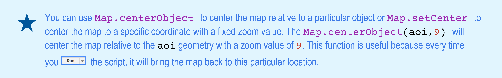
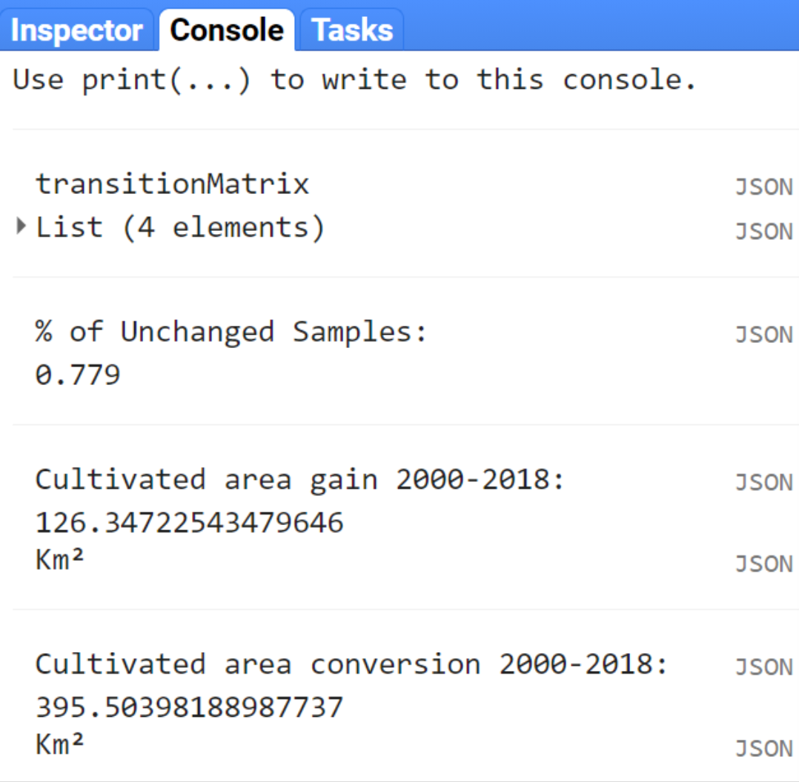

# Supervised Classification of Landsat 8 OLI Imagery

Objectives:

- Use the cloud-masking function (See Chapter 2's [Cloud and cloud shadow masking] section) to mask clouds on Landsat 8 Imagery;
- To produce a cloud-free composite mosaic using the median reducer ([Compositing]), and;
- To classify the cloud-free composite mosaic of Landsat 8 scenes using Random Forest.

## Example 1: Land cover classification of Greater Cairo and Giza area, Egypt - Year 2020 ##

We will start by [opening a new code editor page](https://code.earthengine.google.com/){target="_blank"}

###	Temporal and spatial parameters for compositing
In this example, we are going to create a 2020 annual composite. For this, let’s create three objects `(var)`: `year`, `startDay` and `endDay`.

```{r eval=FALSE}
var year = 2020; //# Year
var startDay = (year)+'-01-01'; //# beginning of date filter | month-day
var endDay = (year)+'-12-30'; //# end of date filter | month-day
```

Additionally, we need to define an area of interest for the composite. Google Earth Engine allows you to import your own shapefiles of your area of interest (through the *New* button in the Assets tab) as well as to direcly create your geometry in the code editor.

```{r my-figGEOM,  echo=FALSE, message=FALSE}

```

For this example, draw a rectangle around the metropolitan area of Cairo, Egypt (Figure 3.1):

```{r my-figGEOMEgypt,  fig.cap="Geometry drawn over the Greater Cairo area", echo=FALSE, message=FALSE}
knitr::include_graphics("images/CairoGEOM1.png")
```

Now, let's create an object `var aoi` that will contain the geometry `AreaOfInterest`:
```{r eval=FALSE}
var aoi = AreaOfInterest;
```

### Landsat 8 Pre-classification steps

* __Auxiliary Functions__

In this step, we will used the functions from Chapter 2 to create a cloud-free mosaic of Landsat scenes over our area of interest. First, the function `maskL8sr` will be used to mask all clouds and cloud shadows from the Landsat scenes:

```{r eval=FALSE}
var maskL8sr = function (image) {
  //# Bits 3 and 5 are cloud shadow and cloud, respectively.
  var cloudShadowBitMask = 1 << 3;
  var cloudsBitMask = 1 << 5;
  //# Get the pixel QA band.
  var qa = image.select('pixel_qa');
  //# Both flags should be set to zero, indicating clear conditions.
  var mask = qa.bitwiseAnd(cloudShadowBitMask).eq(0)
      .and(qa.bitwiseAnd(cloudsBitMask).eq(0));
  //# Return the masked image, scaled to reflectance, without the QA bands.
  return image.updateMask(mask).divide(10000)
      .select("B[0-9]*")
      .copyProperties(image, ["system:time_start"]);
};
```

Second, for a Random Forest type classifier, predictor variables must be used. Usually, different spectral indices are good predictors for the Random Forest Model. The function `addIndicesL8` below can be used to calculate several spectral indices and add them to each scene of the Landsat image collection:

```{r eval=FALSE}
var addIndicesL8 = function(img) {
  //# NDVI (Normalized Difference Vegetation Index)
  var ndvi = img.normalizedDifference(['B5','B4']).rename('NDVI');
  //# NDMI (Normalized Difference Mangrove Index - Shi et al 2016 )
  var ndmi = img.normalizedDifference(['B7','B3']).rename('NDMI');
  //# MNDWI (Modified Normalized Difference Water Index - Hanqiu Xu, 2006)
  var mndwi = img.normalizedDifference(['B3','B6']).rename('MNDWI');
  //# SR (Simple Ratio)
  var sr = img.select('B5').divide(img.select('B4')).rename('SR');
  //# Band Ratio 6/5
  var ratio65 = img.select('B6').divide(img.select('B5')).rename('R65');
  //# Band Ratio 4/6
  var ratio46 = img.select('B4').divide(img.select('B6')).rename('R46');
  //# GCVI (Green Chlorophyll Vegetation Index)
  var gcvi = img.expression('(NIR/GREEN)-1',{
    'NIR':img.select('B5'),
    'GREEN':img.select('B3')
  }).rename('GCVI');
   return img
    .addBands(ndvi) // This will add each spectral index to each Landsat scene
    .addBands(ndmi)
    .addBands(mndwi)
    .addBands(sr)
    .addBands(ratio65)
    .addBands(ratio46)
    .addBands(gcvi);
};
```

* __Landsat 8 image collection and cloud free-mosaic__

In this section we will load the Landsat 8 Surface Reflectance data archive into an object `var collection` by using the container `ee.ImageCollection` and the collection ID `'LANDSAT/LC08/C01/T1_SR'`. Secondly, we will filter this image collection so it only contains the Landsat scenes acquired within the period we selected previously (see Section [Temporal and spatial parameters for compositing]) by using the container `filterDate`. Finally, we will map the cloud-masking and spectral indices functions ([Landsat 8 Pre-classification steps]) to the collection:

```{r eval=FALSE}
var collection = ee.ImageCollection('LANDSAT/LC08/C01/T1_SR') //# Load the Landsat 8 SR Collection
    .filterDate(startDay, endDay) //# Filter the scenes based on the time period selected
    .map(maskL8sr)                //# Masks for clouds and cloud-shadows using the function we created
    .map(addIndicesL8);           //# Add the indices using the function we created
```

The object `collection` will now contain __*all*__ the Landsat 8 scenes from January to December for the year 2020. Each scene in this collection is masked for clouds and cloud shadows and will have additional bands for each spectral index included in the `addIndicesL8` function. 

Next, we will reduce this image collection into a composite. This can be done by a single median composite on a per-pixel, per- band basis using `.median()` or using quality bands such as ‘NDVI’ with `.qualityMosaic(‘NDVI’)` (See [Compositing] for more information). In an object called `var composite`, let’s reduce the collection using the container `.median()` and clip the composite to our area of interest `aoi` using the container `.clip`:

```{r eval=FALSE}
var composite = collection
                .median()   //# Uses the median reducer
                .clip(aoi); //# Clips the composite to our area of interest
```

Now, the object `composite` will contain a single multi-band image that is clipped to our area of interest `aoi`. We can add this composite layer to the map by using `Map.addLayer`. The arguments for `Map.addLayer` container are (but not limited to): 

- The object you want to display;
- The visualization parameters, and;
- A name for the layer of your choosing.

In this example, we are displaying a Landsat composite. Thus, let’s add to the map a real color image called `'Composite'` by selecting the bands `'B4'`, `'B3'`, `'B2'` to display in the RGB channels and the setting the minimum and maximum values to `0` and `0.3`: 

```{r my-figGEOCenter,   echo=FALSE, message=FALSE}

```


```{r eval=FALSE}
//# Display the results.
Map.centerObject(aoi,9); //# Set the map center to match the location of aoi
Map.addLayer(composite, {bands: ['B4', 'B3', 'B2'], min: 0, max: 0.3}, 'Composite');

```

Click Run (or use Ctrl+Enter). You should see something like this:

```{r my-figCompL8,   fig.cap="Landsat median composite for the area of interested displayed with a real color composition (RGB 432)", echo=FALSE, message=FALSE}
knitr::include_graphics("images/CompositeL8.PNG")
```

You can customize the composite visualization parameters by clicking on the settings icon (gear \u2⚙) next to the layer name (in this example: Composite. You can also toggle in between map and Google Earth imagery by using the buttons *__Map__* and *__Satellite__* as seen in Figure 3.3.

```{r my-figLayer,   fig.cap="Layer settings.", echo=FALSE, message=FALSE}
knitr::include_graphics("images/LayerSet.PNG")
```

### Supervised Classification with Random Forest

* __Training sample selection__

For this example, let’s classify the 'composite' into four classes: *water*, *agricultural land*, *sand and bare areas* and *urbanization*. The first step is to create the training samples set to use into the Random Forest Model.

Step 1 - In the Geometry Imports, click *__+new layer__* and make four sets of geometries, each set will represent samples from the classes 'water', 'cropland', 'sand' and 'urban'.

```{r my-figGeom,   fig.cap="Geometry sets to hold samples for each of the four classes.", echo=FALSE, message=FALSE}
knitr::include_graphics("images/Geometries.PNG")
```

Step 2  - For each geometry in the list, clicking on the settings icon (gear \u2): name them accordingly using the 'Name' box, choose a color for it using the color picker and import each geometry as *FeatureCollection*. Add a property called *landcover* by clicking on the *__+ Property__* and set a consecutive integer starting from 0 or 1 for each of the classes. You should achieve something similar to this:

```{r my-figGeom2,   fig.cap="Geometries used to create the training sample sets.", echo=FALSE, message=FALSE}
knitr::include_graphics("images/Geometries2.PNG")
```

Your Geometry Imports should look like this:

```{r my-figGeom3,   fig.cap="Geometry Imports after creating geometry sets to hold training samples", echo=FALSE, message=FALSE}
knitr::include_graphics("images/Geo3.PNG")
```

Start selecting samples by clicking on the ‘Water’ geometry in the Geometry Imports. Choose the point drawing tool and place some points along the River Nile:

```{r my-figadv, echo=FALSE, message=FALSE}

```

Instead of single points (i.e pixels), we can also use polygons containing a variable number of relatively homogenous pixels of a given land cover class. Switch to the polygon drawing tool and draw a few polygons over the River Nile:

```{r my-figNile,   fig.cap="Sample points and polygons for the Water class", echo=FALSE, message=FALSE}
knitr::include_graphics("images/Nile.PNG")
```

```{r my-figadv2, echo=FALSE, message=FALSE}
knitr::include_graphics("images/advantage2.PNG")
```

Once you finish selecting samples, click the *__Exit__* button on the polygon editor dialogue box . 
Repeat the process for each of the other class. Make sure you select samples that are representative of each land cover class by selecting points and polygons of homogenous pixels (Figure 3.8).

```{r my-figAllSamples,   fig.cap="Example of sample points and polygons for ‘Water’ (blue), ‘Cropland’ (yellow), ‘Urban’ (red) and ‘Sand’ (pink). Each pixel within the polygons will be used as training inputs for the RF classifier.", echo=FALSE, message=FALSE}
knitr::include_graphics("images/AllSamples.PNG")
```

After selecting the samples, we will merge all the geometries together into an object var classes using the `.merge` container:

```{r eval=FALSE}
var classes = Water.merge(Cropland)
                   .merge(Sand)
                   .merge(Urban);

```

* __Sample sets__

In this section, we will create the training (and testing) sample sets to be used in the classification with Random Forest. First, we will select the predictors to assign to each sample point in the sample sets. For this example, let’s create an object `var bands` with three spectral bands (`'B5'`,`'B6'`,`'B7'`) and four spectral indices (`'NDVI'`,`'MNDWI'`,`'SR'`,`'GCVI'`).

```{r eval=FALSE}
var bands = ['B5','B6','B7','NDVI','MNDWI','SR','GCVI'];
```

Next, we will sample the Landsat pixels by overlaying the geometries with the composite using the code below:

```{r eval=FALSE}
var samples = composite.select(bands).sampleRegions({
  collection: classes,       #// Set of geometries ~classes~ created in the previous
  properties: ['landcover'], #// Label from each geometry from the feature property
  scale: 30                  #// Make each sample the same size as Landsat pixel
}).randomColumn('random');   #// creates a column with random numbers for the next step

```

In the `sample` object we have just created, each sample will include a column with the values from the object `bands` inherited from the composite and a column with their respective class label. Optionally, you can perform an accuracy assessment of the classifier by taking advantage of the identifiers assigned to the samples by the `.randomColumn('random')` within `samples`.
For this example, we will randomly partition the sample set into `training` (80% of the samples) and `testing` (20% of the samples) samples using the code below:

```{r eval=FALSE}
var split = 0.8; #// Roughly 80% for training, 20% for testing.
var training = samples.filter(ee.Filter.lt('random', split));
var testing = samples.filter(ee.Filter.gte('random', split));
```

```{r my-tip, echo=FALSE, message=FALSE}

```

For your information, you can inspect the size (Figure 3.9) of the samples, training and testing objects using the code below:

```{r eval=FALSE}
print('Samples n =', samples.aggregate_count('.all'));
print('Training n =', training.aggregate_count('.all'));
print('Testing n =', testing.aggregate_count('.all'));
```

```{r my-fig39,   fig.cap="Sample sets size for this example. Note that the number will vary based on the number of geometries (polygons and points) and the sample split value", echo=FALSE, message=FALSE}
knitr::include_graphics("images/Figure39.PNG")
```

* __Classification__

Next, we will train a Random Forest classifier using the training sample set `training`. The Random Forest classifier `ee.Classifier.smileRandomForest` has several user-defined parameters. However, two of them are the most usually defined: the number of trees in the ensemble (a.k.a ‘forest’) and the number of predictors to randomly tested at each tree. Note:__Higher number of trees and number of predictors tested at each node do not mean better performance and overall accuracy__. 
For this example, let’s use `100` trees and `5` randomly selected predictors to use in each tree in a Random Forest model called `classifier`:

```{r eval=FALSE}
var classifier = ee.Classifier.smileRandomForest(100,5).train({
  features: training.select(['B5','B6','B7','NDVI','MNDWI','SR','GCVI', 'landcover']), #// training
  classProperty: 'landcover', 
  inputProperties: bands
});
```

In the `features` argument of the code above, make sure to select the predictors you want to use from the sample set (in this example, `training`) to train the model. Most importantly, you must include the class property (`classProperty`) in which the class label is stored (in this example `'landcover'`).

You can assess the accuracy of the Random Forest model using the testing samples and print the results to the console using the code below:

```{r eval=FALSE}
var validation = testing.classify(classifier);
var testAccuracy = validation.errorMatrix('landcover', 'classification');

print('Validation error matrix RF: ', testAccuracy);
print('Validation overall accuracy RF: ', testAccuracy.accuracy());
});
```

Now, you can classify the `composite` using the Random Forest model `classifier`:

```{r eval=FALSE}
var classifiedrf = composite.select(bands)         #// select the predictors
                            .classify(classifier); #// apply the Random Forest

```

For visualization of the resulting classification output, let’s first create a color palette object `paletteMAP` with colors for each class of the map and a legend object `legend`. The order of the colors in the palette will follow the order of the classes:

```{r eval=FALSE}
var paletteMAP = [
  '#0040ff',  #// Water (Class value 0)
  '#00ab0c',  #// Croplands / Cultivated Areas (Class value 1)
  '#fbf2ad',  #// Sand and bare areas (Class value 2)
  '#878587',  #// Built-up and Urban Areas (Class value 3)
];

var legend = ui.Panel({
  style: {
    position: 'bottom-left', #// Position in the map
    padding: '8px 15px'      #// Padding (border) size
  }
});
var makeRow = function(color, name) {
  #// Create the label that is actually the colored boxes that represent each class
  var colorBox = ui.Label({
    style: {
      backgroundColor: '#' + color,
      #// Use padding to give the label color box height and width.
      padding: '8px', 
      margin: '0 0 4px 0'
    }
  });
  #// Create the label filled with the description text.
  var description = ui.Label({
    value: name,
    style: {margin: '0 0 4px 6px'}
  });
  return ui.Panel({
    widgets: [colorBox, description],
    layout: ui.Panel.Layout.Flow('horizontal')
  });
};
legend.add(makeRow('0040ff', 'Water'));
legend.add(makeRow('00ab0c', 'Croplands / Cultivated areas'));
legend.add(makeRow('fbf2ad', 'Sand and bare areas'));
legend.add(makeRow('878587', 'Artificial Surfaces'));
```

Now, add the classification `classifiedrf` to the map using `Map.addLayer`: set the `min: 0` (first class), `max: 3` (last class), add the color palette `paletteMAP` and a name for the layer `'name'`. Finally, add the `legend` to the map using `Map.add`:

```{r eval=FALSE}
Map.addLayer (classifiedrf, {min: 0, max: 3, palette:paletteMAP}, 'Classification');
Map.add (legend);
```

Click *__Run__* (or ctrl+Enter). After several seconds, you should see something similar to the figure below:

```{r my-2020,   fig.cap="Random Forest classification output for 2020", echo=FALSE, message=FALSE}

```

Finally, export your classification output as a Google Earth Engine asset using the `Export.image.toAsset` function:

```{r eval=FALSE}
Export.image.toAsset({
  image: classifiedrf,                  #// Classification you want to export
  description: 'ClassificationOutput',  #// Name showing on the task list (no space allowed)
  assetId: 'Cairo2020',                 #// Asset name (No spaces allowed)
  scale: 30,                            #// Scale (30m Landsat)
  region: AreaOfInterest,               #// Region that you want to export - requires a geometry
  maxPixels:1e12                        #// Default: if the export exceeds 1e8 = error!
});
```

Running the code above will create the exporting task named *__ClassificationOutput__* in the task manager tab. Click *__Run__* at this task to start exporting your classification.

## Example 2: 2000 - 2020 Map-to-Map change of greater Cairo and Giza area, Egypt

```{block, type='rmdcomment'}
Access the full scrip for this example [here.](https://code.earthengine.google.com/db8f334899c54ce9c6009fb3b56fc653){target="_blank"}
```

In this example, we will use the codes from [Example 1][Example 1: Land cover classification of Greater Cairo and Giza area, Egypt - Year 2020] to create a land cover classification for the year 2000 period. In this case, we have to use the Landsat 7 ETM+ image collection instead, as Landsat 8 OLI is only available after April 2013.
Following are the changes to be made on the codes from [Example 1][Example 1: Land cover classification of Greater Cairo and Giza area, Egypt - Year 2020]:

a)	The `year` object will have a value of `2000`;
b)	The `addIndicesL8` function will have different names for the spectral bands. See [Section 2 from Chapter 2][Spectral Indices];
c)	The `collection` object will have the Landsat 7 `'LANDSAT/LE07/C01/T1_SR'` image collection;
d)	Repeat the training sample selection (See [Sample sets][Example 1: Land cover classification of Greater Cairo and Giza area, Egypt - Year 2020] from previous example) to make sure the samples reflect the correct land cover class for the L7 composite in the year 2000.

You can access the edited script for four steps above [*here.*](https://code.earthengine.google.com/dd0d6a609d2eb5346f33b91d967a30b9){target="_blank"}

After following the 4 steps above, you should achieve a similar output as before:

```{r my-2000,   fig.cap="Random Forest classification output for 2000", echo=FALSE, message=FALSE}
knitr::include_graphics("images/2000.PNG")
```

Export this new classification to you assets. Next, [open a new code editor page](https://code.earthengine.google.com/){target="_blank"} and add the classification exports to this scripts by clicking the *__Import into script__* button (blue arrow) for both classification assets in the Assets tab as shown in the figure 3.12:

```{r my-imports,   fig.cap="Assets tab with classification maps.", echo=FALSE, message=FALSE}
knitr::include_graphics("images/imports.PNG")
```

Rename each import by clicking on their names at the *__Imports__* header:

```{r my-importsHead,   fig.cap="Imports header.", echo=FALSE, message=FALSE}
knitr::include_graphics("images/importHead.PNG")
```

Alternatively, you can import assets to your scripts by using `ee.Image` and their respective asset directory:

```{r eval=FALSE}
var Cairo2000 = ee.Image("users/celiohelder/TutorialAssets/Cairo2000");
var Cairo2020 = ee.Image("users/celiohelder/TutorialAssets/Cairo2020");
```

Add `Cairo2000` and `Cairo2020` to the map using the code below:

```{r eval=FALSE}
var paletteMAP = [
  '#0040ff',  #// Water - pixel value = 0
  '#00ab0c',  #// Croplands / Cultivated Areas - pixel value = 1
  '#fbf2ad',  #// Sand and bare areas - pixel value = 2
  '#878587',  #// Built-up and Urban Areas - pixel value = 3
];

Map.addLayer(Cairo2000, {min: 0, max: 3, palette:paletteMAP}, 'Cairo2000');
Map.addLayer(Cairo2018, {min: 0, max: 3, palette:paletteMAP}, 'Cairo2018');
```

You can examine both layers on the map and try to identify areas where classes have changed in the 21 years period. However, we can use a transition error matrix to quickly quantify these changes. This matrix can be used to assess how much each class has changed and to what they have changed based on sampling design of your choosing. To do that, start by stacking both maps `Cairo2000` and `Cairo2020` into a single object `stackedClassifications` and rename Cairo2000 and Cairo2020 as `'before'` and `'later'`, respectively:

```{r eval=FALSE}
var stackedClassifications = Cairo2018.rename('later').addBands(Cairo2000.rename('before'));
```

Next, create a testing sample set with 500 points for each class using a stratified random sampling design.
In this sampling design each class has the same weight. Therefore, the same number of points will be placed in each class, regardless of its relative extent. This is important to consider as some classes may have very small area extent to be captured by a random sampling design. In this example, water bodies is relatively small compared to the other three land cover class. Thus, a stratified sampling design will ensure that this class will have the same number of points. 
Once the points are placed, they will inherit the class label (pixel value) from `Cairo2000` (`'before'`):

```{r eval=FALSE}
var sample = stackedClassifications.stratifiedSample({
numPoints: 500,        #// Number of points you want to select by each class
classBand: "before",   #// Map you want the points to inherit the class labels from
scale: 30,             #// Alsways remember to set the scale to match Landsat nomimal spatial resolution
geometries: true
});
```

Then add the samples to the map. You should see something similar to figure 3.14:

```{r eval=FALSE}
Map.addLayer(sample, {}, 'Stratified samples');
```

```{r my-strat,   fig.cap="2000 stratified random samples - 500 points by class.", echo=FALSE, message=FALSE}
knitr::include_graphics("images/stratsample.PNG")
```

Next, create a transition matrix using the samples above. This matrix will show how many of these 500 remained the same land cover class 20 years later (`Cairo2018`) and how many of them changed to a given class. You can use `.accuracy()` to calculate the % of these samples remained unchanged between the two periods:

```{r eval=FALSE}
var transitionMatrix = sample.errorMatrix({
  actual: 'before',  #// Cairo 2000 - rows
  predicted: 'later' #// Cairo 2020 – columns
});

print('Transition Matrix', transitionMatrix);
print('% of Unchanged Samples: ', transitionMatrix.accuracy());
```

The matrix will be printed to the *__Console__* tab. The code above should produce something similar to Figure 3.15:

```{r my-matrix,   fig.cap="Transition matrix based on the 2000 samples", echo=FALSE, message=FALSE}
knitr::include_graphics("images/matrix.PNG")
```

In the transition matrix above you can draw information about how many samples transitioned to each class from 2000 to 2020. For example, from the 500 samples of agriculture class (pixel value 1), 1 was classified (or ‘transitioned’) to water, 70 to sand and 106 to urban areas in 2020. Overall, 78% of these samples remained unchanged.

* __Cropland area expansion and conversion in the Nile Delta from 2000-2020__

Another quick analysis that can be done with land cover class maps in two points in time is highlighting areas in which a particular class has changed. In this example, we will assess the cultivated/cropland change between the 2000 and 2020. First, isolate the agricultural land class (pixel value `1`) from both years into separate objects `crop2000` and `crop2020`. Secondly, we calculate the change by simply subtracting both objects:

```{r eval=FALSE}
var crop2000 = Cairo2000.select(['classification']).eq(1);
var crop2020 = Cairo2020.select(['classification']).eq(1);
#// Calculate the change by subtracting the two objects
var change = crop2020.subtract(crop2000);
```

By default, the new objects `crop2000` and `crop2020` will have values of 1 where the `'classification'` has the label equals (`.eq`) to 1 (agriculture) in the land cover map. This will be the case regardless of the label value. Thus, the object `change` will have values of `-1`, `0` and `1`, that represents loss/conversion, no change and gains, respectively: 

`-1` = No crops in 2020 - crops in 2000 (0 - 1 = -1);

`0` = crops in 2020 - crops in 2000 (1 - 1 = 0);

`1` = crops in 2020 - no crops in 2000 (1 - 0 = 1)

Add `change` to the map. Optionally, add a legend to the map using the code from [Example 1][Supervised Classification with Random Forest]

```{r eval=FALSE}
var paletteCHANGE = [
  'red',    // Loss/conversion
  'white',  // No Change
  'green',  // Gain/Expansion
];

Map.addLayer(change, {palette: paletteCHANGE}, 'Change 2000-2018')
```

The resulting change map will look similar to Figure 3.16:

```{r my-change,   fig.cap="2000-2020 Change Map. Conversion/loss west of the Nile Delta are likely due to harvest while the circle shaped areas in the center of the delta are related to expansion of cities and villages.", echo=FALSE, message=FALSE}
knitr::include_graphics("images/matrix.PNG")
```

You can calculate the area of expansion/conversion by isolating the pixels of gain/loss from the `change` into `gain` and `loss`. Then, calculate the area of each pixel using `ee.Image.pixelArea` and multiplying by the count of pixels in gain and loss using `multiply`. The default unit is square meters (m²). You can use `.divide()` to transform into square kilometers (`.divide(1000000)`) or hectares (`.divide(10000)`)

```{r eval=FALSE}
var gain = change.eq(1);  // Isolate the gain pixels from the change
var loss = change.eq(-1); // Isolate the loss pixels from the change

// Calculate the area of each pixel
var gainArea = gain.multiply(ee.Image.pixelArea().divide(1000000));
var lossArea = loss.multiply(ee.Image.pixelArea().divide(1000000));
```

```{r my-areas,   fig.cap="Cultivated area gains and losses in the 2000-2020 period.", echo=FALSE, message=FALSE}

```

