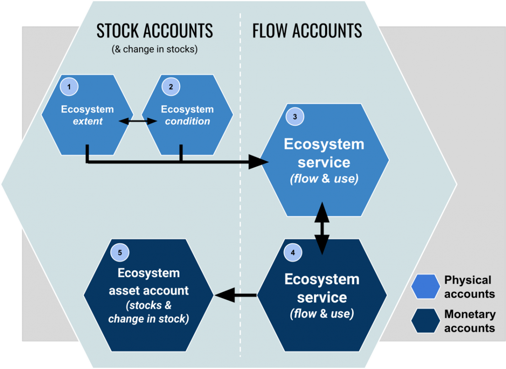

# Part 4 - Ecosystem Accounting

## Introduction to Ecosystem Accounting

### Ecosystem Accounting

**A) Background**

Statistical standard of ***Ecosystem Accounting***...

*Ecosystem Accounting* is a process...

**B) Ecosystem Accounting Components**

Here are essential components:

```{r nameofFigure, fig.cap="Components of ecosystem accounting.", echo=FALSE, message=FALSE}

```
