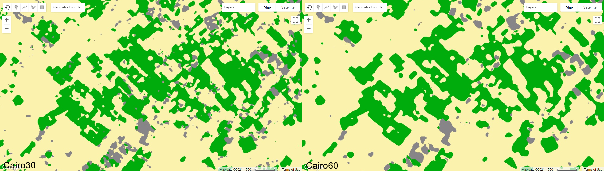

# Post-classification processing

Objective: 

- To provide useful post-classification steps for corrections and general improvement of a random forest classification output. 

## Re-classification ##

Classification outputs often times will need some degree of correction or adjustment. Some of these corrections and adjustments include, for example, the Correction for missclassification erros in specific areas and changing class labels (pixel values) or class order. In this section we will explore the function `remap`. This function maps from input values to output values, represented by two parallel lists: one includes the original number classes and their value; the other represents which class (or classes) is being remapped and to what it is being remapped to. 
To ilustrate this concept, consider the following example:

- The previously produced land cover map of Greater Cairo includes four classes: Water (pixel value = 0), Cropland / Cultivated Areas (pixel value = 1), Sand and bare areas (pixel value = 2) and Built-up and Urban Areas (pixel value = 3) (List 1). If any of these class values needs to be changed, the new value for that class is placed in the *List 2*, in the position of the class that needs changing (Figure 1).

```{r my-remap,  fig.cap="The `remap` function for the land cover classification of the Greater Cairo. ", echo=FALSE, message=FALSE}
knitr::include_graphics("images/remap.png")
```

To test this function, start by [opening a new code editor page](https://code.earthengine.google.com/){target="_blank"} and importing one of the classification assets you used [in the previous chapter][Example 2: 2000 - 2020 Map-to-Map change of greater Cairo and Giza area, Egypt]. In this example, we will importe the latest land cover map from the year 2020 as a variable called `Cairo2020` and we will add it to the map editor using the same color scheme from `paletteMAP` used in the previous chapter:

```{r eval=FALSE}
var Cairo2020 = ee.Image("users/celiohelder/TutorialAssets/Cairo2020");

var paletteMAP = [
  '#0040ff',  #// Water
  '#00ab0c',  #// Croplands / Cultivated Areas
  '#fbf2ad',  #// Sand and bare areas
  '#878587',  #// Built-up and Urban Areas
];

Map.addLayer(Cairo2020, {min: 0, max: 3, palette:paletteMAP}, 'Cairo2000');
```

Now, let's consider the following scenarios:

```{block, type='rmdcomment'}
Access the full scrip for the three scenarios [here.](https://code.earthengine.google.com/a2e86da139ffccfdeaeda582355932a0){target="_blank"}
```

### Scenario 1

A new version of the `Cairo2020` map where *__Sand and bare areas (pixel value = 2)__* and *__Built-up and Urban Areas (pixel value = 3)__* switch orders in the final map. In this case, we can use the `remap` function to change the pixel value of *Built-up and Urban Areas* to __2__ and *Sand and bare areas* to __3__ in their respective position on list 2 (Figure 2):

```{r my-remap2,  fig.cap="Sand (2) and Cities (3) changing orders in the image output using `.remap` ", echo=FALSE, message=FALSE}
knitr::include_graphics("images/remap2.png")
```

As a guide, the figure above can be used to create a new variable `CairoV1` with the new order for the classes using `remap`:
```{r eval=FALSE}
var CairoV1 = Cairo2020.remap([0,1,2,3],[0,1,3,2]);
```

Add the `CairoV1` to the the map using the original color scheme `paletteMAP`:

```{r eval=FALSE}
Map.addLayer(CairoV1, {min: 0, max: 3, palette:paletteMAP}, 'Cairo V1');
```

```{r my-CairoV1,  fig.cap="`Cairo2020` and `CairoV1` maps using the original `paletteMap`. Note that Sand and bare areas and Built-up and Urban areas switched colors as we switched their order.  ", echo=FALSE, message=FALSE}
knitr::include_graphics("images/CairoV1.png")
```

### Scenario 2

A new version of the `Cairo2020` map where *__Sand and bare areas (pixel value = 2)__* and *__Built-up and Urban Areas (pixel value = 3)__* are merged into a new class called *__Barren land and Articicial Surfaces (pixel value = 2)__*. Note that this new class can assume any value when merging, as long as both classes have the same value: 

```{r my-remap3,  fig.cap="Sand and bare areas merging with Built-up and Urban area into a new class value (2). New classes can assume any value when merging, as long as these values are the same for both classes.", echo=FALSE, message=FALSE}
knitr::include_graphics("images/remap3.png")
```

For this example, keep the value *__2__* for this new class following Figure 4 and create a new variable `CairoV2` for the new map:

```{r eval=FALSE}
var CairoV2 = Cairo2020.remap([0,1,2,3],[0,1,2,2]);
```

Similarly, Add the `CairoV2` to the the map using the original color scheme `paletteMAP`.

```{r eval=FALSE}
Map.addLayer(CairoV2, {min: 0, max: 2, palette:paletteMAP}, 'Cairo V1');
```

Note that the `min` and `max` range of values changed from 0-3 (4 classes) to 0-2 (three classes). Even if the original range was mainted, `Map.addLayer` would only map the color scheme to the first three values of`Cairov2` (0, 1 and 2). However, it is always good practice to set the `min` and `max` range of values to match the actual number of classes. Alternatively, you can also edit the color palette to have the same number of colors as the number of classes in your map:

```{r my-CairoV2,  fig.cap="`Cairo2020` and `CairoV2` maps using the original `paletteMap`. Note that *Sand and bare areas* and *Built-up and Urban areas* have the same color as they were merged under the same pixel value (2).", echo=FALSE, message=FALSE}
knitr::include_graphics("images/CairoV2.png")
```

### Scenario 3

A new version of the `Cairo2020` map where only a portion of it is remapped to a given class.
This scenario is one of the most commonly used post-classification procedure where the goal is to remap specific areas to fix for classification errors. To ilustrate, consider the following example:

- Upon close inspection, the `Cairo2020` map showed some cropland/cultivated areas within zones of dense urbanization. A team on the ground went to the area and confirmed that is indeed dense urbanization and no agricultural land was found in that area. Therefore, that portion of the map needs to be rectified in order to reflect the actual land cover. In this case, the `.where` function is used. This function performs conditional replacement of values, following the formula `input.where(test,value)`. For each pixel in each band of `input`, if the corresponding pixel in `test` is nonzero, Google Earth Engine will output the corresponding pixel in `value`, otherwise it will output the `input` pixel. Translating this function to this example, `input` is the land cover map in which we aim to perform the reclassification - in this case `Cairo2020`; `test` is the area or region of the map `value` will take place, and; `value` is the correct classification that will be included in the final map (Figure 6):

```{r my-where,  fig.cap=" The `.where` function applied to this example.", echo=FALSE, message=FALSE}
knitr::include_graphics("images/WhereFunction.png")
```

In your own version of `Cairo2020` map, create an new geometry over an area of your interest and name it `aoi`: 
```{r my-regionwhere,  fig.cap="A geometry over an area of `Cairo2020` highlighting cultivated areas next to urbanization.", echo=FALSE, message=FALSE}
knitr::include_graphics("images/RegionWhere.png")
```

The function `.where` only uses images as `test`. Therefore, using the geometry/feature `aoi` is not allowed. 
An easy and effective way to go around this rule is to create an image with `ee.Image()` and clip it for the region of interest:

```{r eval=FALSE}
var region = ee.Image(1).clip(aoi);
```

The function above will create an image of 30 m pixels with value of 1 and will clip it for the area of interest `aoi`. Next, using the same approach from *Scenario 1* and *2*, create a new version of `Cairo2020` called `subistitute`, where the *__Cropland/Cultivated Areas__* class is remapped to *__Built-up and Urban Areas__*: the position 2 on list 2 (belonging to agricultural/cultivated areas) receives the value *__3__* from *__Built-up and Urban Areas__* on list 1:

```{r eval=FALSE}
var substitute = Cairo2020.remap([0,1,2,3],[0,3,2,3]);
```

Now, using `.where` create a new map `CairoV3` following the formula seen on Figure 6 and add it to the map editor:

```{r eval=FALSE}
var CairoV3 = Cairo2020.where(region,substitute);
Map.addLayer(CairoV3, {min: 0, max: 3, palette:paletteMAP}, 'Cairo V3');
```

```{r my-cairov3,  fig.cap="`CairoV3` showing the pixels of Cropland/Cultivated Areas remapped as Built-up and Urban Areas within `aoi`.", echo=FALSE, message=FALSE}
knitr::include_graphics("images/CairoV3.png")
```

Notice that every pixel of *__Cropland/Cultivated Areas__* (green, pixel value = 2) within the `aoi` in `Cairo2020` is now remapped to *__Built-up and Urban Areas__* (grey, pixel value = 3) in `CairoV3`.

## Map spatial smoothing ##

Spatial smoothing is another post-classification procedure to enhance the quality of a land cover classification output. A common issue that arises from the pixel-based classification of fine/medium spatial resolution imagery is the “salt-and-pepper” effect. This happens when individual pixels are classified differently from their neighbors, creating speckles of isolated pixels of different classes. There are several ways to minimize this issue, such as:

- image pre-processing, such as low-pass filter and texture analysis;
- contextual classification, and;
- post-classification processing, such as median and mode filtering.

In this section, we will focus on a post-classification technique to reduce the salt and pepper effect and edge roughness of land cover maps using focal median filtering (`ee.Image.focal_median`).

First, [open a new code editor page](https://code.earthengine.google.com/){target="_blank"} and add one the classification exports to this script by clicking the *__Import into script__* button (blue arrow) for the classification asset of your choosing. For this example, we will use `Cairo2020`.

```{r eval=FALSE}
// Color palette for the original map
var paletteMAP = [
  '#0040ff',  // Water
  '#00ab0c',  // Croplands / Cultivated Areas
  '#fbf2ad',  // Sand and bare areas
  '#878587',  // Built-up and Urban Areas
];

Map.setCenter(31.42217, 29.99157,10); // Set the center over Cairo
Map.addLayer(Cairo2020, {min: 0, max: 3, palette:paletteMAP}, 'Cairo2000');
```

Next, we will apply the `.focal_median` function to `Cairo2020`. This function is a simple sliding-window spatial filter that replaces the center value (or class) in the window with the median of all the pixel values in the window. The window, or kernel, is usually square but can be any shape. The `focal_median` function usually is expressed as:

```{r my-focal,  fig.cap="`.focal_median` spatial filter.", echo=FALSE, message=FALSE}
knitr::include_graphics("images/focal.png")
```

In the function above, the `radius` parameter specifies the number of pixels from the center that the kernel will cover. This radius value can be expressed as number of pixels or meters. The `kernelType` specifies the type of kernel to use. For instance, consider the example below:

- Either `.focal_median(1, 'square', 'pixels')` or `.focal_median(30, 'square', 'meters')` will produce a 3x3 pixel sliding-window, as you are specifing 1 pixel (or 30 meters which is equal to one Landsat pixel) in each direction from the center pixel. Similarly, a `radius` of 2 pixels or 60 meters will produce a 5x5 sliding-window: a center pixel plus 2 pixels in each direction. 

Following Figure 9 and the example above, apply the `.focal_median` filtering with two `radius` sizes (30 and 60 meters) to `Cairo2020`, add `Cairo30` and `Cairo60` to the map editor and compare the results:

```{r eval=FALSE}
var Cairo30 = Cairo2020.focal_median(1,'square', 'pixels');
var Cairo60 = Cairo2020.focal_median(30,'square', 'meters');
#// Add the new maps to the map editor
Map.addLayer(Cairo30, {min: 0, max: 3, palette:paletteMAP}, 'Cairo 3x3');
Map.addLayer(Cairo60, {min: 0, max: 3, palette:paletteMAP}, 'Cairo 5x5');
```

```{r my-smooth1,  fig.cap="`Cairo2020` processed with `.focal_median` spatial filter with 3x3 and 5x5 pixels square kernels.", echo=FALSE, message=FALSE}

```

```{block, type='caution'}
__IMPORTANT:__ The *.focal_median(1, 'square', 'pixels')* and *.focal_median(30, 'square', 'meters')* will only achieve the intended final result if you reproject it back to the original scale and projection from the original map.
```

Note that this technique while effective in removing the "salt-and-pepper" effect from the original map, it creates edges that are not in the same resolution and projection as the original map. Therefore, creating fairly rounded boundaries for the classes. This is not ideal as it is usually intended for these maps to keep the same resolution as the original map, as well as to preserve the boundaries between classes. To account for this issue, you can reproject this output back the original scale so it is formed by 30 x 30 meter pixels.

To do that, simply use `.reproject(projection.atScale(scale))` within the `.focal_median` filter. The `.reproject` function will take two arguments: projection and scale. You can extract this information from the original map with `.projection()` and `.nominalScale()`:

```{r eval=FALSE}
var prj = Cairo2020.projection();
var scale = prj.nominalScale();
```

Then, re-aply the `.focal_median` filter with `.reproject(projection.atScale(scale))`:

```{r eval=FALSE}
var Cairo30 = Cairo2020.focal_median(1,'square', 'pixels')
                       .reproject(prj.atScale(scale));
                       
var Cairo60 = Cairo2020.focal_median(30,'square', 'meters')
                       .reproject(prj.atScale(scale));
```

```{r my-smooth2,  fig.cap="`Cairo2020` processed with `.focal_median` spatial filter with 3x3 and 5x5 pixels square kernels. Note that the function was reprojected to match `Cairo2020`'s projection and scale", echo=FALSE, message=FALSE}
knitr::include_graphics("images/cairosmooth2.png")
```

Note that even though the boundaries of the classes are smoother, they are formed by the 30 x 30 meter pixels. 
Usually, a `radius` of 1 (3x3 square window) removes most of the salt-and-pepper effect, smoothens the boundaries in between classes while preserving the overall shape of the classes.

```{block, type='rmdcomment'}
Access the full scrip for this section [here.](https://code.earthengine.google.com/b5d782ff5849d59af760e62e85065909){target="_blank"}
```
