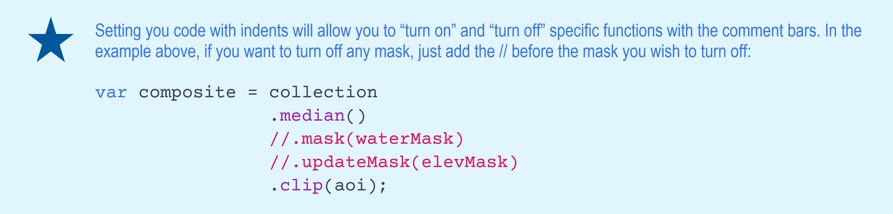
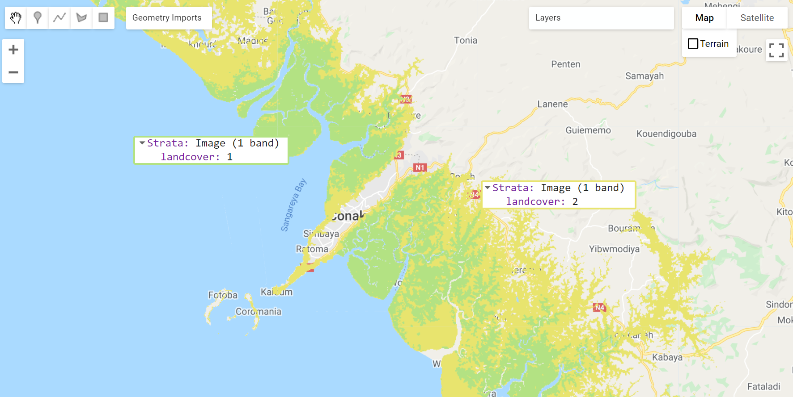

# Country-specific analyses

In this chapter we will explore examples of class-specific classification using previously used functions as well as useful land cover classification-based analysis.

Objectives:

- To classify a cloud-free composite mosaic of Landsat 8 scenes for single class mapping in countries of interest in West Africa;
- To introduce the use of other datasets in the classification workflow.

## Mangrove mapping in Guinea - West Africa

In this example, we will use the codes from the previous chapters and adapt portions of them for mangrove mapping in Guinea, in West Africa. We will also introduce the use of other datasets for masking and sample selection to assist in the classification workflow.

Start by [opening a new code editor page](https://code.earthengine.google.com/){target="_blank"} and
by defining the spatial and temporal parameters of the composite you wish to classify, just like the other examples. For the temporal parameters, let’s use an annual 2020 composite:

```{r eval=FALSE}
var year = 2020; #// Year
var startDay = (year)+'-01-01'; #// beginning of date filter | month-day
var endDay = (year)+'-12-30';   #// end of date filter | month-day
```

For the spatial parameters, you can use the *Large Scale International Boundary (LSIB)* dataset and select Guinea’s national border. First, load the dataset into an object `countries` using the `ee.FeatureCollection` container and the feature collection ID `'USDOS/LSIB/2013'`. Secondly, filter the dataset using `.filterMetadata` and select Guinea from the list of countries and storing it in `aoi`:

```{r eval=FALSE}
var countries = ee.FeatureCollection('USDOS/LSIB/2013');
var nationalborder = countries.filterMetadata('name' , 'equals', 'GUINEA');
```

```{block, type='rmdcomment'}
Note that you can select a any country border by filtering *'USDOS/LSIB/2013'* dataset by using *.filterMetadata('name' , 'equals', 'NAME OF THE COUNTRY IN CAPITAL LETTERS')*. 
```

Alternatively, you can use any previously uploaded Guinea's boundary datasets available [here.](https://code.earthengine.google.com/16fbfeb335381c203fed98eb81712dda){target="_blank"} Select a dataset from the list, copy its Asset ID and load it with `ee.FeatureCollection` into `aoi`. 

```{r my-borders,  fig.cap="Examples of Guinea's administrative borders.", echo=FALSE, message=FALSE}
knitr::include_graphics("images/borders.png")
```

In this example, we aim to map of Guinea's mangroves. Therefore, we chose `prefecures5k` as it emcompasses the entirety of Guinea's coast:

```{r eval=FALSE}
var aoi = ee.FeatureCollection('users/celiohelder/Guinea/Borders/CoastalPrefectures5k');
```

```{block, type='caution'}
*__Important__*: All these datasets were made available through our collaboration with the Guinea and the World Bank and they were modified with a GIS software for the sole purpose of this exercise. You can upload any geographical dataset (both raster or shapefile) into GEE with the *__NEW__* button in the Assets table. 
```

As auxiliary functions for cloud masking and spectral index calculation, we will use the same functions provided in [Chapter 2][Auxiliary functions]:

```{r eval=FALSE}
var maskL8sr = function (image) {
  var cloudShadowBitMask = 1 << 3;
  var cloudsBitMask = 1 << 5;
  var qa = image.select('pixel_qa');
  var mask = qa.bitwiseAnd(cloudShadowBitMask).eq(0)
      .and(qa.bitwiseAnd(cloudsBitMask).eq(0));
  return image.updateMask(mask).divide(10000)
      .select("B[0-9]*")
      .copyProperties(image, ["system:time_start"]);
};

var addIndicesL8 = function(img) {
  #// NDVI (Normalized Difference Vegetation Index)
  var ndvi = img.normalizedDifference(['B5','B4']).rename('NDVI');
  #// NDMI (Normalized Difference Mangrove Index - Shi et al 2016 )
  var ndmi = img.normalizedDifference(['B7','B3']).rename('NDMI');
  #// MNDWI (Modified Normalized Difference Water Index - Hanqiu Xu, 2006)
  var mndwi = img.normalizedDifference(['B3','B6']).rename('MNDWI');
  #// SR (Simple Ratio)
  var sr = img.select('B5').divide(img.select('B4')).rename('SR');
  #// Band Ratio 6/5
  var ratio65 = img.select('B6').divide(img.select('B5')).rename('R65');
  #// Band Ratio 4/6
  var ratio46 = img.select('B4').divide(img.select('B6')).rename('R46');
  #// GCVI (Green Chlorophyll Vegetation Index)
  var gcvi = img.expression('(NIR/GREEN)-1',{
    'NIR':img.select('B5'),
    'GREEN':img.select('B3')
  }).rename('GCVI');

   return img
    .addBands(ndvi) // This will add each spectral index to each Landsat scene
    .addBands(ndmi)
    .addBands(mndwi)
    .addBands(sr)
    .addBands(ratio65)
    .addBands(ratio46)
    .addBands(gcvi);
};
```

### Masking

In this example, we will focus on mangrove mapping. Therefore, other known classes can be masked from the analysis.

- *__Water mask__*

The objective of this mask is to remove water pixels from the Landsat composite as we are only focusing on Mangroves. We will create a water mask using the JRC’s Global Surface Water dataset:

```{r eval=FALSE}
var globalwater = ee.Image('JRC/GSW1_0/GlobalSurfaceWater');
```

The Global Water Dataset `'JRC/GSW1_0/GlobalSurfaceWater'` has different bands: one of them `'occurrence'`. This band shows how many times (expressed as %) a given pixel was classified as water relative to the total time span of the dataset. Let’s isolate the `'occurrence'` band from the globalwater object:

```{r eval=FALSE}
var occurence = globalwater.select('occurrence'); #// Select the occurrence band
```

Masks are composed by zeros and non-zero values. When you set or apply a mask to an image, the output image will keep its original values where the mask has non-zero values and pixels will be masked where the mask has zeros:

```{r my-mask,  fig.cap="Masking procedure. In this figure, the mask was applied to the raster image generating an output image where pixels are visible only where the correspondent mask pixel has non-zero values.", echo=FALSE, message=FALSE}
knitr::include_graphics("images/maskexample.png")
```

For this example, we want to create a water mask. Thus, the water mask has to have zeros where there is water and non-zero values for non-water pixels. Consequently, when we apply this mask to a Landsat image, pixels of water will be invisible (transparent) while all the other pixels will remain visible in the composite. For the mask using the JRC Global Water dataset, make sure you are selecting "permanent" water. One way of doing this is by filtering the dataset for water pixels that occurred more than 50% of the time over the 35 years time spam for this dataset. You can be more or less restrictive with the water extent by changing the 50% threshold.

```{r eval=FALSE}
var waterMask = occurrence.lt(50)     #// Selects lower than 50% 
                          .unmask(1); #// unmkask all other areas and set the values to 1
```

Note that `.lt(50)` was used to select pixels from `occurrence` that are smaller than 50%. Automatically, the values above 50% will be set to 0 which is what is needed for this mask. In this particular case, we use .unmask(1) to set to 1(or unmask) all the other areas that were originally masked in the JRC Global Water dataset.

```{r my-watermask,  fig.cap="Global water mask produced with JRC’s Global Surface Water dataset and Guinea's coastal prefectures (`aoi`) in red for reference. You can add this mask to the map editor (and clip for `aoi`) using *Map.addLayer(waterMask.clip(aoi), {}, 'Water Mask')*. Areas in black (0) will be masked in the composite while areas in white (1) will remain.", echo=FALSE, message=FALSE}
knitr::include_graphics("images/watermask.png")
```

- *__Elevation mask__*

The purpose of this mask is to further remove pixels that are unlikely to be mangrove based on altitude values. Generally, mangroves will occur near shore where elevation and slope are relatively low. Similar to the water mask, we will create a mask using the SRTM Elevation Data:

```{r eval=FALSE}
var srtm = ee.Image('USGS/SRTMGL1_003');
```

Similarly to the previous dataset, select the band of interest by using `.select`. The altitude values for the SRTM dataset are stored in the elevation band `'elevation'`. Create a mask `elevMask` where pixels that have elevation values greater than 25 meters are removed. For that, you select everything that is *__lower__* than (`.lte`) 25 meters; any other value above 25 meters will be set to 0 automatically.

```{r eval=FALSE}
var elevation = srtm.select('elevation');
var elevMask = elevation.lte(25);
```

```{r my-elevmask,  fig.cap="Global elevation (> 25 m) mask produced with the Shuttle Radar Topography Mission dataset and Guinea's coastal prefectures (`aoi`) in red for reference. You can add this mask to the map editor (and clip for `aoi`) using *Map.addLayer(elevMask.clip(aoi), {}, 'Elevation Mask')*. Areas in black (0) will be masked in the composite while areas in white (1) will remain.", echo=FALSE, message=FALSE}
knitr::include_graphics("images/elevmask.PNG")
```

###	Landsat 8 Image Collection and Cloud-free Mosaic

Similarly to the examples from [Chapter 3][Supervised classification of Landsat 8 OLI imagery], load the Landsat 8 Surface Reflectance data archive into an object `collection` by using the container `ee.ImageCollection` and the collection ID `'LANDSAT/LC08/C01/T1_SR'`. Secondly, filter this image collection for the temporal parameters by using the container `.filterDate`. Finally, map the cloud-masking and spectral indices functions to the collection:

```{r eval=FALSE}
var collection = ee.ImageCollection('LANDSAT/LC08/C01/T1_SR')
    .filterDate(startDay, endDay)
    .map(maskL8sr)
    .map(addIndicesL8);
```

In an object called `composite`, reduce `collection` using the container `.median()`. Next, mask the composite using the masks `waterMask` and `elevMask` using `.mask()` for the first mask and then `.updateMask()` for the second. This container is necessary as we are *__updating__* the raster that will have been masked (by the first mask).  

```{r my-updatemask,  fig.cap="Output raster from .`mask()` and `.updateMask()` of a previously masked input raster. `.updateMask()` will only mask areas that have not been masked previously; if `.mask()` is used for a second mask, areas that have been previously invisible (i.e masked) will then assume the values of the mask used.", echo=FALSE, message=FALSE}
knitr::include_graphics("images/updateMask.png")
```

```{block, type='rmdcomment'}
As a rule of thumb: the *first* mask applied to the raster is done by *.mask()* and then use *.updateMask()* for any subsequent masks.
```

Finally, clip the composite to our area of interest `aoi` using the container clip:

```{r eval=FALSE}
var composite = collection
                .median()
                .mask(waterMask) #// mask the composite
                .updateMask(elevMask) #// update the mask
                .clip(aoi);
```

```{r my-indent, echo=FALSE, message=FALSE}

```

### Supervised Classification with Random Forest

- *__Strata for Sample Selection__*

As shown in the previous examples, the first step to perform a supervised classification is to select the training samples. One way of selecting the training samples for the Random Forest classifier was shown in the training sample selection section of [chapter 3][Supervised classification of Landsat 8 OLI imagery]. Alternatively, you can automatically select random points based on a stratification map using `.stratifiedSample`. In this case, the stratification map will have two classes: Mangroves and Non-mangroves.
You can create a mangrove stratum for sample selection using available mangrove datasets, such as:

- Global Mangrove Forest Distribution dataset (raster) for the year 2000, available through Google Earth Engine (`ee.ImageCollection('LANDSAT/MANGROVE_FORESTS')`), or;
- The latest global Mangrove Extent from the [Global Mangrove Watch](https://www.globalmangrovewatch.org/country/GIN?map=eyJiYXNlbWFwIjoibGlnaHQiLCJ2aWV3cG9ydCI6eyJsYXRpdHVkZSI6OS45NDcyMTU4OTUwNDI0NzIsImxvbmdpdHVkZSI6LTE1Ljk0Njk3MjgyMzgwNzMzOCwiem9vbSI6Ni4xMzk0MjcyMjU1NDAzMjcsImJlYXJpbmciOjAsInBpdGNoIjowfX0%3D){target="_blank"}, available for download [here.](https://data.unep-wcmc.org/datasets/45){target="_blank"}
- Or any other dataset that you may have available;

a) *Mangroves*: For this example, we will use the GMW Global mangrove extent dataset that was previously downloaded and added as an asset to Google Earth Engine. First, load the mangrove extent shapefile into a object `dataset`:

```{r eval=FALSE}
var dataset = ee.FeatureCollection('users/celiohelder/Guinea/Mangroves2016');
```

To create the mangrove stratification class, simply create an image with `ee.Image(1)` and clip it using `dataset`:

```{r eval = FALSE}
var mangrove = ee.Image(1).clip(dataset);
```

b) *Non-mangroves*: Using `.where`, create an image of zeros where two (2) will be added where there is a pixel from the `composite`:

```{r eval = FALSE}
var nonmangrove = ee.Image(0).where(composite.select('B1'),2).selfMask() 
#// use selfMask() to eliminate mask itselt and eliminate the zeros
```

Finally, to create `strata`, set this image's pixels to 1 where there is pixels of the mangrove stratum and use `.rename` to rename it to `'landcover`.

```{r eval = FALSE}
var strata = nonmangrove.where(mangrove,1).rename('landcover');
```

The object `strata` is an image with one band called `'landcover'`. It is good practice to rename this band to something easy to remember because `.stratifiedSample` requires the image and the band name with which the samples will be stratified.

Add `strata` to the map editor to visualize:

```{r eval = FALSE}
Map.addLayer (strata, {palette:['#B3E283','#E8E46E'], min:1, max:2}, 'Strata')
```

```{r my-strata,  fig.cap="Stratification map `strata` showing GMW's 2016 Mangrove extent (`landcover:1`) and non-mangrove areas (`landcover:2`). The `.stratifiedSample` function generates a set of random points to each of these classes.", echo=FALSE, message=FALSE}

```

- *__Random training sample selection__*

Now that you have the stratification map `strata` for mangroves and all other areas, use `.stratifiedSample` function below to select 1000 points (`classPoints`) for each of the two classes (`classValues`):

```{r eval = FALSE}
var stratified = strata.addBands(ee.Image.pixelLonLat()).stratifiedSample({
      numPoints: 1,
      classBand: 'landcover',
      scale: 30,
      region: coastalprefectures,
      classValues:[1,2],       #// The classes from strata that points will be selected from
      classPoints:[1000,1000]  #// number of points per class. 
    }).map(function(f) {       #// set these points to geometry and get their coordinates
       return f.setGeometry(ee.Geometry.Point([f.get('longitude'), f.get('latitude')]))
    });
```

The function above includes:

a) `.addBands(ee.Image.pixelLonLat())` to add a band to `strata` that will have the latitude and longitude for each pixel;
b) `numPoints` is the default number of points to sample in each class in `strata`. If `numPoints` is set to 2000, 1000 points will be selected for each of the two classes in `strata`. This, however, can be overridden for specific classes using the `classValues` and `classPoints` properties. In this case, these properties allow which classes you want to use from your stratification map and how many points for each of these classes you want to select.
c) `classBand: 'landcover'` to define the band from `strata` that will be used to select the random samples;
d) `scale` sets the scale to 30 meters to match Landsat nominal spatial resolution;
e) The rest of the function will set these points to geometry and get their lat/long coordinates.

You can use the function below to colorize these point samples based on a color palette for visualization. First, the color pallete for this particular case will be slightly different that the color palettes that have been used throught this tutorial so far: it will be created as a `ee.List` of colors including a null color:

```{r eval = FALSE}
var paletteSamples = ee.List([
  'FFFFFF',  #// NULL
  '01937C',  #// Mangrove
  'B6C867',  #// Non-Mangrove
 ]);
```

Then, `features` will include the colorized version of `stratified` based on the function:

```{r eval = FALSE}
var features = stratified.map(function(f) {
  var landcover = f.get('landcover');
  return ee.Feature(ee.Geometry.Point([f.get('longitude'), f.get('latitude')]), f.toDictionary()).set({style: {color: paletteSamples.get(landcover) }}); 
});
```

Add `features` to the map editor using `Map.addLayer` and `.style` following the formula below:

```{r eval = FALSE}
Map.addLayer(features.style({styleProperty: "style"}),{}, 'Samples/Location');
```

Remember, these steps are not necessary to the classification workflow. However, it allows you to visualize the selected samples with a color palette of your choice.