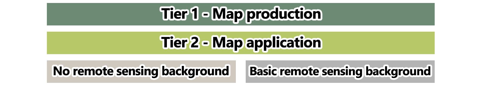
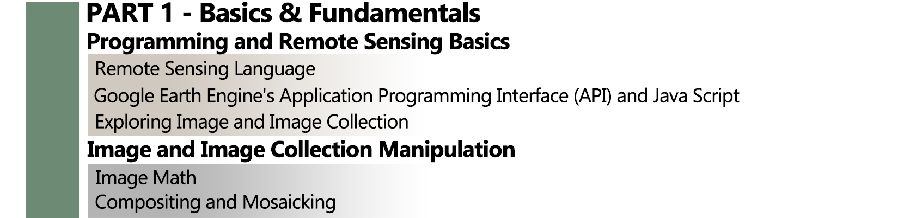
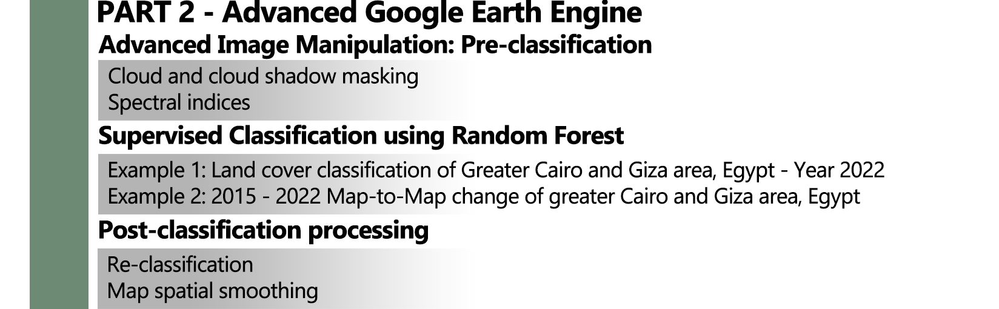
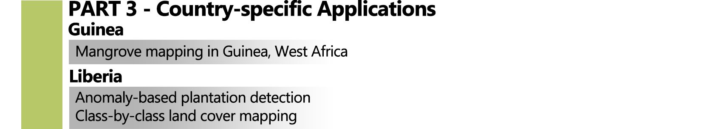

--- 
title: "Supervised Land Cover Classification with Google Earth Engine"
author: "Celio Sousa (celio.h.resendedesousa@nasa.gov) and Miroslav Honzak (mhonzak@conservation.org)"
date: "`r Sys.Date()`"
site: bookdown::bookdown_site
---

__Disclaimer__:

__This training material has been developed free-of-charge for educational purposes only and without any commercial interest. Some images and figures of this tutorial may have been reproduced from open sources and are cited accordingly, unless they were created by the author. If you believe any material shown in this course may be infringing a copyright, please let us know and we will remove it or take appropriate corrective action__.

# Introduction and overview {-}

Welcome to __Supervised Land Cover Classification with Google Earth Engine__! This online classification tutorial is a byproduct of the work conducted under the [NASA-Conservation Partnership]( http://www.gaboronedeclaration.com/blog/2019/11/17/nasa-conservation-international-partnership-supports-gdsa-goals-toward-mainstreaming-ecosystem-accounting-in-africa#:~:text=November%2017%2C%202019-,NASA%2DConservation%20International%20Partnership%20Supports%20GDSA%20Goals,Mainstreaming%20Ecosystem%20Accounting%20in%20Africa&text=NOVEMBER%2C%202019%E2%80%94Ecosystems%20provide%20a,integrated%20into%20the%20official%20statistics.){target=”blank”}, signed in 2018 with the overarching goal of assisting African nations to account for their ecosystem services and natural capital. More specifically, we aimed to develop repeatable methodologies to map land cover and ecosystem extent, meet international standards for ecosystem accounting, and satisfy the requirements of a broad range of nation-specific decision support needs. This tutorial will include the steps taken through two work-streams to develop ecosystem extent maps:  

```{r Introduction-Workstreams, fig.cap="NASA- and Conservation International-led work-streams: land cover and plant dissimilarity for ecosystem mapping.", echo=FALSE, message=FALSE}
knitr::include_graphics("images/Introduction-Workstreams.png")
```

This tutorial is broadly organized in four parts: These parts are divided into *Map production* and *Map application* tiers and whether or not each section requires basic remote sensing knowledge. An overview of the tutorial structure is shown below:

```{r Introduction-Structure1, echo=FALSE, message=FALSE}

```

The first half of the TIER 1 (PART 1) is designed to provide you with the basic remote sensing knowledge to understand the concepts that will be discussed in the following sections. Also, it aims to take you from being a complete Earth Engine novice to being fairly familiarized with its basic functionalities. Those who are almost entirely unfamiliar with remote sensing data, or are almost entirely unfamiliar with programming, or both, are encouraged to start at the beginning (*Programming and Remote Sensing Basics*). This section assumes that the user has no remote sensing background and programming experience, and begins with the most fundamental first steps. 

```{r Introduction-Structure2, echo=FALSE, message=FALSE}

```

The second the half of TIER 1 (PART 2), presents you with a guided tour of the world of satellite imagery classification using Google Earth Engine! In this section we explore the overall approach of image classification using real life and real location examples: from the pre-classification steps of preparing the imagery to post-classification procedures to enhance your classification outputs.

```{r Introduction-Structure3, echo=FALSE, message=FALSE}

```

The TIER 2 is designed to apply all the concepts and techniques covered in PART 1 and 2 for country-specific appliactions.

```{r Introduction-Structure4, echo=FALSE, message=FALSE}

```
